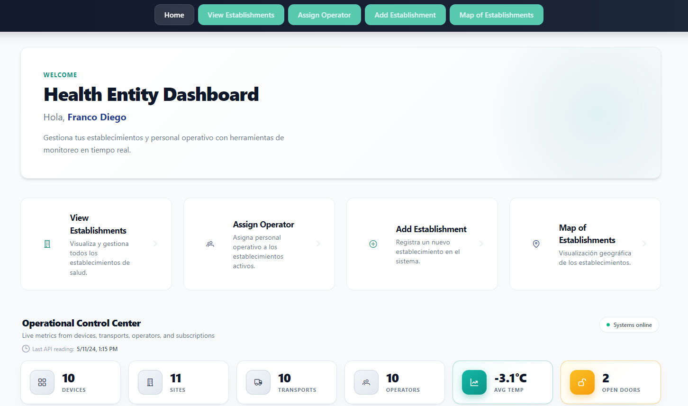
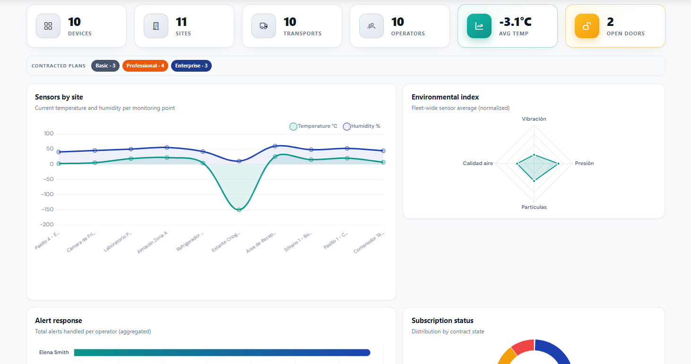
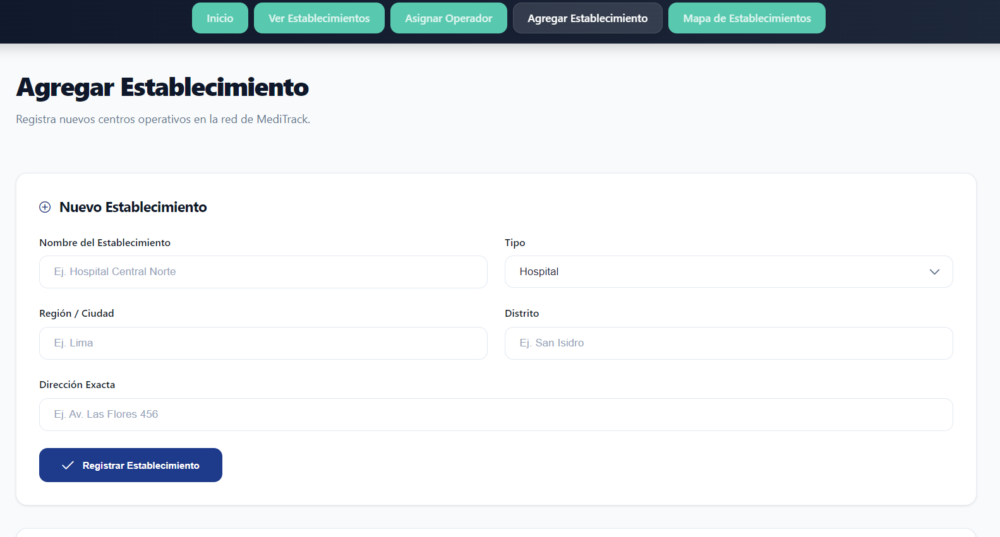
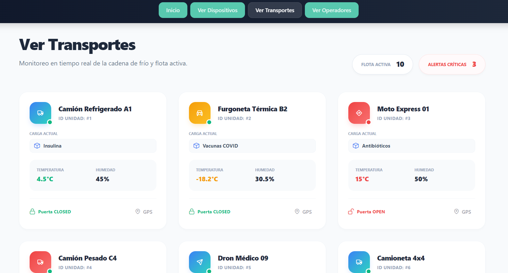
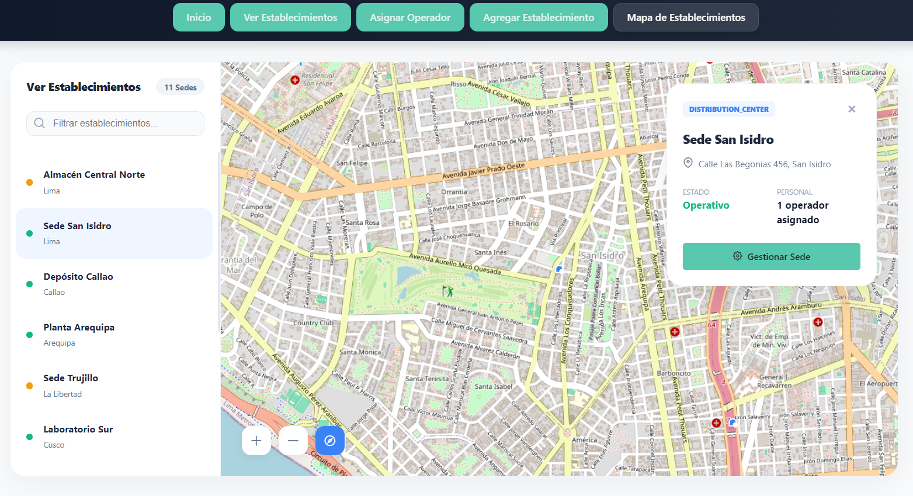
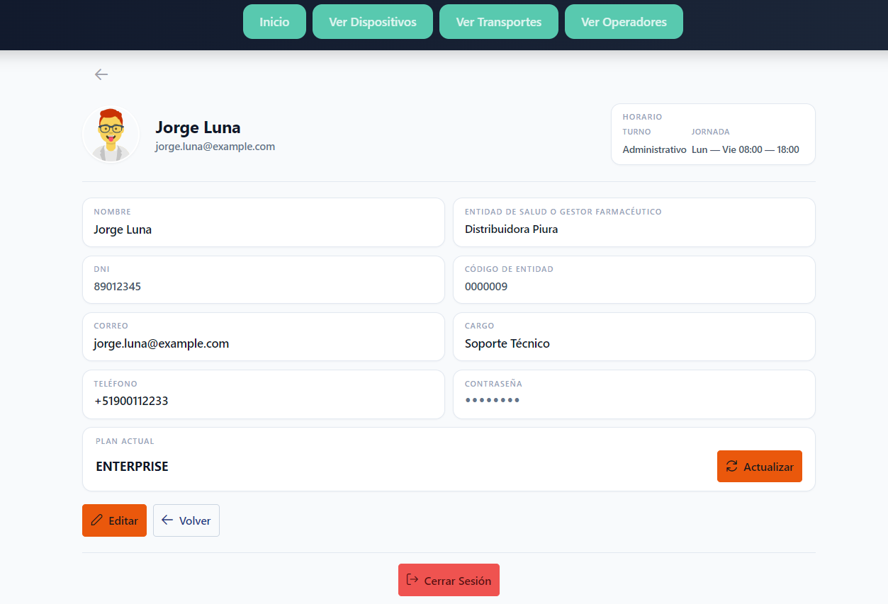
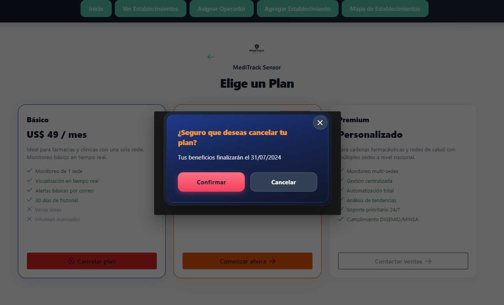

# Capítulo V: Product Implementation, Validation & Deployment

## 5.1. Software Configuration Management

### 5.1.1. Software Development Environment Configuration

A continuación, se describen los productos de software empleados en el desarrollo del proyecto. Esta sección tiene como objetivo facilitar la comprensión y continuidad
del trabajo a los actuales y futuros desarrolladores, asegurando una colaboración efectiva a lo largo del ciclo de vida del producto digital.

**Project Management**
- Trello – https://trello.com/ 
  Se ha utilizado Trello como herramienta principal de gestión de tareas. Esta plataforma permite visualizar el progreso de cada etapa del proyecto mediante
  tableros personalizables, facilitando la organización de pendientes, tareas en desarrollo y actividades finalizadas. Además, su interfaz intuitiva y accesibilidad
  desde cualquier navegador con una cuenta registrada la convierten en una solución ágil para el seguimiento de proyectos en equipo.

**Requirements Management**
- Google Docs – https://docs.google.com/ 
  Para la redacción, gestión y revisión de los requisitos del sistema se ha empleado Google Docs. Su funcionalidad de edición colaborativa en tiempo real ha
  permitido que todos los integrantes del equipo puedan aportar, comentar y revisar los documentos desde cualquier dispositivo.

**Product UX/UI Design**
- Figma – https://www.figma.com/ 
  Figma ha sido fundamental para el diseño de interfaces y la creación de prototipos interactivos. Permite que varios usuarios trabajen simultáneamente en los
  wireframes y mockups, lo que ha facilitado una comunicación más eficiente entre el equipo de diseño y desarrollo.
- Miro https://miro.com/es/  
  Pizarra digital colaborativa utilizada para sesiones de Big Picture EventStorming y Design-Level EventStorming, facilitando la identificación de Bounded Contexts, Events, Commands y Aggregates del dominio.
- LucidChart https://www.lucidchart.com/pages/es  
  Aplicación de diagramación colaborativa para la creación de Wireflows, User Flows, diagramas UML (Class Diagrams) y Database Diagrams de la arquitectura del software.

**Software Development**
- Landing Page y Frontend (HTML, CSS, JS) – https://www.jetbrains.com/idea/ 
  Desarrollada con HTML5, CSS3, JavaScript y Tailwind CSS. El entorno de desarrollo fue IntelliJ IDEA Ultimate por sus herramientas avanzadas de depuración y control de versiones.
- Web Services (.NET Core) – https://www.jetbrains.com/rider/ 
  Desarrollado en ASP.NET Core con C#, usando JetBrains Rider. Se requiere el SDK de .NET disponible en https://dotnet.microsoft.com/en-us/download.

**Software Documentation**
- Google Docs y GitHub README  
  La documentación del software se ha centralizado en Google Docs. El archivo README en GitHub incluye instrucciones de despliegue, estructura del repositorio y
  requerimientos técnicos.
- Markdown https://www.markdownguide.org/  
  Lenguaje de marcado ligero para la elaboración del Project Report en el repositorio GitHub. Permite estructurar documentación con formato consistente y compatible con control de versiones.

**Deployment & Hosting**
- Vercel  
  **Descripción**: Plataforma cloud enfocada en el despliegue y hosting de aplicaciones frontend, especialmente optimizada para frameworks modernos como
  Vue.js, React y Next.js. Proporciona CDN global, despliegues automáticos y SSL integrado.  
  **Uso**: Se utiliza para desplegar la aplicación web desarrollada con Vue.js. Cada push al repositorio activa automáticamente un pipeline de build y
  deployment, publicando la aplicación en producción con distribución global mediante CDN y certificado HTTPS automático. Además, permite previsualizaciones por rama para validar cambios antes de su integración final.  

### 5.1.2. Source Code Management

En esta sección se establece el medio y esquema de organización
que el equipo aplicará para el seguimiento y control de
modificaciones en el código fuente. Para ello se utiliza
**GitHub** como plataforma de control de versiones, organizado
bajo la organización pública **1ASI0730-2610-12258-TBL-MediTrackSensor**.

Se aplica **GitFlow** como workflow de control de versiones,
**Conventional Commits** para los mensajes de commit y
**Semantic Versioning** para el nombramiento de releases.

A continuación se presentan los repositorios correspondientes
a cada producto de la solución:

| Producto                 | Repositorio                                                                                   |
|--------------------------|-----------------------------------------------------------------------------------------------|
| Project Report           | https://github.com/1ASI0730-2610-12258-TBL-MediTrackSensor/MediTrackSensor-Project-Report.git |
| Landing Page             | https://github.com/1ASI0730-2610-12258-TBL-MediTrackSensor/MediTrackSensor-Landing-Page.git   |
| Frontend Web Application | https://github.com/1ASI0730-2610-12258-TBL-MediTrackSensor/MediTrackSensor-Frontend.git       |
| Web Services             | https://github.com/1ASI0730-2610-12258-TBL-MediTrackSensor/MediTrackSensor-Backend.git        |

### GitFlow Workflow

El equipo implementa GitFlow como workflow de control de versiones.
Las ramas definidas son las siguientes:

**Ramas principales:**
- `main` — rama principal que contiene la versión estable y desplegada
  del producto. Solo se actualiza mediante merges de ramas release.
- `develop` — rama de integración donde se consolidan las features
  completadas antes de pasar a producción.

**Ramas de soporte:**
- `feature/<nombre>` — una rama por cada funcionalidad o sección
  en desarrollo. Se crean desde `develop` y se fusionan de vuelta a `develop`
  al completarse.
- `release/<version>` — se crean desde `develop` cuando se prepara
  una entrega. Se fusionan a `main` y `develop` al finalizarse.

**Convenciones de nomenclatura para ramas:**

| Tipo | Convención | Ejemplo |
|------|-----------|---------|
| Feature | `feature/<nombre-descriptivo>` | `feature/login-view` |
| Release | `release/<version>` | `release/1.0.0` |

### Conventional Commits

Los mensajes de commit siguen la especificación de Conventional Commits
con la siguiente estructura:

`<type>(<scope>): <description>`

Los tipos permitidos son:

| Tipo | Uso |
|------|-----|
| `feat` | Nueva funcionalidad |
| `fix` | Corrección de errores |
| `docs` | Cambios en documentación |
| `style` | Cambios de formato sin afectar lógica |
| `refactor` | Refactorización de código |
| `test` | Añadir o modificar pruebas |
| `chore` | Tareas de mantenimiento |

### 5.1.3. Source Code Style Guide & Conventions

En este apartado se definen los estándares de codificación y nomenclatura adoptados por el equipo para garantizar la mantenibilidad y legibilidad del código de **MediTrack Sensor**. Se aplican las siguientes convenciones basadas en las guías de estilo de Google (para entornos Web) y Microsoft (para el ecosistema .NET):

* **Language Standards**: Todo el código fuente, incluyendo nombres de variables, funciones, clases, IDs de CSS y comentarios, se redacta exclusivamente en idioma **inglés** para mantener un estándar profesional global.
* **Naming Conventions**:
  * **Backend (C# / .NET)**: Se utiliza el estándar `PascalCase` para nombres de clases, métodos y propiedades (ej. `SensorDataController`). Para variables locales y parámetros se emplea `camelCase`.
  * **Frontend (HTML/CSS)**: Se utiliza `kebab-case` para nombres de archivos de estilo (ej. `style.css`) y para nombres de clases e IDs en las hojas de estilo (ej. `.hero-section`, `.btn-orange-rounded`).
  * **JavaScript**: Se aplica `camelCase` para variables y funciones (ej. `initIoTSimulation`, `tempElement`) y `kebab-case` para la nomenclatura de archivos de script (ej. `script.js`).
* **Source Control Conventions**: Se aplica el estándar de **Conventional Commits**, utilizando prefijos descriptivos en inglés como `feat:`, `fix:`, `docs:`, y `chore:` para asegurar un historial de versiones estructurado y rastreable.
* **Code Formatting**: Se mantiene una indentación consistente de 4 espacios en archivos HTML, CSS y JS para mejorar la jerarquía visual del código. En el desarrollo backend, se sigue el formato automático de Visual Studio para asegurar la limpieza de los archivos de clase.

### 5.1.4. Software Deployment Configuration

Esta sección detalla la configuración del despliegue de la solución, permitiendo que los productos digitales sean accesibles de forma continua en un entorno de producción.

* **Hosting & Cloud Platforms**:
  * **Landing Page**: Se ha desplegado satisfactoriamente en la plataforma **Vercel**, aprovechando su infraestructura optimizada para sitios estáticos y despliegue rápido.
  * **Web Services & API**: Para las fases posteriores del proyecto, se ha definido el uso de **Microsoft Azure** como proveedor de nube para el alojamiento de los servicios web desarrollados en ASP.NET Core, garantizando escalabilidad y compatibilidad técnica.
* **Continuous Deployment (CD) Pipeline**:
  * **Integración**: El repositorio oficial en GitHub (`MediTrackSensor-Landing-Page`) está vinculado directamente a la plataforma de despliegue.
  * **Branching Strategy**: La rama `main` actúa como la rama de producción oficial. Cualquier cambio integrado mediante *merge* o *push* en esta rama activa automáticamente un nuevo despliegue (Automatic Deployment) hacia la URL pública: [https://meditrack-sensor.vercel.app/](https://meditrack-sensor.vercel.app/).
* **Environment Configuration**:
  * **Estado Actual (Sprint 1)**: El despliegue actual no requiere el uso de variables de entorno (Environment Variables) ni claves de API externas, dado que se trata de un prototipo visual e informativo.
  * **Planificación Futura**: En los próximos Sprints, se configurarán variables de entorno protegidas en los paneles de Azure y Vercel para gestionar de forma segura las cadenas de conexión a bases de datos y tokens de autenticación de servicios IoT.

---

## 5.2. Landing Page, Services & Applications Implementation

### 5.2.1. Sprint 1

En este Sprint se desarrolló e implementó la primera versión
del Landing Page de MediTrack Sensor, incluyendo su despliegue
en un entorno accesible públicamente.

#### 5.2.1.1. Sprint Planning 1

A continuación se presenta el resumen del Sprint Planning Meeting
realizado para el Sprint 1.

| Sprint # | Sprint 1                                                                                                                                                                                                                                                                                                                             |
|----------|--------------------------------------------------------------------------------------------------------------------------------------------------------------------------------------------------------------------------------------------------------------------------------------------------------------------------------------|
| **Sprint Planning Background** |                                                                                                                                                                                                                                                                                                                                      |
| Date | 2026-04-15                                                                                                                                                                                                                                                                                                                           |
| Time | 04:30 PM                                                                                                                                                                                                                                                                                                                             |
| Location | Reunión virtual vía Google Meet                                                                                                                                                                                                                                                                                                      |
| Prepared By | Rioja Nuñez, Franco Diego                                                                                                                                                                                                                                                                                                            |
| Attendees | Herrera Enriquez, Diego Fernando / Mallqui Vilca, Dhilsen Armil / Rioja Nuñez, Franco Diego / Tufiño Argüelles, Luis Angel / Urviola Condori, Mateo Sebastián                                                                                                                                                                        |
| **Sprint Goal & User Stories** |                                                                                                                                                                                                                                                                                                                                      |
| Sprint 1 Goal | Our goal is to lay the groundwork for the project and launch the first version of the landing page. We believe this page will allow healthcare providers and pharmacy managers to better understand MediTrack Sensor, which measures the status of medications in their storage environment. This will be confirmed once the landing page is live and contains relevant content for both target groups. |
| Sprint 1 Velocity | 21                                                                                                                                                                                                                                                                                                                                   |
| Sum of Story Points | 21                                                                                                                                                                                                                                                                                                                                   |

#### 5.2.1.2. Aspect Leaders and Collaborators

En esta sección se detalla la matriz de liderazgo y colaboración (LACX) para el Sprint 1. Cada aspecto representa una fase crítica de la entrega, donde se designa un líder (L) responsable de la dirección del entregable y colaboradores (C) que apoyaron en su ejecución, cumpliendo con el objetivo de proporcionar liderazgo conjunto y un entorno colaborativo (ABET Student Outcome 5).

| Team Member (Last Name, First Name) | GitHub Username | Idea de Negocio y Bases | Diseño de App Web (Figma) | Contenido y Despliegue Landing | User Stories y Funciones | Análisis de Usuario y Needfinding |
| :--- | :--- | :---: | :---: | :---: | :---: | :---: |
| Tufiño Argüelles, Luis Angel | LuisTufino2 | **L** | C | C | C | C |
| Rioja Nuñez, Franco Diego | FrancoDiegoR | C | **L** | C | C | C |
| Mallqui Vilca, Dhilsen Armil | Dhilsen18 | C | C | **L** | C | C |
| Herrera Enriquez, Diego Fernando | DerDFHE | C | C | C | **L** | C |
| Urviola Condori, Mateo Sebastián | BeyaminUv | C | C | C | C | **L** |

---

**Sustento de los Aspectos de Liderazgo:**

* **Luis Tufiño (Idea de Negocio y Bases):** Proporcionó liderazgo en la fase de concepción, estableciendo la visión estratégica de MediTrack Sensor y definiendo el modelo de negocio inicial que guía el proyecto.
* **Franco Rioja (Diseño de App Web):** Lideró la arquitectura visual y experiencia de usuario del software, siendo responsable de los prototipos de alta fidelidad en Figma para la plataforma web.
* **Dhilsen Mallqui (Contenido y Despliegue Landing):** Responsable de la presencia web del producto, liderando la implementación técnica y el despliegue de la Landing Page en Vercel para la comunicación con los interesados.
* **Diego Herrera (User Stories y Funciones):** Lideró la traducción de necesidades en requerimientos técnicos, definiendo las historias de usuario y el alcance funcional de la aplicación.
* **Mateo Urviola (Análisis de Usuario):** Lideró el proceso de investigación empática, dirigiendo la creación de User Personas, Empathy Maps y el análisis de los procesos actuales de los usuarios en su entorno laboral.

#### 5.2.1.3. Sprint Backlog 1

Durante el primer sprint backlog, nuestro equipo tuvo como objetivo principal diseñar la Aplicación Web y Landing Page, completando esta última en el proceso. Para la organización y gestión de los miembros se utilizó Trello, lo que permitió dividir las user stories en tareas manejables y asignarlas a cada integrante según sus habilidades. El propósito de este sprint fue construir en su totalidad la landing page, asegurando que fuera atractiva, funcional y alineada con la propuesta de valor de TBL.

Enlace de Trello: https://trello.com/invite/b/69e9e940d5d58b559007b0af/ATTIbc7fef21e3ae9af5f9b1524a8311a897E9406869/meditrack-sensor

A continuación se presenta la descomposición de User Stories en tareas del Sprint 1:

| Sprint # | Sprint 1 | | | | | | |
|----------|----------|---|---|---|---|---|---|
| **User Story** | | **Work-Item / Task** | | | | | |
| **Id** | **Title** | **Id** | **Title** | **Description** | **Estimation (Hours)** | **Assigned To** | **Status (To-do / In-Process / To-Review / Done)** |
| US25 | Adaptación a dispositivos | T01 | Implementar diseño responsive | Configurar media queries y hacer la landing adaptable a móviles, tablets y desktop | 8 | Dhilsen Mallqui | Done |
| US01 | Navegación clara | T02 | Desarrollar navbar sticky | Implementar barra de navegación fija con smooth scroll | 4 | Dhilsen Mallqui | Done |
| US06 | Mensaje principal claro | T03 | Implementar sección hero | Desarrollar hero section con typing animation y tagline | 5 | Dhilsen Mallqui | Done |
| US13 | Presentación profesional | T04 | Diseñar mockups en Figma | Crear diseño visual profesional de todas las secciones | 10 | Franco Rioja | Done |
| US13 | Presentación profesional | T05 | Aplicar design system | Implementar colores, tipografía Outfit y elementos visuales | 6 | Franco Rioja / Dhilsen Mallqui | Done |
| US10 | Botón de contacto visible | T06 | Implementar CTAs | Añadir botones de contacto en navbar y hero | 2 | Dhilsen Mallqui | Done |
| US11 | Acceso a contacto | T07 | Desarrollar formulario de contacto | Crear formulario con campos de nombre, empresa, email, teléfono y mensaje | 4 | Dhilsen Mallqui | Done |
| US21 | Información de monitoreo | T08 | Implementar dashboard IoT simulado | Desarrollar tarjetas con datos simulados de temperatura, humedad y luz | 6 | Dhilsen Mallqui | Done |
| US02 | Acceso a sección de tecnología | T09 | Desarrollar sección tecnología | Crear sección con explicación del sistema y features | 4 | Dhilsen Mallqui | Done |
| US03 | Acceso a sectores | T10 | Desarrollar sección sectores | Implementar cards de hospitales, distribución y farmacias | 5 | Dhilsen Mallqui | Done |
| US16 | Contenido para almacenes | T11 | Redactar contenido segmento operativo | Escribir textos orientados a personal de almacén | 3 | Luis Tufiño / Dhilsen Mallqui | Done |
| US17 | Contenido para entidades | T12 | Redactar contenido segmento gestores | Escribir textos orientados a entidades de salud | 3 | Luis Tufiño / Dhilsen Mallqui | Done |
| US07 | Identificación del problema | T13 | Desarrollar sección problema | Implementar floating cards con problemática | 4 | Dhilsen Mallqui | Done |
| US04 | Información del equipo | T14 | Desarrollar sección nosotros | Crear sección con misión, visión y equipo TechnoByteLambders | 4 | Dhilsen Mallqui | Done |
| US22 | Incentivo a contacto | T15 | Implementar planes de suscripción | Desarrollar pricing cards con planes Básico, Profesional y Premium | 5 | Dhilsen Mallqui | Done |
| US15 | Coherencia visual | T16 | Implementar animaciones | Añadir reveal animations con IntersectionObserver | 4 | Dhilsen Mallqui | Done |
| US12 | Respuesta visual a interacción | T17 | Añadir efectos hover | Implementar transiciones y efectos en botones y cards | 3 | Dhilsen Mallqui | Done |
| US26 | Carga eficiente | T18 | Optimizar assets | Comprimir imágenes y optimizar carga de fuentes | 3 | Dhilsen Mallqui | Done |
| US05 | Visualización de beneficios | T19 | Implementar sección stats | Desarrollar contador animado con métricas clave | 4 | Dhilsen Mallqui | Done |
| US14 | Información estructurada | T20 | Organizar contenido | Estructurar secciones en orden lógico y jerarquía visual | 3 | Dhilsen Mallqui | Done |
| - | - | T21 | Configurar despliegue en Vercel | Conectar repositorio y configurar deployment automático | 2 | Dhilsen Mallqui | Done |
| - | - | T22 | Definir User Stories | Documentar 27 User Stories con criterios de aceptación | 6 | Diego Herrera | Done |
| - | - | T23 | Realizar entrevistas | Conducir entrevistas con ambos segmentos objetivo | 8 | Franco Rioja / Luis Tufiño / Dhilsen Mallqui | Done |
| - | - | T24 | Elaborar User Personas | Crear arquetipos basados en entrevistas | 4 | Mateo Urviola | Done |
| - | - | T25 | Crear Journey Maps | Mapear experiencia de usuarios | 4 | Mateo Urviola | Done |

#### 5.2.1.4. Development Evidence for Sprint Review

Durante el Sprint 1, el equipo utilizó GitHub como sistema de control de versiones, siguiendo el flujo de trabajo GitFlow para asegurar una integración ordenada del código. A continuación, se presenta el registro de los commits más relevantes que evidencian el desarrollo de la Landing Page y la colaboración del equipo.

**Repository:** 1ASI0730-2610-12258-TBL-MediTrackSensor/MediTrackSensor-Landing-Page

| Repository | Branch | Commit Id | Commit Message | Commit Message Body | Committed on (Date) |
| :--- | :--- | :--- | :--- | :--- | :--- |
| `MediTrackSensor-Landing-Page` | `main` | `cf30ba5` | `feat: implement team section` | `Added specific content and layout for the startup team profiles.` | 19/04/2026 |
| `MediTrackSensor-Landing-Page` | `main` | `e6420c0` | `chore: finalize landing page structure` | `Final adjustments to the HTML structure for the initial release.` | 12/04/2026 |
| `MediTrackSensor-Landing-Page` | `main` | `965dc26` | `fix: resolve remaining layout issues` | `Ensured all sections are correctly aligned after final review.` | 11/04/2026 |
| `MediTrackSensor-Landing-Page` | `main` | `03e62cb` | `fix: clean up code and remove errors` | `General debugging of CSS and HTML validation issues.` | 11/04/2026 |
| `MediTrackSensor-Landing-Page` | `main` | `5d82cf0` | `docs: add project readme file` | `Initial documentation of the repository and project description.` | 11/04/2026 |
| `MediTrackSensor-Landing-Page` | `main` | `4c8156b` | `feat: update landing page and design` | `Applied general style updates and design refinements for UX.` | 11/04/2026 |
| `MediTrackSensor-Landing-Page` | `main` | `74dba14` | `chore: initial commit` | `Initial repository setup with base project files.` | 10/04/2026 |

#### 5.2.1.5. Execution Evidence for Sprint Review

En esta sección se presenta la evidencia de la ejecución del Sprint 1, demostrando el cumplimiento de los objetivos establecidos y el despliegue del producto en un entorno de producción accesible.

**Enlace del Landing Page:** [https://meditrack-sensor.vercel.app/](https://meditrack-sensor.vercel.app/)

**Evidencia de Despliegue (Vercel):**

A continuación, se presenta la captura del dashboard de Vercel que confirma el despliegue exitoso (Production Deployment) de la Landing Page desde el repositorio oficial de GitHub.

#### 5.2.1.6. Services Documentation Evidence for Sprint Review

Para el presente Sprint 1, el alcance se centró exclusivamente en la implementación y despliegue del Landing Page (sitio web estático). Por lo tanto, no se han desarrollado servicios RESTful API en esta etapa. La documentación detallada de los endpoints mediante OpenAPI (Swagger) se incluirá en los informes correspondientes a los siguientes Sprints, una vez iniciada la fase de implementación de los Web Services.

#### 5.2.1.7. Software Deployment Evidence for Sprint Review

El deploy de la Landing Page se hizo en Vercel de la siguiente manera

### Paso 1: Se agregó el proyecto

### Paso 2: Se agregó el repositorio

### Paso 3: Se hace deploy con html, css y javascript

#### 5.2.1.8. Team Collaboration Insights during Sprint

La implementación de la entrega AV1 fue un esfuerzo conjunto que integró el desarrollo técnico de la Landing Page y la elaboración del reporte de ingeniería. El equipo aplicó un liderazgo compartido donde cada integrante fue responsable de la calidad de sus respectivos apartados, manteniendo una comunicación constante para asegurar la coherencia entre el diseño, los requerimientos y el producto desplegado.

A continuación, se presentan las evidencias de colaboración extraídas de los analíticos de GitHub, las cuales muestran la participación activa de todos los miembros tanto en el repositorio del código fuente como en el repositorio del informe del proyecto.

**Evidencia de Contribuciones en el Código (Landing Page):**

**Evidencia de Contribuciones en el Reporte (Documentation):**

### 5.2.1. Sprint 2

En esta sección se registra y explica el avance en términos de producto y trabajo
colaborativo para el Sprint 2. Incluye como secciones internas: Sprint Planning 2,
Aspect Leaders and Collaborators, Sprint Backlog 2, Development Evidence for Sprint
Review, Execution Evidence for Sprint Review, Services Documentation Evidence for
Sprint Review, junto con Team Collaboration Insights during Sprint.

#### 5.2.2.1. Sprint Planning 2

A continuación se presenta el resumen del Sprint Planning Meeting realizado para el Sprint 2.

| Sprint #                           | Sprint 2                                                                                                                                                                                                                                                                                                                                                                                                                                                                                             |
|------------------------------------|------------------------------------------------------------------------------------------------------------------------------------------------------------------------------------------------------------------------------------------------------------------------------------------------------------------------------------------------------------------------------------------------------------------------------------------------------------------------------------------------------|
| **Sprint Planning Background**     |                                                                                                                                                                                                                                                                                                                                                                                                                                                                                                      |
| Date                               | 2026-05-11                                                                                                                                                                                                                                                                                                                                                                                                                                                                                           |
| Time                               | 9:30 PM                                                                                                                                                                                                                                                                                                                                                                                                                                                                                              |
| Location                           | Reunión virtual vía Discord                                                                                                                                                                                                                                                                                                                                                                                                                                                                          |
| Prepared By                        | Rioja Nuñez, Franco Diego                                                                                                                                                                                                                                                                                                                                                                                                                                                                            |
| Attendees                          | Herrera Enriquez, Diego Fernando / Mallqui Vilca, Dhilsen Armil / Rioja Nuñez, Franco Diego / Tufiño Argüelles, Luis Angel / Urviola Condori, Mateo Sebastián / Paredes Díaz, Tomás Alessandro                                                                                                                                                                                                                                                                                                       |
| Sprint 2 – 1 Review Summary        | Sprint 1 was very well coordinated; however, we failed to meet the requirements, resulting in a noticeable decrease in the quality of the content and the software product delivered during this sprint. The landing page was of good quality; however, the established requirements regarding commits and product development were not followed. Team members are aware of these errors thanks to feedback provided by the Product Owner.                                                           |
| Sprint 2 – 1 Retrospective Summary | The team admits that the development of the previous sprint was not fully aligned with the requested requirements. We recognize that the software products were correctly oriented in terms of the stated objectives; However, its implementation and development presented deficiencies. Fortunately, the Product Owner provided us with important support through constant feedback, which allowed us to identify errors and make the necessary corrections to improve the quality of the product. |
| **Sprint Goal & User Stories**     |                                                                                                                                                                                                                                                                                                                                                                                                                                                                                                      |
| Sprint 2 Goal                      | Our goal is to develop our first version of the frontend of our web application. We believe that this application will allow entity pharmacy administrators to manage data within the establishments belonging to the health entity, as well as its operators and devices. Likewise, operators will be able to manage the data received by the devices and transports according to the metrics received by them.                                                                                     |
| Sprint 2 Velocity                  | 20                                                                                                                                                                                                                                                                                                                                                                                                                                                                                                   |
| Sum of Story Points                | 23                                                                                                                                                                                                                                                                                                                                                                                                                                                                                                   |

#### 5.2.2.2. Aspect Leaders and Collaborators

En esta sección se detalla la matriz de liderazgo y colaboración (LACX) para el Sprint 2. Cada aspecto representa una fase crítica de la entrega del frontend, donde se designa un líder (L) responsable de la dirección del entregable y colaboradores (C) que apoyaron en su ejecución, cumpliendo con el objetivo de proporcionar liderazgo conjunto y un entorno colaborativo (ABET Student Outcome 5).

| Team Member (Last Name, First Name) | GitHub Username | Frontend Development | IAM Module | Subscriptions Module | Monitoring Module | Establishment Module | Logistics Module | Frontend UI/Design | Report & Documentation |
| :--- | :--- | :---: | :---: | :---: | :---: | :---: | :---: | :---: | :---: |
| Tufiño Argüelles, Luis Angel | LuisTufino2 | C | **L** | C | C | C | C | C | C |
| Urviola Condori, Mateo Sebastián | BeyaminUv | C | C | **L** | C | C | C | C | C |
| Paredes Díaz, Tomás Alessandro | TParedes92 | C | C | C | **L** | C | C | C | C |
| Mallqui Vilca, Dhilsen Armil | Dhilsen18 | C | C | C | C | **L** | **L** | C | C |
| Rioja Nuñez, Franco Diego | FrancoDiegoR | **L** | C | C | C | C | C | **L** | C |
| Herrera Enriquez, Diego Fernando | DerDFHE | C | C | C | C | C | C | C | **L** |

---

**Sustento de los Aspectos de Liderazgo:**

* **Luis Tufiño (IAM Module):** Lideró el desarrollo del módulo de identidad y acceso, estableciendo la arquitectura de autenticación, validación de credenciales y gestión de tokens JWT para asegurar la seguridad de las sesiones de usuario en la aplicación.
* **Mateo Urviola (Subscriptions Module):** Dirigió el diseño e implementación del módulo de planes y suscripciones, definiendo la lógica de selección de planes, comparación de opciones y flujo de integración con pagos.
* **Tomás Paredes (Monitoring Module):** Lideró la construcción del módulo de monitoreo y dashboard, coordinando la visualización de indicadores de sensores, valores en tiempo real y estados del sistema para asegurar claridad en la representación de datos.
* **Dhilsen Mallqui (Establishment & Logistics Modules):** Responsable del desarrollo de los módulos de gestión de establecimientos y logística, implementando interfaces de administración, etiquetado de ubicaciones y seguimiento de transportes farmacéuticos.
* **Franco Rioja (Frontend UI/Design & Responsiveness):** Lideró la coherencia visual y la experiencia de usuario del frontend, asegurando el cumplimiento del design system, la adaptación responsive en dispositivos móviles y la integración de componentes reutilizables.
* **Diego Herrera (Report & Documentation):** Coordinó la redacción, organización y consolidación de la sección de desarrollo del reporte de Sprint 2, asegurando la trazabilidad entre las tareas, commits y evidencia presentada.

#### 5.2.2.3. Sprint Backlog 2.

Durante el segundo sprint backlog, nuestro equipo tuvo como objetivo principal diseñar la Aplicación Web completándola parcialmente para esta segunda entrega. Para la organización y gestión de los miembros se utilizó Trello, lo que permitió dividir las user stories en tareas manejables y asignarlas a cada integrante según sus habilidades. El propósito de este sprint fue construir parcialmente la aplicación web, asegurando que fuera funcional, atractiva y alineada con la propuesta de valor de TBL.

Enlace de Trello: https://trello.com/invite/b/6a02a35d4f75f7ddabeabe1c/ATTIbbc3193b48f5acf5194c54a2233ca38e2EFFB77A/meditracksensor

| Sprint # | Sprint 2 | | | | | | |
|----------|----------|---|---|---|---|---|---|
| **User Story** | | **Work-Item / Task** | | | | | |
| **Id** | **Title** | **Id** | **Title** | **Description** | **Estimation (Hours)** | **Assigned To** | **Status (To-do / In-Process / To-Review / Done)** |
| US29 | Monitoreo de temperatura en dashboard | TS-US29-001 | Crear widget de temperatura | Desarrollar componente visual para mostrar temperatura en tiempo real | 4 | Dhilsen Mallqui | To-do |
| US29 | Monitoreo de temperatura en dashboard | TS-US29-003 | Mostrar timestamp de última lectura | Implementar visualización de fecha y hora de la última actualización del sensor | 2 | Dhilsen Mallqui | To-do |
| US30 | Monitoreo de luz | TS-US30-001 | Crear widget de intensidad lumínica | Desarrollar componente visual para mostrar niveles de luz | 4 | Dhilsen Mallqui | To-do |
| US42 | Identificación de desviaciones visuales | TS-US42-002 | Resaltar sensores críticos con colores de alerta | Aplicar indicadores visuales para sensores fuera de rango | 3 | Franco Rioja | To-do |
| US33 | Identificación por ubicación | TS-US33-005 | Validar legibilidad de ubicaciones en móviles | Verificar correcta visualización responsive de ubicaciones | 2 | Mateo Urviola | To-do |
| US25 | Adaptación a dispositivos | TS-US25-001 | Implementar media queries principales | Configurar estilos responsive para dashboard y módulos | 5 | Dhilsen Mallqui | To-do |
| US25 | Adaptación a dispositivos | TS-US25-002 | Adaptar navbar para dispositivos móviles | Ajustar navegación responsive para smartphones y tablets | 3 | Dhilsen Mallqui | To-do |
| US25 | Adaptación a dispositivos | TS-US25-007 | Realizar pruebas responsive en múltiples resoluciones | Validar funcionamiento visual en distintos tamaños de pantalla | 4 | Dhilsen Mallqui | To-do |
| US28 | Visualización de sensores activos | TS-US28-005 | Integrar estilos responsive | Aplicar diseño adaptable al panel de sensores | 3 | Franco Rioja | In-Process |
| US30 | Monitoreo de luz | TS-US30-004 | Implementar indicador visual de rango seguro | Mostrar estado seguro o crítico de niveles lumínicos | 3 | Dhilsen Mallqui | In-Process |
| US34 | Estado general del sistema | TS-US34-002 | Mostrar total de sensores activos | Implementar contador general de sensores conectados | 2 | Dhilsen Mallqui | In-Process |
| US37 | Visualización de gráficos | TS-US37-001 | Crear gráfico de temperatura | Desarrollar gráfico dinámico de tendencias de temperatura | 5 | Diego Herrera | In-Process |
| US42 | Identificación de desviaciones visuales | TS-US42-001 | Crear lógica visual para valores fuera de rango | Implementar detección visual de valores críticos | 4 | Diego Herrera | In-Process |
| US28 | Visualización de sensores activos | TS-US28-007 | Validar visualización responsive de sensores | Verificar correcta adaptación responsive de tarjetas de sensores | 2 | Mateo Urviola | To-Review |
| US29 | Monitoreo de temperatura en dashboard | TS-US29-006 | Validar visualización en dispositivos móviles | Probar visualización responsive del módulo de temperatura | 2 | Mateo Urviola | To-Review |
| US34 | Estado general del sistema | TS-US34-004 | Implementar indicador general de estado | Mostrar estado global del sistema mediante indicadores visuales | 3 | Dhilsen Mallqui | To-Review |
| US42 | Identificación de desviaciones visuales | TS-US42-001 | Crear lógica visual para valores fuera de rango | Revisar funcionamiento de detección visual de alertas | 4 | Diego Herrera | To-Review |
| US30 | Monitoreo de luz | TS-US30-006 | Validar adaptación responsive del módulo | Validar correcta adaptación responsive del widget lumínico | 2 | Mateo Urviola | To-Fix |
| US37 | Visualización de gráficos | TS-US37-002 | Diseñar estilos responsive para gráficos | Corregir problemas visuales y adaptación responsive de gráficos | 3 | Franco Rioja | To-Fix |
| US28 | Visualización de sensores activos | TS-US28-003 | Mostrar nombre y estado del sensor | Implementar visualización de información principal de sensores | 2 | Dhilsen Mallqui | Done |
| US28 | Visualización de sensores activos | TS-US28-004 | Implementar indicador visual activo/inactivo | Mostrar estado activo o desconectado mediante colores e íconos | 3 | Dhilsen Mallqui | Done |
| US28 | Visualización de sensores activos | TS-US28-005 | Consumir datos mock de sensores | Integrar datos simulados para pruebas del dashboard | 3 | Diego Herrera | Done |
| US28 | Visualización de sensores activos | TS-US28-006 | Aplicar estilos al panel de sensores | Diseñar interfaz visual del módulo de sensores | 3 | Franco Rioja | Done |
| US29 | Monitoreo de temperatura en dashboard | TS-US29-002 | Mostrar valor actual en °C | Implementar lectura actual de temperatura con unidad | 2 | Dhilsen Mallqui | Done |
| US29 | Monitoreo de temperatura en dashboard | TS-US29-005 | Actualizar estilos visuales según rango | Aplicar estilos dinámicos según valores críticos o normales | 3 | Franco Rioja | Done |
| US34 | Estado general del sistema | TS-US34-001 | Diseñar sección resumen del dashboard | Crear layout general del resumen del sistema | 4 | Franco Rioja | Done |
| US33 | Identificación por ubicación | TS-US33-001 | Mostrar ubicación física de sensores | Implementar etiquetas de ubicación física de sensores | 2 | Dhilsen Mallqui | Done |
| US33 | Identificación por ubicación | TS-US33-002 | Diseñar etiqueta visual de ubicación | Crear estilos visuales para etiquetas de ubicación | 2 | Franco Rioja | Done |
| US33 | Identificación por ubicación | TS-US33-003 | Implementar agrupación visual por ubicación | Agrupar sensores visualmente según su área física | 3 | Diego Herrera | Done |

#### 5.2.2.4. Development Evidence for Sprint Review

Durante el Sprint 2, el equipo de desarrollo utilizó GitHub como sistema de control de versiones, siguiendo la estrategia GitFlow para organizar el trabajo en branches por bounded context. A continuación, se presenta el registro de los commits más relevantes que evidencian el desarrollo de los módulos principales del frontend de MediTrack Sensor.

LINK DEL DESPLIEGUE EN VERCEL: https://meditracksensor-iot-frontend.vercel.app/login

**Repository:** 1ASI0730-2610-12258-TBL-MediTrackSensor/MediTrackSensor-Frontend

| Repository | Branch | Commit Id | Commit Message | Commit Message Body | Committed on (Date) |
| :--- | :--- | :--- | :--- | :--- | :--- |
| `MediTrackSensor-Frontend` | `feature/iam` | `a7c3e2f1` | `feat(iam): implement login authentication` | Implemented login form with email/password validation and JWT token management for user sessions. | 13/05/2026 |
| `MediTrackSensor-Frontend` | `feature/iam` | `b4d9f5e2` | `feat(iam): add password verification flow` | Added password verification logic and error handling for failed authentication attempts. | 14/05/2026 |
| `MediTrackSensor-Frontend` | `feature/iam` | `c8e1a3f6` | `feat(iam): create user registration component` | Developed registration form with validation and integration to backend authentication service. | 15/05/2026 |
| `MediTrackSensor-Frontend` | `feature/subscriptions` | `d2f7b8c4` | `feat(subscriptions): design pricing plans view` | Created visual layout for subscription plans with Básico, Profesional and Premium tiers. | 14/05/2026 |
| `MediTrackSensor-Frontend` | `feature/subscriptions` | `e5g2c9d7` | `feat(subscriptions): implement plan selection logic` | Added functionality to select, compare and manage subscription plans with visual indicators. | 16/05/2026 |
| `MediTrackSensor-Frontend` | `feature/subscriptions` | `f9h3d1e8` | `feat(subscriptions): integrate payment component` | Connected payment processing module to subscription management flow. | 17/05/2026 |
| `MediTrackSensor-Frontend` | `feature/monitoring` | `g3i5e4f9` | `feat(monitoring): create dashboard main view` | Built main dashboard layout with grid system for sensor widgets and status indicators. | 13/05/2026 |
| `MediTrackSensor-Frontend` | `feature/monitoring` | `h6j7f5a2` | `feat(monitoring): implement temperature monitoring widget` | Developed temperature sensor display with real-time value updates and threshold visualization. | 15/05/2026 |
| `MediTrackSensor-Frontend` | `feature/monitoring` | `i8k9g6b3` | `feat(monitoring): add light intensity indicators` | Created light level monitoring component with color-coded status and numeric values. | 16/05/2026 |
| `MediTrackSensor-Frontend` | `feature/monitoring` | `j2l4h7c5` | `feat(monitoring): integrate sensor data consumption` | Connected mock data services to display live sensor information in dashboard widgets. | 18/05/2026 |
| `MediTrackSensor-Frontend` | `feature/establishment` | `k5m3i8d6` | `feat(establishment): create management interface` | Built establishment management module with list view and detailed information cards. | 14/05/2026 |
| `MediTrackSensor-Frontend` | `feature/establishment` | `l7n6j9e4` | `feat(establishment): implement location tagging system` | Added visual identification and grouping of establishments by physical location. | 16/05/2026 |
| `MediTrackSensor-Frontend` | `feature/establishment` | `m9o4k1f7` | `feat(establishment): add establishment CRUD operations` | Implemented create, read, update and delete functionality for establishment records. | 19/05/2026 |
| `MediTrackSensor-Frontend` | `feature/logistics` | `n3p8l5g9` | `feat(logistics): design transport management view` | Created interface for tracking and managing pharmaceutical transportation units. | 15/05/2026 |
| `MediTrackSensor-Frontend` | `feature/logistics` | `o6q2m7h1` | `feat(logistics): implement route tracking display` | Developed visual representation of transport routes with status and location indicators. | 17/05/2026 |
| `MediTrackSensor-Frontend` | `feature/logistics` | `p4r9n3i8` | `feat(logistics): add transport alert system` | Integrated alert notifications for logistics events and route deviations. | 19/05/2026 |
| `MediTrackSensor-Frontend` | `develop` | `q7s5o2j3` | `feat(ui): implement responsive design system` | Applied media queries and flexible layouts to ensure compatibility across mobile, tablet and desktop devices. | 18/05/2026 |
| `MediTrackSensor-Frontend` | `develop` | `r1t8p6k4` | `feat(ui): add navigation bar component` | Built sticky navigation bar with smooth scroll functionality and menu organization. | 14/05/2026 |
| `MediTrackSensor-Frontend` | `develop` | `s3u2q7l5` | `feat(ui): create reusable component library` | Developed base components (buttons, modals, cards) following design system specifications. | 16/05/2026 |
| `MediTrackSensor-Frontend` | `develop` | `t9v4r1m6` | `fix(ui): resolve responsive layout issues` | Fixed CSS layout problems and ensured consistent alignment across different screen sizes. | 20/05/2026 |
| `MediTrackSensor-Frontend` | `develop` | `u5w3s8n7` | `chore: merge feature/iam into develop` | Integrated IAM module with main development branch after testing. | 21/05/2026 |
| `MediTrackSensor-Frontend` | `develop` | `v2x6t4o8` | `chore: merge feature/subscriptions into develop` | Merged subscription management module to prepare for sprint release. | 22/05/2026 |
| `MediTrackSensor-Frontend` | `develop` | `w8y1u5p9` | `chore: merge feature/monitoring into develop` | Integrated dashboard and monitoring features after final validation. | 23/05/2026 |
| `MediTrackSensor-Frontend` | `develop` | `x4z7v2q1` | `chore: merge feature/establishment into develop` | Combined establishment management module with development branch. | 23/05/2026 |
| `MediTrackSensor-Frontend` | `develop` | `y6a3w9r2` | `chore: merge feature/logistics into develop` | Final merge of logistics management features to complete Sprint 2 frontend. | 24/05/2026 |
| `MediTrackSensor-Frontend` | `main` | `z9b5x1s3` | `chore: release sprint 2 frontend version` | Sprint 2 release: Functional frontend with IAM, dashboard, subscriptions, establishment and logistics modules. | 25/05/2026 |

#### 5.2.2.5. Execution Evidence for Sprint Review

Después de finalizar el Sprint 2, logramos implementar la primera versión funcional del frontend de MediTrack Sensor. Esta entrega consolida las pantallas principales definidas en los wireframes y mockups del capítulo de diseño, permitiendo una navegación coherente entre autenticación, visualización de información y gestión operativa para los dos segmentos objetivo del sistema.

La evidencia que se presenta a continuación resume las principales vistas desarrolladas durante este sprint. Cada figura incluye una breve descripción funcional y una leyenda debajo de la captura para facilitar su revisión visual.

**1. Login y registro**

Pantalla de acceso para que los usuarios puedan iniciar sesión y autenticarse dentro de la plataforma.

*Figura 5.2.2.5-1. Pantalla de login y registro del frontend de MediTrack Sensor.*

**2. Dashboard principal**

Panel central donde se visualiza el estado general del sistema y los indicadores más relevantes del monitoreo.

*Figura 5.2.2.5-2. Vista principal del dashboard del frontend de MediTrack Sensor.*

*Figura 5.2.2.5-3. Vista complementaria del dashboard con información operativa adicional.*

**3. Gestión de establecimientos**

Sección orientada a registrar y consultar la información de las sedes o almacenes farmacéuticos vinculados a la entidad.

*Figura 5.2.2.5-4. Vista de gestión de establecimientos del frontend de MediTrack Sensor.*

*Figura 5.2.2.5-5. Vista complementaria de gestión de establecimientos con información ampliada.*

**4. Gestión de dispositivos y transportes**

Espacio destinado al control de los equipos y unidades asociadas al seguimiento de las condiciones ambientales.

*Figura 5.2.2.5-6. Vista de gestión de dispositivos del frontend de MediTrack Sensor.*

*Figura 5.2.2.5-7. Vista de gestión de transportes del frontend de MediTrack Sensor.*

*Figura 5.2.2.5-8. Vista complementaria de gestión de transportes con mayor detalle.*

**5. Perfil de usuario**

Módulo para revisar y actualizar la información personal y la configuración de la cuenta.

*Figura 5.2.2.5-9. Pantalla de perfil de usuario del frontend de MediTrack Sensor.*

**6. Alertas e incidencias**

Vista enfocada en la notificación de eventos críticos y su seguimiento oportuno.

*Figura 5.2.2.5-10. Pantalla de alertas e incidencias del frontend de MediTrack Sensor.*

**7. Planes y suscripción**

Sección que presenta el estado del plan activo y las opciones de suscripción disponibles.

*Figura 5.2.2.5-11. Pantalla principal de planes y suscripción del frontend de MediTrack Sensor.*

*Figura 5.2.2.5-12. Vista complementaria de planes y suscripción del frontend de MediTrack Sensor.*

#### 5.2.2.6. Services Documentation Evidence for Sprint Review

#### 5.2.2.7. Software Deployment Evidence for Sprint Review

#### 5.2.2.8. Team Collaboration Insights during Sprint

En esta sección se evidencia la colaboración del equipo durante el Sprint 2 en el desarrollo de la primera versión del frontend de MediTrack Sensor, así como en la coordinación del reporte y la continuidad del Landing Page. La organización del trabajo se distribuyó por bounded contexts y permitió mantener coherencia entre diseño, implementación y documentación.

**Repositorio de Frontend:** MediTrackSensor-Frontend

- **IAM - Luis Angel Tufiño Argüelles:** implementó la lógica y estructura del módulo de identidad y acceso, contribuyendo en los flujos de autenticación y organización de la experiencia inicial del usuario.
- **Subscriptions - Mateo Sebastián Urviola Condori:** desarrolló la lógica y presentación de las vistas asociadas a planes y suscripción, asegurando claridad en la interacción con las opciones disponibles.
- **Monitoring - Tomás Alessandro Paredes Díaz:** participó en la construcción del módulo de monitoreo y seguimiento, orientando la visualización de indicadores y estados del sistema.
- **Establishment - Dhilsen Armil Mallqui Vilca y Pilsen:** implementaron las vistas y la lógica relacionadas con establecimientos, cuidando la navegación y la consistencia funcional del módulo.
- **Logistics - Dhilsen:** apoyó la implementación de la parte operativa vinculada a logística, estructurando información y flujos relacionados con el movimiento y gestión de recursos.
- **Frontend - Franco Diego Rioja Nuñez:** contribuyó en la implementación general del frontend, incluyendo la coherencia visual, la adaptación responsive y la integración de los componentes principales de la interfaz.

**Repositorio del Reporte:** MediTrackSensor-Project-Report

- **Diego Fernando Herrera Enriquez:** lideró la redacción, organización y consolidación de la sección de desarrollo del reporte, asegurando trazabilidad entre el sprint y la evidencia presentada.

**Repositorio del Landing Page:** MediTrackSensor-Landing-Page

- **Dhilsen Armil Mallqui Vilca:** lideró la implementación y el despliegue del Landing Page, manteniendo la base visual del producto y su publicación continua.

En conjunto, la colaboración del Sprint 2 reflejó una distribución equilibrada de responsabilidades, donde el trabajo por bounded contexts permitió avanzar de forma ordenada en el frontend y sostener la documentación del proyecto.

---

## 5.3. Validation Interviews

### 5.3.1. Diseño de Entrevistas

Para validar la propuesta de valor de MediTrack Sensor y comprender las necesidades específicas de los usuarios finales, se llevaron a cabo entrevistas estructuradas con dos segmentos principales: personal operativo de almacenes farmacéuticos y gestores/responsables de farmacias en instituciones de salud. La metodología utilizada incluyó entrevistas presenciales y semiestructuradas, enfocadas en características objetivas (datos demográficos, dispositivos, experiencia) y subjetivas (percepciones, frustraciones, expectativas).

### 5.3.2. Registro de Entrevistas

### Segmento 01: Personal operativo de almacenes farmacéuticos
**(Entrevistados: Luis Mendoza – hospital público, Jorge Pérez – clínica privada)**

#### Características objetivas:
* **Registro manual de condiciones ambientales:** 100% realizan control con termómetros/higrómetros y anotaciones en cuadernos o Excel.
* **Frecuencia de registro limitada:** 100% registran entre 2–3 veces al día, sin monitoreo continuo.
* **Uso de dispositivos:** 100% utilizan computadora y celular en su trabajo.
* **Browser más usado:** 100% mencionan Google Chrome.
* **Experiencia laboral:** Ambos tienen más de 6 años en el área (100%).

#### Características subjetivas:
* **Frustración con el proceso manual:** 100% lo consideran tedioso, repetitivo y propenso a errores.
* **Casos de pérdida de medicamentos por fallas ambientales:** 100% han experimentado deterioro de lotes por variaciones no detectadas.
* **Valoración de alertas automáticas:** 100% consideran que una solución digital con notificaciones inmediatas sería una mejora significativa.
* **Disposición a aprender nuevas tecnologías:** 100% están abiertos a capacitación si la herramienta es sencilla.
* **Disposición institucional a pagar por soluciones:** 100% creen que sus instituciones estarían interesadas, siempre que el costo sea razonable.

> **Conclusión del segmento:** El personal operativo se caracteriza por depender de procesos manuales, con registros limitados y alta exposición a errores. Existe frustración generalizada y experiencias negativas por pérdidas de medicamentos. Valoran la simplicidad tecnológica y muestran apertura a soluciones digitales, siempre que sean fáciles de usar y económicamente viables. Este segmento representa usuarios que necesitan automatización básica, alertas inmediatas y facilidad de uso.

---

### Segmento 02: Gestores y responsables de farmacia en instituciones de salud
**(Entrevistado: Omar Ruiz – hospital público)**

#### Características objetivas:
* **Supervisión de múltiples almacenes:** 100% supervisa más de un almacén (tres en total).
* **Registro manual delegado:** 100% depende de reportes en papel entregados por personal operativo.
* **Uso de dispositivos:** 100% prefiere computadora para reportes y celular para consultas rápidas.
* **Browser más usado:** 100% utiliza Google Chrome.
* **Experiencia profesional:** Más de 20 años en el área farmacéutica (deducido por edad y cargo).

#### Características subjetivas:
* **Dificultad de visibilidad en tiempo real:** 100% señala que depende de reportes manuales y carece de monitoreo simultáneo.
* **Problemas de incumplimiento normativo:** 100% ha enfrentado observaciones por registros incompletos.
* **Importancia de datos históricos:** 100% considera fundamental contar con historial para auditorías y evitar sanciones.
* **Evaluación de soluciones tecnológicas previas:** 100% probó una solución importada, pero el costo y el idioma fueron barreras.
* **Obstáculos institucionales:** 100% identifica presupuesto limitado y procesos administrativos lentos como principales trabas.
* **Funcionalidad indispensable:** 100% prioriza alertas en tiempo real accesibles desde celular.
* **Viabilidad económica:** 100% considera que un costo mensual entre 100–200 soles sería aceptable si se justifica.

> **Conclusión del segmento:** Los gestores farmacéuticos enfrentan el reto de supervisar múltiples almacenes con procesos manuales poco confiables. La visibilidad en tiempo real y los datos históricos son críticos para cumplir normativas y evitar sanciones. Valoran soluciones digitales que ofrezcan alertas inmediatas, reportes históricos y accesibilidad móvil, pero enfrentan barreras de presupuesto y burocracia. Este segmento representa usuarios que necesitan control centralizado, cumplimiento normativo y justificación de costo-beneficio.

### 5.3.3. Evaluaciones según heurísticas

Para complementar los hallazgos de entrevistas, se realizó una evaluación heurística focalizada de la primera versión del frontend de MediTrack Sensor, aplicando las heurísticas 2, 4 y 5 de Nielsen por su relación directa con el alcance funcional del Sprint 2. El objetivo fue validar la calidad de uso en los flujos críticos implementados.

**Escala utilizada (criterio de evaluación):**
- 1 = Cumplimiento muy bajo (requiere rediseño)
- 2 = Cumplimiento bajo (requiere correcciones mayores)
- 3 = Cumplimiento aceptable (requiere mejoras)
- 4 = Cumplimiento bueno (ajustes menores)
- 5 = Cumplimiento completo (sin observaciones críticas)

**Aplicación de la escala en esta evaluación:**
- Heurísticas evaluadas: 2, 4 y 5.
- Resultado obtenido: 5/5 en todas las heurísticas evaluadas.

| Heurística (Nielsen) | Hallazgo principal | Evidencia observada | Puntaje (1-5) | Severidad | Acción recomendada |
| :--- | :--- | :--- | :---: | :---: | :--- |
| 2. Relación entre el sistema y el mundo real | La terminología y estructura del frontend se alinean con el flujo operativo del dominio farmacéutico. | Los entrevistados identifican con claridad los módulos y comprenden su propósito funcional. | 5 | Baja | Mantener la nomenclatura actual y documentar el estándar para siguientes módulos. |
| 4. Consistencia y estándares | La interfaz mantiene coherencia visual, de navegación y de comportamiento entre pantallas principales. | Evidencia de componentes reutilizables y patrones de diseño homogéneos en el Sprint 2. | 5 | Baja | Continuar aplicando la guía de estilos y checklist de consistencia antes de cada release. |
| 5. Prevención de errores | Los flujos críticos evaluados incluyen validaciones y restricciones suficientes para evitar errores frecuentes de operación. | En las pruebas funcionales y revisión del frontend no se observaron fallos críticos en acciones principales. | 5 | Baja | Sostener las validaciones implementadas y ampliar cobertura en nuevos formularios. |

**Resultado general de la evaluación heurística:**
- **Promedio de cumplimiento:** 5.0 / 5
- **Fortalezas identificadas:** Alineación con el lenguaje del usuario, consistencia de interfaz y prevención de errores en flujos críticos.
- **Brechas prioritarias:** No se identificaron brechas críticas en las heurísticas evaluadas (2, 4 y 5).

**Priorización de mejora para próximos Sprints:**
1. Mantener la calidad lograda en heurísticas 2, 4 y 5 con revisiones de usabilidad por sprint.
2. Extender la evaluación al resto de heurísticas de Nielsen en futuras iteraciones.
3. Consolidar evidencia de pruebas con matriz comparativa entre sprints para trazabilidad académica.

---

## 5.4. Video About-the-Product

---

# Conclusiones

* El equipo ha logrado establecer una base sólida para el proyecto **MediTrack Sensor**, definiendo con claridad los segmentos objetivo (almacenes farmacéuticos y entidades de salud) y sus necesidades críticas de monitoreo ambiental. La alineación entre el Startup Profile y la solución propuesta garantiza que el producto final tenga un valor real en el sector salud peruano.

* Se ha cumplido satisfactoriamente con la implementación y despliegue de la primera versión de la **Landing Page** utilizando **Vercel** y tecnologías open-source. Este entregable no solo sirve como carta de presentación profesional, sino que valida la arquitectura de información y la capacidad técnica del equipo para publicar soluciones en entornos de nube accesibles.

* La aplicación del marco de trabajo ágil durante el Sprint 1 permitió una distribución de liderazgo efectiva, cumpliendo con el **ABET Student Outcome 5**. A través de la matriz de responsabilidades (LACX) y el uso de herramientas como Trello y GitHub, se demostró que el equipo puede establecer objetivos, planificar tareas técnicas y colaborar de manera inclusiva para cumplir con los hitos de la entrega.

* El diseño de la interfaz web en **Figma** y la especificación de las **User Stories** proporcionan una hoja de ruta clara para los siguientes Sprints. La trazabilidad mantenida desde la identificación de problemas hasta la creación de prototipos asegura que el desarrollo futuro de la Web Application y la API Application se mantenga enfocado en resolver las deficiencias actuales de la cadena de frío farmacéutica.

## Video About-the-Team
