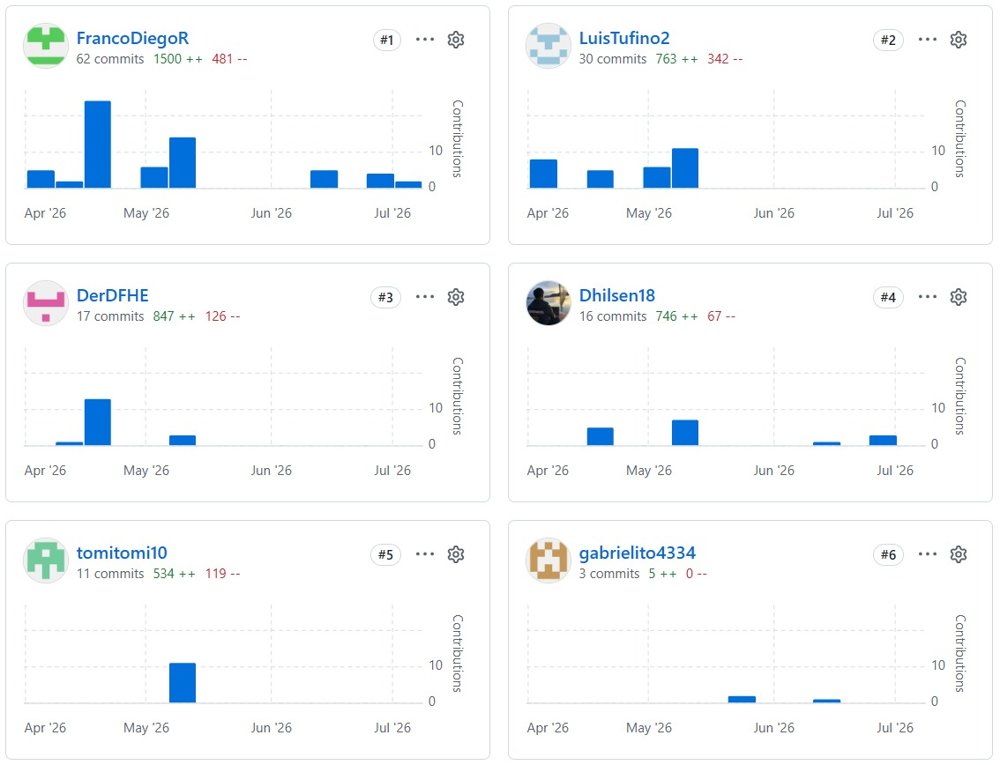
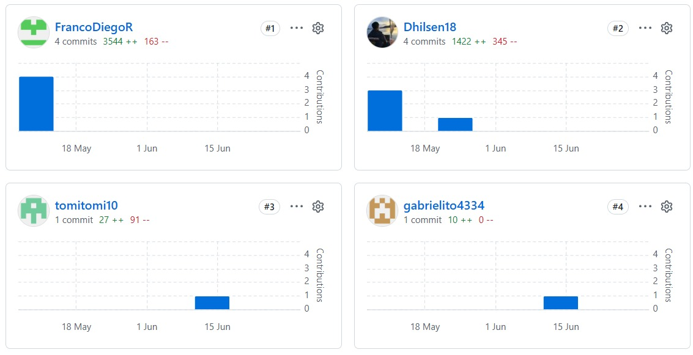
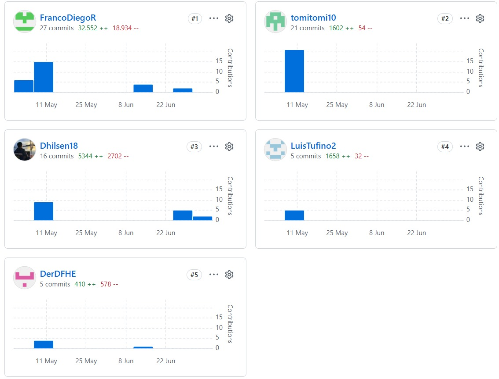
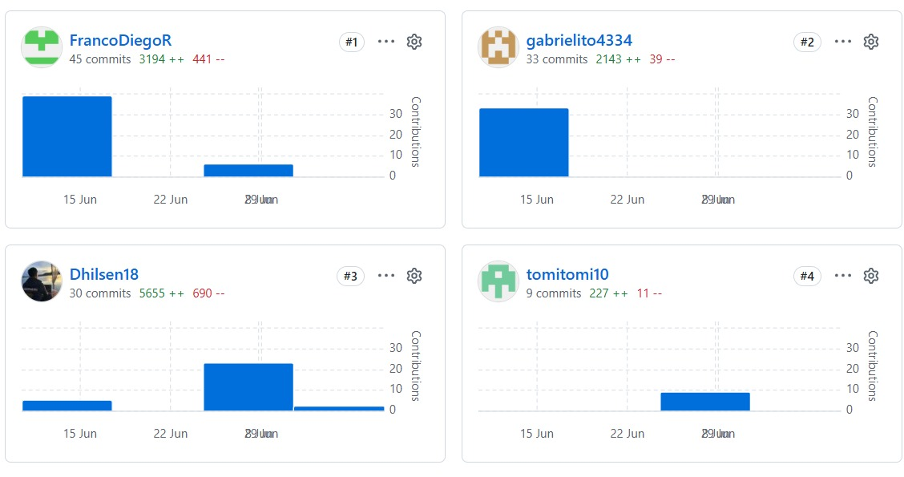
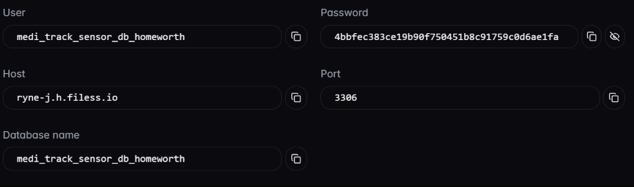
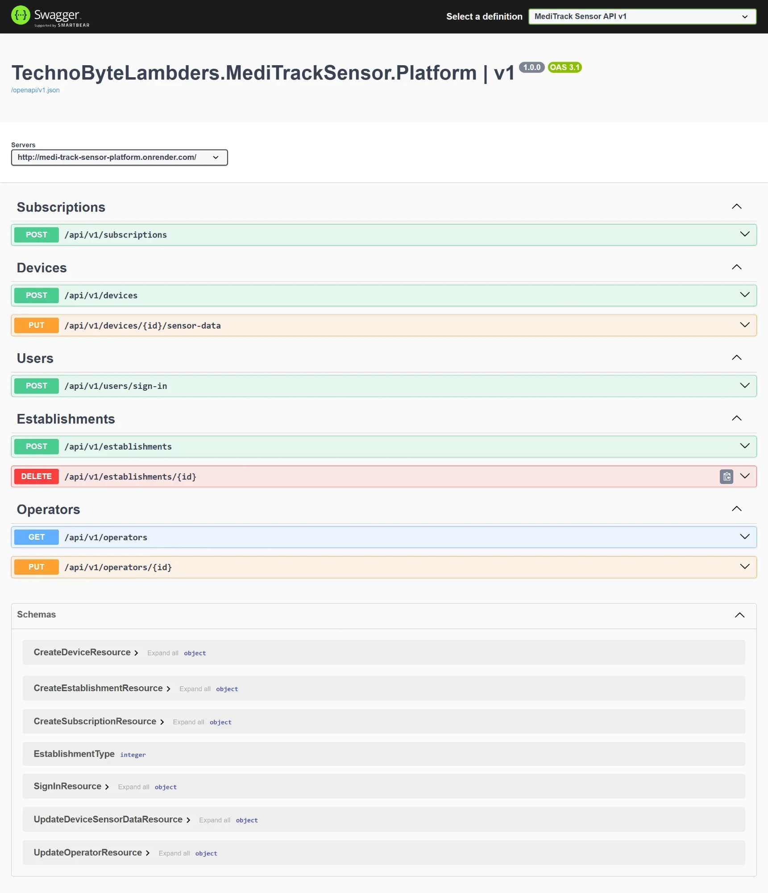
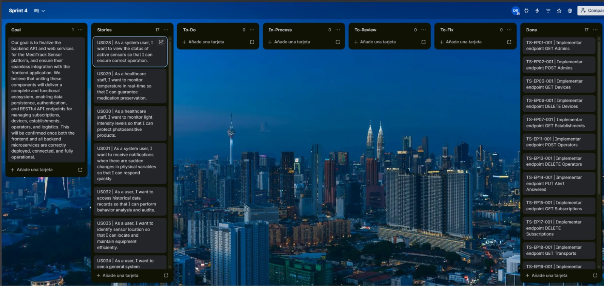

Universidad Peruana de Ciencias Aplicadas

Carrera de Ingeniería de Software

<strong>1ASI0730</strong>

<strong>Aplicaciones Web</strong>

NRC

<strong>12258</strong>

<strong>Informe del Trabajo Final</strong>

Docente

<strong>Velásquez Núñez, Ángel Augusto</strong>

Equipo

<strong>TechnoByteLambders</strong>

Proyecto

<strong>MediTrack Sensor</strong>

<strong>Integrantes</strong>

| Código | Apellidos y Nombres |
|:------:|:-------------------:|
| u202221597 | Rioja Nuñez, Franco Diego |
| u202319440 | Mallqui Vilca, Dhilsen Armil |
| u20231b424 | Montoya Torres, Alexander Gabriel |

<strong>Período 202610</strong>

<strong>Julio 2026</strong>

# Registro de Versiones del Informe

## 1.0 - AV1 (Sprint 1)

| Versión | Fecha      | Autor(es) | Descripción de cambios |
| :--- |:-----------| :--- | :--- |
| 1.01 | 04/04/2026 | Rioja Nuñez, Franco Diego | Creación del reporte en formato Markdown y estructura base. |
| 1.02 | 06/04/2026 | Montoya Torres, Alexander Gabriel | Definición del Startup Profile y planteamiento de la problemática del sector salud. |
| 1.03 | 08/04/2026 | Mallqui Vilca, Dhilsen Armil | Elaboración del Needfinding: User Personas, Journey Maps y análisis de entrevistas. |
| 1.04 | 10/04/2026 | Rioja Nuñez, Franco Diego | Configuración del repositorio en GitHub y definición de la metodología de trabajo. |
| 1.05 | 11/04/2026 | Montoya Torres, Alexander Gabriel | Especificación de requerimientos de software y diseño de las User Stories iniciales. |
| 1.06 | 12/04/2026 | Rioja Nuñez, Franco Diego | Diseño de prototipos de alta fidelidad en Figma y arquitectura visual de la marca. |
| 1.07 | 15/04/2026 | Mallqui Vilca, Dhilsen Armil | Desarrollo de la estructura base de la Landing Page utilizando HTML5 y CSS3. |
| 1.08 | 19/04/2026 | Mallqui Vilca, Dhilsen Armil | Implementación de estilos responsivos y despliegue continuo (CD) en la plataforma Vercel. |
| 1.09 | 23/04/2026 | Rioja Nuñez, Franco Diego | Redacción de la documentación técnica del despliegue y evidencias de colaboración. |
| 1.10 | 24/04/2026 | Rioja Nuñez, Franco Diego | Cierre del AV1. |

---

## 2.0 - TB1 (Sprint 2)

| Versión | Fecha      | Autor(es) | Descripción de cambios |
| :--- |:-----------| :--- | :--- |
| 2.01 | 05/05/2026 | Montoya Torres, Alexander Gabriel | Refactorización y optimización del Capítulo 4: Software Architecture, ajustando diagramas y descripciones técnicas según feedback docente. |
| 2.02 | 10/05/2026 | Mallqui Vilca, Dhilsen Armil | Desarrollo técnico de la capa Frontend del módulo de Monitoreo, implementando el dashboard operacional y la vista de dispositivos IoT. |
| 2.03 | 15/05/2026 | Rioja Nuñez, Franco Diego | Implementación de componentes reutilizables en Vue.js y mejora de la arquitectura modular del frontend. |
| 2.04 | 20/05/2026 | Mallqui Vilca, Dhilsen Armil | Configuración de rutas con lazy-loading y optimización del rendimiento de la aplicación. |
| 2.05 | 23/05/2026 | Rioja Nuñez, Franco Diego | Auditoría técnica y unificación del reporte, supervisando coherencia entre arquitectura y código. |
| 2.06 | 25/05/2026 | Rioja Nuñez, Franco Diego | Cierre del TB1 con integración de cambios en rama develop. |

---

## 3.0 - AV2 (Sprint 3)

| Versión | Fecha      | Autor(es) | Descripción de cambios |
| :--- |:-----------| :--- | :--- |
| 3.01 | 12/06/2026 | Montoya Torres, Alexander Gabriel | Planificación del Sprint 3: definición de arquitectura backend y asignación de módulos por bounded context. |
| 3.02 | 15/06/2026 | Montoya Torres, Alexander Gabriel | Implementación del módulo IAM: endpoints de autenticación y control de acceso con JWT. |
| 3.03 | 16/06/2026 | Montoya Torres, Alexander Gabriel | Diseño e implementación de la base de datos relacional en Filess.io con esquemas optimizados. |
| 3.04 | 17/06/2026 | Mallqui Vilca, Dhilsen Armil | Desarrollo del módulo de Suscripciones: endpoints para gestión de planes y validación de cobros. |
| 3.05 | 18/06/2026 | Montoya Torres, Alexander Gabriel | Implementación del módulo de Establecimientos: endpoints CRUD para gestión de ubicaciones y datos operativos. |
| 3.06 | 19/06/2026 | Rioja Nuñez, Franco Diego | Desarrollo del módulo de Logística: endpoints para transporte y monitoreo de envíos farmacéuticos. |
| 3.07 | 20/06/2026 | Rioja Nuñez, Franco Diego | Configuración de despliegue continuo en Render y establecimiento de pipeline CI/CD. |
| 3.08 | 21/06/2026 | Rioja Nuñez, Franco Diego | Documentación de API mediante Swagger/OpenAPI con especificación completa de endpoints. |
| 3.09 | 22/06/2026 | Rioja Nuñez, Franco Diego | Redacción de Chapter V: Product Implementation, Validation & Deployment con evidencias de Sprint 3. |
| 3.10 | 23/06/2026 | Rioja Nuñez, Franco Diego | Actualización de Student Outcome 5 con acciones y conclusiones del AV2 para todos los integrantes. |
| 3.11 | 25/06/2026 | Rioja Nuñez, Franco Diego | Cierre del AV2 e integración de cambios en rama main. |

---

## 4.0 - TB2 (Sprint 4)

| Versión | Fecha      | Autor(es) | Descripción de cambios |
| :--- |:-----------| :--- | :--- |
| 4.01 | 01/07/2026 | Rioja Nuñez, Franco Diego | Planificación del Sprint 4: definición del objetivo de integración full-stack y asignación de módulos entre el equipo. |
| 4.02 | 02/07/2026 | Montoya Torres, Alexander Gabriel | Finalización de endpoints del backend API y documentación de servicios en Swagger/OpenAPI. |
| 4.03 | 03/07/2026 | Mallqui Vilca, Dhilsen Armil | Integración del frontend con los servicios REST del backend y validación de flujos de autenticación. |
| 4.04 | 04/07/2026 | Montoya Torres, Alexander Gabriel | Optimización de la base de datos y validación de persistencia de datos entre microservicios. |
| 4.05 | 04/07/2026 | Mallqui Vilca, Dhilsen Armil | Despliegue de la versión final del frontend en Vercel con conexión a la API en producción. |
| 4.06 | 05/07/2026 | Rioja Nuñez, Franco Diego | Despliegue final del backend en Render, evidencias de ejecución y documentación del Sprint 4. |
| 4.07 | 05/07/2026 | Rioja Nuñez, Franco Diego | Redacción de Conclusiones finales, Bibliografía, Anexos y actualización de Student Outcome para TB2. |
| 4.08 | 05/07/2026 | Rioja Nuñez, Franco Diego | Cierre del TB2 e integración de cambios en rama main. |

---

# Project Report Collaboration Insights

| Enlace del repositorio del informe del proyecto                                    |
|------------------------------------------------------------------------------------|
| https://github.com/1ASI0730-2610-12258-TBL-MediTrackSensor/MediTrackSensor-Project-Report.git |

A continuación, se brindará un mayor detalle sobre las actividades realizadas en cada entrega, la participación de cada miembro de la startup y las evidencias correspondientes.

## AV1

## Desarrollo del reporte

## Desarrollo de Landing Page

## TB1

## Desarrollo del reporte

## Desarrollo de Landing Page

## Desarrollo del Frontend

## Desarrollo del Backend

## AV2

## Desarrollo del reporte

## Desarrollo de Landing Page

## Desarrollo del Frontend

## Desarrollo del Backend

## TB2

Durante la entrega TB2 (Sprint 4), el equipo de tres integrantes consolidó la integración full-stack y el cierre del ciclo de vida del proyecto.

**Repositorio del informe:** [MediTrackSensor-Project-Report](https://github.com/1ASI0730-2610-12258-TBL-MediTrackSensor/MediTrackSensor-Project-Report)

## Desarrollo del reporte

## Desarrollo de Landing Page

## Desarrollo del Frontend

## Desarrollo del Backend

| Integrante | Repositorio | Contribución principal |
| :--- | :--- | :--- |
| Rioja Nuñez, Franco Diego | Informe / Backend | Sprint Planning 4, despliegue Render, conclusiones y registro de versiones TB2 |
| Mallqui Vilca, Dhilsen Armil | Frontend / Landing | Integración frontend–API, despliegue Vercel de la Web Application |
| Montoya Torres, Alexander Gabriel | Backend | Finalización de endpoints, base de datos Filess.io y documentación Swagger |

**Productos desplegados en producción:**

- Landing Page: https://meditrack-sensor.vercel.app/
- Frontend: https://medi-track-sensor-frontend.vercel.app/login
- Backend API: https://medi-track-sensor-platform.onrender.com/swagger/index.html

---

---

# Contenido

- [Registro de Versiones del Informe](#registro-de-versiones-del-informe)
  - [1.0 - AV1 (Sprint 1)](#10---av1-sprint-1)
  - [2.0 - TB1 (Sprint 2)](#20---tb1-sprint-2)
  - [3.0 - AV2 (Sprint 3)](#30---av2-sprint-3)
  - [4.0 - TB2 (Sprint 4)](#40---tb2-sprint-4)
- [Project Report Collaboration Insights](#project-report-collaboration-insights)
  - [AV1](#av1)
  - [Desarrollo del reporte](#desarrollo-del-reporte)
  - [Desarrollo de Landing Page](#desarrollo-de-landing-page)
  - [TB1](#tb1)
  - [Desarrollo del reporte](#desarrollo-del-reporte-1)
  - [Desarrollo de Landing Page](#desarrollo-de-landing-page-1)
  - [Desarrollo del Frontend](#desarrollo-del-frontend)
  - [Desarrollo del Backend](#desarrollo-del-backend)
  - [AV2](#av2)
  - [Desarrollo del reporte](#desarrollo-del-reporte-2)
  - [Desarrollo de Landing Page](#desarrollo-de-landing-page-2)
  - [Desarrollo del Frontend](#desarrollo-del-frontend-1)
  - [Desarrollo del Backend](#desarrollo-del-backend-1)
  - [TB2](#tb2)
  - [Desarrollo del reporte](#desarrollo-del-reporte-3)
  - [Desarrollo de Landing Page](#desarrollo-de-landing-page-3)
  - [Desarrollo del Frontend](#desarrollo-del-frontend-2)
  - [Desarrollo del Backend](#desarrollo-del-backend-2)
- [Student Outcome](#student-outcome)
      - [5.2.2. ABET Student Outcome 5: Teamwork](#522-abet-student-outcome-5-teamwork)
- [Capítulo I: Introducción](#capítulo-i-introducción)
  - [1.1. Startup Profile](#11-startup-profile)
    - [1.1.1. Descripción de la Startup](#111-descripción-de-la-startup)
    - [1.1.2. Perfiles de integrantes del equipo](#112-perfiles-de-integrantes-del-equipo)
  - [1.2. Solution Profile](#12-solution-profile)
    - [1.2.1. Antecedentes y problemática](#121-antecedentes-y-problemática)
    - [Contexto del mercado y oportunidad](#contexto-del-mercado-y-oportunidad)
      - [Who (¿Quiénes son los involucrados?)](#who-quiénes-son-los-involucrados)
      - [What (¿Qué se necesita?)](#what-qué-se-necesita)
      - [Where (¿Dónde ocurre el problema?)](#where-dónde-ocurre-el-problema)
      - [When (¿Cuándo surge esta necesidad?)](#when-cuándo-surge-esta-necesidad)
      - [Why (¿Por qué existe esta necesidad?)](#why-por-qué-existe-esta-necesidad)
      - [How (¿Cómo se manifiesta el problema?)](#how-cómo-se-manifiesta-el-problema)
      - [How Much (¿Cuánto cuesta o qué magnitud tiene el problema?)](#how-much-cuánto-cuesta-o-qué-magnitud-tiene-el-problema)
    - [Descripción de la Solución Propuesta](#descripción-de-la-solución-propuesta)
  - [1.2.2. Lean UX Process](#122-lean-ux-process)
    - [1.2.2.1. Lean UX Problem Statements](#1221-lean-ux-problem-statements)
      - [**Problem Statement 1 — Personal encargado de almacenes farmacéuticos**](#problem-statement-1--personal-encargado-de-almacenes-farmacéuticos)
      - [**Problem Statement 2 — Personal de salud y entidades regulatorias**](#problem-statement-2--personal-de-salud-y-entidades-regulatorias)
    - [1.2.2.2. Lean UX Assumptions](#1222-lean-ux-assumptions)
      - [Supuestos de Negocio](#supuestos-de-negocio)
      - [Supuestos de Usuario](#supuestos-de-usuario)
      - [Supuestos de Tecnología](#supuestos-de-tecnología)
      - [Supuestos del Mercado](#supuestos-del-mercado)
      - [1.2.2.3. Lean UX Hypothesis Statements](#1223-lean-ux-hypothesis-statements)
    - [1.2.2.4. Lean UX Canvas](#1224-lean-ux-canvas)
    - [8. What’s the least amount of work we need to do to learn the next most important thing?](#8-whats-the-least-amount-of-work-we-need-to-do-to-learn-the-next-most-important-thing)
  - [1.3. Segmentos objetivo](#13-segmentos-objetivo)
- [Capítulo II: Requirements Elicitation & Analysis](#capítulo-ii-requirements-elicitation--analysis)
  - [2.1. Competidores](#21-competidores)
    - [2.1.1. Análisis competitivo](#211-análisis-competitivo)
    - [2.1.2. Estrategias y tácticas frente a competidores](#212-estrategias-y-tácticas-frente-a-competidores)
  - [2.2. Entrevistas](#22-entrevistas)
    - [2.2.1. Diseño de entrevistas](#221-diseño-de-entrevistas)
    - [2.2.2. Registro de entrevistas](#222-registro-de-entrevistas)
      - [Segmento 01](#segmento-01)
      - [Segmento 02](#segmento-02)
    - [2.2.3. Análisis de entrevistas](#223-análisis-de-entrevistas)
    - [Segmento 01: Personal operativo de almacenes farmacéuticos](#segmento-01-personal-operativo-de-almacenes-farmacéuticos)
      - [Características objetivas:](#características-objetivas)
      - [Características subjetivas:](#características-subjetivas)
    - [Segmento 02: Gestores y responsables de farmacia en instituciones de salud](#segmento-02-gestores-y-responsables-de-farmacia-en-instituciones-de-salud)
      - [Características objetivas:](#características-objetivas-1)
      - [Características subjetivas:](#características-subjetivas-1)
  - [2.3. Needfinding](#23-needfinding)
    - [2.3.1. User Personas](#231-user-personas)
    - [2.3.2. User Task Matrix](#232-user-task-matrix)
    - [Matriz de Tareas: Luis Mendoza (El Guardián Operativo)](#matriz-de-tareas-luis-mendoza-el-guardián-operativo)
    - [Matriz de Tareas: Omar Ruiz (El Gestor de Cumplimiento)](#matriz-de-tareas-omar-ruiz-el-gestor-de-cumplimiento)
    - [2.3.3. User Journey Mapping](#233-user-journey-mapping)
    - [2.3.4. Empathy Mapping](#234-empathy-mapping)
    - [2.3.5. As-is Scenario Maps](#235-as-is-scenario-maps)
    - [2.3.6. To-be Scenario Maps](#236-to-be-scenario-maps)
  - [2.4. Big Picture EventStorming](#24-big-picture-eventstorming)
  - [2.5. Ubiquitous Language](#25-ubiquitous-language)
  - [1. Monitoring Core (Núcleo de Monitoreo)](#1-monitoring-core-núcleo-de-monitoreo)
  - [2. Conservation & Quality (Conservación y Calidad)](#2-conservation--quality-conservación-y-calidad)
  - [3. Alerts & Remediation (Alertas y Remediación)](#3-alerts--remediation-alertas-y-remediación)
  - [4. Organization & Actors (Organización y Actores)](#4-organization--actors-organización-y-actores)
- [Capítulo III: Requirements Specification](#capítulo-iii-requirements-specification)
  - [3.1. User Stories](#31-user-stories)
      - [Epics](#epics)
  - [3.2. Impact Mapping](#32-impact-mapping)
  - [3.3. Product Backlog](#33-product-backlog)
- [Capítulo IV: Product Design](#capítulo-iv-product-design)
  - [4.1. Style Guidelines](#41-style-guidelines)
    - [4.1.1. General Style Guidelines](#411-general-style-guidelines)
    - [Colors](#colors)
      - [Colores Principales de Marca](#colores-principales-de-marca)
      - [Paleta Funcional de Metricas](#paleta-funcional-de-metricas)
      - [Gama de Apoyo y Estados](#gama-de-apoyo-y-estados)
    - [4.1.2. Web Style Guidelines](#412-web-style-guidelines)
    - [4.2.1. Organization Systems](#421-organization-systems)
      - [Organización Visual del Contenido](#organización-visual-del-contenido)
    - [4.2.2. Labeling Systems](#422-labeling-systems)
    - [4.2.3. SEO Tags and Meta Tags](#423-seo-tags-and-meta-tags)
    - [4.2.4. Searching Systems](#424-searching-systems)
      - [Búsqueda y filtros en monitoreo de almacenes](#búsqueda-y-filtros-en-monitoreo-de-almacenes)
      - [Búsqueda en módulos adicionales](#búsqueda-en-módulos-adicionales)
      - [Flujo de búsqueda**](#flujo-de-búsqueda)
    - [4.2.5. Navigation Systems](#425-navigation-systems)
      - [Navegación en la Landing Page](#navegación-en-la-landing-page)
      - [Navegación en la Web Application](#navegación-en-la-web-application)
      - [Interacción con el sistema](#interacción-con-el-sistema)
  - [4.3. Landing Page UI Design](#43-landing-page-ui-design)
    - [4.3.1. Landing Page Wireframe](#431-landing-page-wireframe)
    - [4.3.2. Landing Page Mock-up](#432-landing-page-mock-up)
  - [4.4. Web Applications UX/UI Design](#44-web-applications-uxui-design)
    - [4.4.1. Web Applications Wireframes](#441-web-applications-wireframes)
    - [4.4.2. Web Applications Wireflow Diagrams](#442-web-applications-wireflow-diagrams)
    - [4.4.3. Web Applications Mock-ups](#443-web-applications-mock-ups)
    - [🔹 Mockups de Autenticación y Gestión de Cuenta](#-mockups-de-autenticación-y-gestión-de-cuenta)
    - [🔹 Mockups del Dashboard y Home](#-mockups-del-dashboard-y-home)
    - [🔹 Gestión de Dispositivos y Sensores](#-gestión-de-dispositivos-y-sensores)
    - [🔹 Gestión de Transporte](#-gestión-de-transporte)
    - [🔹 Gestión de Sedes e Instituciones](#-gestión-de-sedes-e-instituciones)
    - [🔹 Perfil y Configuración](#-perfil-y-configuración)
    - [🔹 Planes y Pagos](#-planes-y-pagos)
    - [🔹 Gestión Operativa y Supervisión](#-gestión-operativa-y-supervisión)
    - [4.4.4. Web Applications User Flow Diagrams](#444-web-applications-user-flow-diagrams)
    - [🔹 User Flow – Login Entidades](#-user-flow--login-entidades)
    - [🔹 User Flow – Login Personal](#-user-flow--login-personal)
    - [🔹 User Flow – Editar Perfil Entidades](#-user-flow--editar-perfil-entidades)
    - [🔹 User Flow – Editar Perfil Personal](#-user-flow--editar-perfil-personal)
  - [4.5. Web Applications Prototyping](#45-web-applications-prototyping)
  - [4.6. Domain-Driven Software Architecture](#46-domain-driven-software-architecture)
    - [4.6.1. Design-Level EventStorming](#461-design-level-eventstorming)
    - [4.6.2. Software Architecture Context Diagram](#462-software-architecture-context-diagram)
    - [4.6.3. Software Architecture Container Diagrams](#463-software-architecture-container-diagrams)
    - [4.6.4. Software Architecture Components Diagrams](#464-software-architecture-components-diagrams)
  - [4.7. Software Object-Oriented Design](#47-software-object-oriented-design)
    - [4.7.1. Class Diagrams](#471-class-diagrams)
      - [**1. Arquitectura de Usuarios y Gestión de Acceso (Herencia)**](#1-arquitectura-de-usuarios-y-gestión-de-acceso-herencia)
      - [**2. Núcleo Operativo: Establishments y Organización**](#2-núcleo-operativo-establishments-y-organización)
      - [**3. Monitoreo IoT y Telemetría: Devices y Transports**](#3-monitoreo-iot-y-telemetría-devices-y-transports)
      - [**4. Ciclo de Vida Comercial: Subscriptions**](#4-ciclo-de-vida-comercial-subscriptions)
  - [4.8. Database Design](#48-database-design)
    - [4.8.1. Database Diagrams](#481-database-diagrams)
      - [**1. Gestión de Identidad y Seguridad (Users, Admins, Operators)**](#1-gestión-de-identidad-y-seguridad-users-admins-operators)
      - [**2. Arquitectura de Infraestructura (Establishments)**](#2-arquitectura-de-infraestructura-establishments)
      - [**3. Motor de Telemetría IoT (Devices y Transports)**](#3-motor-de-telemetría-iot-devices-y-transports)
      - [**4. Gobernanza Comercial (Subscriptions)**](#4-gobernanza-comercial-subscriptions)
- [Capítulo V: Product Implementation, Validation & Deployment](#capítulo-v-product-implementation-validation--deployment)
  - [5.1. Software Configuration Management](#51-software-configuration-management)
    - [5.1.1. Software Development Environment Configuration](#511-software-development-environment-configuration)
    - [5.1.2. Source Code Management](#512-source-code-management)
    - [GitFlow Workflow](#gitflow-workflow)
    - [Conventional Commits](#conventional-commits)
    - [5.1.3. Source Code Style Guide & Conventions](#513-source-code-style-guide--conventions)
    - [5.1.4. Software Deployment Configuration](#514-software-deployment-configuration)
  - [5.2. Landing Page, Services & Applications Implementation](#52-landing-page-services--applications-implementation)
    - [5.2.1. Sprint 1](#521-sprint-1)
      - [5.2.1.1. Sprint Planning 1](#5211-sprint-planning-1)
      - [5.2.1.2. Aspect Leaders and Collaborators](#5212-aspect-leaders-and-collaborators)
      - [5.2.1.3. Sprint Backlog 1](#5213-sprint-backlog-1)
      - [5.2.1.4. Development Evidence for Sprint Review](#5214-development-evidence-for-sprint-review)
      - [5.2.1.5. Execution Evidence for Sprint Review](#5215-execution-evidence-for-sprint-review)
      - [5.2.1.6. Services Documentation Evidence for Sprint Review](#5216-services-documentation-evidence-for-sprint-review)
      - [5.2.1.7. Software Deployment Evidence for Sprint Review](#5217-software-deployment-evidence-for-sprint-review)
    - [Paso 1: Se agregó el proyecto](#paso-1-se-agregó-el-proyecto)
    - [Paso 2: Se agregó el repositorio](#paso-2-se-agregó-el-repositorio)
    - [Paso 3: Se hace deploy con html, css y javascript](#paso-3-se-hace-deploy-con-html-css-y-javascript)
      - [5.2.1.8. Team Collaboration Insights during Sprint](#5218-team-collaboration-insights-during-sprint)
    - [5.2.2. Sprint 2](#522-sprint-2)
      - [5.2.2.1. Sprint Planning 2](#5221-sprint-planning-2)
      - [5.2.2.2. Aspect Leaders and Collaborators](#5222-aspect-leaders-and-collaborators)
      - [5.2.2.3. Sprint Backlog 2.](#5223-sprint-backlog-2)
      - [5.2.2.4. Development Evidence for Sprint Review](#5224-development-evidence-for-sprint-review)
      - [5.2.2.5. Execution Evidence for Sprint Review](#5225-execution-evidence-for-sprint-review)
      - [5.2.2.6. Services Documentation Evidence for Sprint Review](#5226-services-documentation-evidence-for-sprint-review)
      - [5.2.2.7. Software Deployment Evidence for Sprint Review](#5227-software-deployment-evidence-for-sprint-review)
      - [5.2.2.8. Team Collaboration Insights during Sprint](#5228-team-collaboration-insights-during-sprint)
    - [5.2.3. Sprint 3](#523-sprint-3)
      - [5.2.3.1. Sprint Planning 3](#5231-sprint-planning-3)
      - [5.2.3.2. Aspect Leaders and Collaborators](#5232-aspect-leaders-and-collaborators)
      - [5.2.3.3. Sprint Backlog 3](#5233-sprint-backlog-3)
      - [5.2.3.4. Development Evidence for Sprint Review](#5234-development-evidence-for-sprint-review)
      - [5.2.3.5. Execution Evidence for Sprint Review](#5235-execution-evidence-for-sprint-review)
      - [5.2.3.6. Services Documentation Evidence for Sprint Review](#5236-services-documentation-evidence-for-sprint-review)
      - [5.2.3.7. Software Deployment Evidence for Sprint Review](#5237-software-deployment-evidence-for-sprint-review)
      - [5.2.3.8. Team Collaboration Insights during Sprint](#5238-team-collaboration-insights-during-sprint)
    - [5.2.4. Sprint 4](#524-sprint-4)
      - [5.2.4.1. Sprint Planning 4](#5241-sprint-planning-4)
      - [5.2.4.2. Aspect Leaders and Collaborators](#5242-aspect-leaders-and-collaborators)
      - [5.2.4.3. Sprint Backlog 4](#5243-sprint-backlog-4)
      - [5.2.4.4. Development Evidence for Sprint Review](#5244-development-evidence-for-sprint-review)
      - [5.2.4.5. Execution Evidence for Sprint Review](#5245-execution-evidence-for-sprint-review)
      - [5.2.4.6. Services Documentation Evidence for Sprint Review](#5246-services-documentation-evidence-for-sprint-review)
      - [5.2.4.7. Software Deployment Evidence for Sprint Review](#5247-software-deployment-evidence-for-sprint-review)
      - [5.2.4.8. Team Collaboration Insights during Sprint](#5248-team-collaboration-insights-during-sprint)
  - [5.3. Validation Interviews](#53-validation-interviews)
    - [5.3.1. Diseño de Entrevistas](#531-diseño-de-entrevistas)
    - [5.3.2. Registro de Entrevistas](#532-registro-de-entrevistas)
      - [Segmento 01: Personal operativo de almacenes farmacéuticos](#segmento-01-personal-operativo-de-almacenes-farmacéuticos-1)
      - [Segmento 02: Gestores y responsables de farmacia en instituciones de salud](#segmento-02-gestores-y-responsables-de-farmacia-en-instituciones-de-salud-1)
    - [5.3.3. Evaluaciones según heurísticas](#533-evaluaciones-según-heurísticas)
  - [5.4. Video About-the-Product](#54-video-about-the-product)
- [Conclusiones](#conclusiones)
  - [Conclusiones y recomendaciones](#conclusiones-y-recomendaciones)
    - [Conclusiones](#conclusiones-1)
    - [Recomendaciones y roadmap](#recomendaciones-y-roadmap)
  - [Video About-the-Team](#video-about-the-team)
- [Bibliografía](#bibliografía)
- [Anexos](#anexos)
  - [Anexo A. Recopilación de entrevistas de descubrimiento](#anexo-a-recopilación-de-entrevistas-de-descubrimiento)
  - [Anexo B. Videos de Exposiciones](#anexo-b-videos-de-exposiciones)
  - [Anexo D. Videos de entrevistas de validación (TB2)](#anexo-d-videos-de-entrevistas-de-validación-tb2)
  - [Anexo C. URLs de productos digitales en producción](#anexo-c-urls-de-productos-digitales-en-producción)

# Student Outcome

El curso contribuye al cumplimiento del Student Outcome ABET:

**ABET – EAC - Student Outcome 5**
Criterio: La capacidad de funcionar efectivamente en un
equipo cuyos miembros juntos proporcionan liderazgo, crean un entorno de
colaboración e inclusivo, establecen objetivos, planifican tareas y cumplen objetivos

#### 5.2.2. ABET Student Outcome 5: Teamwork

| Criterio específico | Acciones realizadas | Conclusiones |
| :--- | :--- | :--- |
| **Trabaja en equipo para proporcionar liderazgo en forma conjunta.** | **Rioja Nuñez, Franco Diego** **AV1:** Lideró el diseño de la interfaz de la aplicación web en Figma y supervisó la integración estética con el código de la Landing Page. **TB1:** Lideró la implementación de componentes reutilizables en Vue.js para la vista de dispositivos, asegurando la consistencia del diseño premium. **AV2:** Lideró la coordinación de la arquitectura general del backend, la integración de módulos de logística y el despliegue de servicios web en Render. **TB2:** Lideró la planificación del Sprint 4, el despliegue final del backend y la consolidación del informe con conclusiones y evidencias de integración full-stack.  **Mallqui Vilca, Dhilsen Armil** **AV1:** Lideró el desarrollo técnico y la estructuración de contenido de la Landing Page. **TB1:** Lideró la estructuración de la arquitectura modular del frontend, el módulo de monitoreo y la implementación de servicios compartidos para la gestión de datos. **AV2:** Lideró el módulo de suscripciones y la implementación de endpoints críticos para la gestión de planes de usuarios. **TB2:** Lideró la integración del frontend con los servicios REST del backend y el despliegue final de la aplicación web en Vercel.  **Montoya Torres, Alexander Gabriel** **AV1:** Lideró la definición del Startup Profile, la problemática del sector salud y la especificación de User Stories iniciales. **TB1:** Lideró la refactorización del Capítulo 4 de arquitectura de software y la optimización de diagramas técnicos según feedback docente. **AV2:** Lideró la arquitectura backend, el módulo IAM, el diseño de la base de datos relacional y el módulo de establecimientos. **TB2:** Lideró la finalización de endpoints del backend API, la documentación Swagger y la optimización de persistencia de datos. | **Rioja Nuñez, Franco Diego** **AV1:** El liderazgo en diseño UI/UX sentó las bases visuales que el equipo desarrolló en sprints posteriores. **TB1:** El liderazgo en la creación de componentes modulares facilitó la integración fluida de nuevas funcionalidades en el frontend de la aplicación. **AV2:** El liderazgo coordinado en arquitectura backend y despliegue permitió que múltiples módulos se desarrollen en paralelo sin conflictos de integración. **TB2:** La coordinación en el cierre del proyecto aseguró la entrega de un ecosistema full-stack funcional y documentado.  **Mallqui Vilca, Dhilsen Armil** **AV1:** El liderazgo técnico en la Landing Page estableció estándares de calidad que el equipo replicó en el frontend. **TB1:** La coordinación técnica en la arquitectura modular evitó conflictos en el repositorio y permitió un desarrollo paralelo eficiente entre los miembros del equipo. **AV2:** La implementación del módulo de suscripciones en backend consolida la estrategia de monetización del producto. **TB2:** La integración frontend-backend validó que el producto cumple con los flujos operativos definidos en los sprints anteriores.  **Montoya Torres, Alexander Gabriel** **AV1:** El liderazgo en definición de requisitos y startup profile orientó las decisiones técnicas de todo el proyecto. **TB1:** La mejora del Capítulo 4 alineó la arquitectura documentada con la implementación real del sistema. **AV2:** El diseño riguroso de la base de datos y la arquitectura IAM proporcionan la estructura necesaria para que todos los módulos backend funcionen de manera eficiente. **TB2:** La finalización de la API y su documentación garantiza la mantenibilidad y escalabilidad del sistema en producción. |
| **Crea un entorno colaborativo e inclusivo, establece metas, planifica tareas y cumple objetivos.** | **Rioja Nuñez, Franco Diego** **AV1:** Planificó las tareas de diseño en el Sprint Backlog y colaboró en el despliegue de la solución en Vercel. **TB1:** Planificó las tareas de estilización responsiva y cumplió con la meta de despliegue continuo de las nuevas vistas de monitoreo. **AV2:** Planificó las tareas de integración entre frontend y backend, estableciendo metas de deployment en Render y cumpliendo con la meta de despliegue de servicios web. **TB2:** Planificó el Sprint 4, estableció metas de integración full-stack y cumplió con la entrega final del informe y productos digitales.  **Mallqui Vilca, Dhilsen Armil** **AV1:** Planificó la implementación de las secciones de la Landing y cumplió con el objetivo de realizar el despliegue mediante GitHub y Vercel. **TB1:** Planificó la configuración de rutas con lazy-loading para optimizar el rendimiento y cumplió con la integración del módulo de monitoreo. **AV2:** Planificó la implementación del módulo de suscripciones en backend y cumplió con la meta de crear endpoints para gestión de planes. **TB2:** Planificó la conexión del frontend con la API en producción y cumplió con la meta de despliegue final en Vercel.  **Montoya Torres, Alexander Gabriel** **AV1:** Estableció las metas generales del Sprint 1, definió la problemática del sector salud y planificó las User Stories iniciales. **TB1:** Planificó la mejora del Capítulo 4 de arquitectura y cumplió con la meta de alinear diagramas técnicos con el feedback docente. **AV2:** Planificó la arquitectura backend, el módulo IAM y el diseño de base de datos, cumpliendo con objetivos de seguridad y persistencia. **TB2:** Planificó la finalización de endpoints pendientes y cumplió con la meta de documentar todos los servicios en Swagger. | **Rioja Nuñez, Franco Diego** **AV1:** La planificación colaborativa del Sprint 1 fomentó un entorno inclusivo donde cada integrante aportó según su especialidad. **TB1:** El uso de herramientas de despliegue continuo fomentó un entorno de retroalimentación inmediata sobre el progreso visual del frontend. **AV2:** La planificación colaborativa en deployment aseguró una transición exitosa del código a producción en Render y Filess.io. **TB2:** La planificación del cierre del ciclo de vida del proyecto permitió cumplir con todos los entregables de la entrega final.  **Mallqui Vilca, Dhilsen Armil** **AV1:** El cumplimiento de metas de la Landing Page demostró la capacidad del equipo para entregar valor desde el primer sprint. **TB1:** El cumplimiento de metas de arquitectura técnica refuerza la confianza del equipo en la capacidad de entrega y escalabilidad de la startup. **AV2:** La implementación planificada del módulo de suscripciones asegura que los objetivos de monetización sean alcanzables técnicamente. **TB2:** La validación de flujos de autenticación en producción confirma la coherencia entre frontend y backend.  **Montoya Torres, Alexander Gabriel** **AV1:** La definición clara de metas y User Stories en el Sprint 1 creó un marco colaborativo para las entregas posteriores. **TB1:** La mejora planificada del Capítulo 4 fortaleció la documentación técnica compartida del equipo. **AV2:** La planificación rigurosa del diseño de base de datos proporciona una estructura confiable que soporta el desarrollo paralelo de múltiples módulos. **TB2:** La documentación completa de la API en Swagger facilita la colaboración técnica y la validación de servicios por parte del equipo. |

# Capítulo I: Introducción

## 1.1. Startup Profile

### 1.1.1. Descripción de la Startup
Somos el equipo **MediTrack**, un grupo de estudiantes de la Universidad Peruana de Ciencias Aplicadas comprometidos con el uso de la tecnología para mejorar la conservación y monitoreo de medicamentos en el sector salud, enfocados en el desarrollo de soluciones innovadoras orientadas al control de condiciones ambientales en el Perú.
Nuestra misión es diseñar soluciones tecnológicas que permitan garantizar el almacenamiento adecuado de medicamentos mediante el monitoreo en tiempo real de variables como temperatura, humedad y luz, mejorando la seguridad, la eficiencia y la toma de decisiones en organizaciones del sector salud.
Nuestra visión es contribuir a la modernización de la gestión del almacenamiento y transporte de medicamentos en el país, impulsando el uso de tecnologías como IoT y plataformas digitales para lograr un control más eficiente, confiable y basado en datos.
Nuestro producto principal es MediTrack Sensor, una plataforma web que permite a clínicas, farmacias, hospitales y entidades de distribución supervisar en tiempo real las condiciones ambientales de los medicamentos, generando alertas, almacenando datos históricos y facilitando la gestión de la conservación. Esta solución reemplaza procesos manuales y limitados, ofreciendo un sistema centralizado que mejora la trazabilidad y reduce riesgos en la calidad de los productos farmacéuticos.

### 1.1.2. Perfiles de integrantes del equipo

| Código     | Descripción | Foto |
|:-----------|:---|:---|
| U20221587  | **Franco Diego Rioja Nuñez**  Ingeniería de Software  Tengo 21 años y actualmente curso el séptimo ciclo de la carrera. Me considero una persona proactiva y comprometida en el desarrollo de proyectos, además de ser colaborativa y atenta a las necesidades y problemas de mis compañeros de equipo. En paralelo, me encuentro llevando cursos de especialización en Análisis de Datos, con el objetivo de ampliar mi perfil profesional. |  |
| U202419440 | **Dhilsen Armil Mallqui Vilca**  Ingeniería de Software  Estudiante de Ingeniería de Software enfocado en el desarrollo de soluciones tecnológicas escalables. Me interesa la implementación de buenas prácticas de programación y el despliegue continuo. Soy una persona colaborativa, orientada al aprendizaje constante y al cumplimiento de los hitos técnicos del equipo. |  |
| U20231b424 | **Alexander Gabriel Montoya Torres**  Ingeniería de Software  Soy estudiante de Ingeniería de Software en la UPC, tengo 20 años. Manejo lenguajes como C++, MySQL, Python, HTML y CSS. Me gusta dedicar esfuerzo a todo lo que hago, tanto en lo académico como en mis hobbies. Busco seguir desarrollando habilidades profesionales y personales. |  |

## 1.2. Solution Profile

### 1.2.1. Antecedentes y problemática

### Contexto del mercado y oportunidad

En el Perú, el sector salud enfrenta desafíos en la gestión del almacenamiento de medicamentos, como se evidencia en el caso del Hospital I de Tingo María, donde los medicamentos se encontraron almacenados en condiciones inadecuadas, expuestos al sol y sin control adecuado de temperatura y humedad. Este problema, común en muchas instituciones de salud, compromete la eficacia y seguridad de los medicamentos.
Actualmente, existe una oportunidad de mercado para soluciones tecnológicas que mejoren la eficiencia operativa del sector salud. Aunque algunas herramientas en el mercado abordan aspectos como inventarios o facturación, pocas resuelven el problema central: la falta de visibilidad en tiempo real sobre las condiciones críticas de almacenamiento.
Con la creciente necesidad de digitalización en el sector, especialmente a través de iniciativas como las del Ministerio de Salud, las soluciones basadas en sensores IoT ofrecen una oportunidad única para mejorar el monitoreo y control de las condiciones de conservación de los medicamentos, asegurando su efectividad y reduciendo riesgos operativos.
---
#### Who (¿Quiénes son los involucrados?)
Los principales involucrados en esta problemática son los hospitales, clínicas, farmacias, almacenes farmacéuticos, distribuidores de medicamentos y entidades del Estado encargadas de la regulación y distribución de medicamentos en el Perú. Los pacientes son también actores clave, ya que dependen de que los medicamentos sean almacenados y transportados en condiciones óptimas para garantizar su efectividad y seguridad.

#### What (¿Qué se necesita?)
Se necesita un sistema tecnológico que permita monitorear en tiempo real las condiciones de almacenamiento y transporte de los **medicamentos**, específicamente variables críticas como la temperatura, la humedad y la exposición a la luz. Este sistema debe utilizar sensores IoT para asegurar que los medicamentos mantengan sus propiedades y no sufran deterioro debido a condiciones de almacenamiento inadecuadas.

#### Where (¿Dónde ocurre el problema?)
El problema ocurre principalmente en los hospitales, clínicas, almacenes farmacéuticos y centros de distribución de medicamentos a nivel nacional, especialmente en zonas de provincias como Tingo María y en áreas de difícil acceso donde la infraestructura de almacenamiento no es adecuada para garantizar el control de los medicamentos. Este problema también se extiende a los procesos de transporte, donde los medicamentos pueden ser expuestos a condiciones no ideales sin monitoreo efectivo.

#### When (¿Cuándo surge esta necesidad?)
Esta necesidad surge de manera constante durante todo el proceso de almacenamiento y distribución de medicamentos. Desde que los productos son almacenados hasta que son transportados a su destino final, existe la necesidad continua de monitorear las condiciones ambientales para evitar que los medicamentos sufran alteraciones que puedan comprometer su seguridad y efectividad.

#### Why (¿Por qué existe esta necesidad?)
La problemática existe debido a la falta de infraestructura adecuada en muchos almacenes y hospitales, junto con la carencia de sistemas automatizados de monitoreo de condiciones. Esto ha provocado incidentes de almacenamiento inadecuado, como la exposición a temperaturas o humedades fuera de rango, lo que compromete la calidad de los medicamentos. Además, la dependencia de procesos manuales y la ausencia de tecnologías de monitoreo en tiempo real incrementan el riesgo de pérdida de productos y desabastecimiento.

#### How (¿Cómo se manifiesta el problema?)
El problema se manifiesta en el almacenamiento de medicamentos en condiciones no controladas, como la exposición al sol, humedad excesiva, polvo, o el almacenamiento en espacios no adecuados. También se evidencia la falta de un sistema automatizado que controle y ajuste en tiempo real estos parámetros, lo que obliga a depender de procesos manuales y poco confiables. Esto aumenta el riesgo de que los medicamentos se deterioren o pierdan su efectividad, poniendo en peligro la salud de los pacientes.

#### How Much (¿Cuánto cuesta o qué magnitud tiene el problema?)
El impacto económico de este problema es significativo, dado que el almacenamiento inadecuado de medicamentos genera pérdidas debido al deterioro de productos que no pueden ser utilizados. Además, esta situación afecta la salud de los pacientes, ya que los medicamentos deteriorados pueden resultar ineficaces o incluso peligrosos. La magnitud del problema es considerable a nivel nacional, afectando tanto a las entidades públicas como privadas, lo que resalta la urgente necesidad de implementar soluciones tecnológicas que permitan garantizar la trazabilidad y conservación de los medicamentos.

---

### Descripción de la Solución Propuesta

El producto propuesto consiste en un sistema de monitoreo en tiempo real utilizando sensores IoT que permiten controlar y registrar las condiciones ambientales de almacenamiento y transporte de los **medicamentos**. Estos sensores medirán constantemente parámetros como temperatura, humedad y exposición a la luz, proporcionando alertas inmediatas si alguno de estos valores se desvía de los rangos recomendados para la correcta conservación de los medicamentos.

Este sistema automatizado facilitará la gestión de los productos farmacéuticos a lo largo de toda la cadena de suministro, desde el almacenamiento en los almacenes hasta el transporte y distribución. A través de la integración de tecnologías de monitoreo avanzadas, el sistema asegura que los medicamentos se mantengan en condiciones óptimas, evitando el deterioro y mejorando la trazabilidad, lo que reducirá el riesgo de pérdidas económicas y contribuirá a la seguridad de los pacientes.

## 1.2.2. Lean UX Process

### 1.2.2.1. Lean UX Problem Statements

#### **Problem Statement 1 — Personal encargado de almacenes farmacéuticos**

**Contexto:**
En el sector salud en Perú, hospitales y centros de distribución enfrentan el desafío de no contar con un sistema de monitoreo en tiempo real para condiciones críticas como temperatura, humedad y luz. La falta de visibilidad sobre estos parámetros compromete la efectividad de los medicamentos y genera pérdidas económicas debido al deterioro o vencimiento de productos.

**Problema:**
El personal de almacenes farmacéuticos carece de un sistema automatizado que permita monitorear en tiempo real las condiciones críticas de almacenamiento, lo que genera vulnerabilidades en el proceso y aumenta el riesgo de deterioro de los medicamentos.

**Pregunta clave:**
¿Cómo podemos proporcionar a los encargados de almacenes una solución que permita monitorear las condiciones de almacenamiento de los medicamentos en tiempo real, reducir las incidencias operativas no detectadas y mejorar la trazabilidad de los productos en un 30% durante los primeros 6 meses?

---

#### **Problem Statement 2 — Personal de salud y entidades regulatorias**

**Contexto:**
Las entidades de salud, como hospitales y centros de distribución, carecen de un sistema automatizado de monitoreo continuo para asegurar que los medicamentos se conserven en condiciones óptimas. Esto genera incumplimiento de normativas sanitarias y riesgos para la seguridad de los pacientes debido a la dependencia de procesos manuales ineficaces.

**Problema:**
El personal de salud y las entidades regulatorias no cuentan con herramientas automatizadas para monitorear y garantizar el cumplimiento de las normativas de conservación de medicamentos, lo que pone en riesgo la calidad de los medicamentos y la seguridad de los pacientes.

**Pregunta clave:**
¿Cómo podemos diseñar un sistema que permita a las entidades de salud cumplir con las normativas sanitarias de manera más eficiente, garantizando que el 100% de los medicamentos se almacenen en condiciones adecuadas dentro de los primeros 12 meses de uso?

### 1.2.2.2. Lean UX Assumptions

#### Supuestos de Negocio
- **Creemos que** el mercado de la salud en Perú necesita una solución tecnológica que permita monitorear en tiempo real las condiciones ambientales (temperatura, humedad, luz) en los almacenes farmacéuticos y hospitales, para garantizar la conservación adecuada de los medicamentos.

- **Creemos que** el valor principal que los clientes buscan obtener de esta solución es la seguridad de los medicamentos, evitando pérdidas económicas debido al deterioro o vencimiento de los productos.

- **Creemos que** el modelo de negocio se basará en un sistema de suscripción mensual escalable según la cantidad de almacenes y sensores IoT conectados, con soporte adicional para instalación y mantenimiento de los sensores.

- **Creemos que** nuestra ventaja competitiva es la combinación de monitoreo IoT en tiempo real con la gestión de condiciones ambientales, específicamente en el sector farmacéutico y de salud.

- **Creemos que** si no se evidencia una reducción de pérdidas operativas en los primeros 3 meses, perderemos la confianza de los clientes y no renovarán la suscripción.

- **Creemos que** la mayoría de los almacenes clave en el sector salud cuentan con conexión a internet suficiente para sincronizar datos operativos en tiempo real desde la plataforma.

---

#### Supuestos de Usuario

- ¿Quién es el usuario?
  - Personal encargado de almacenes farmacéuticos, como operarios, técnicos y responsables de control de medicamentos en hospitales y centros de distribución.

- ¿Dónde encaja nuestro producto en su trabajo o vida?
  - El producto se utilizará en la gestión diaria del almacenamiento de medicamentos, ayudando al personal a monitorear las condiciones ambientales (temperatura, humedad, luz) y asegurarse de que los productos se mantengan en condiciones adecuadas.

- ¿Qué problemas resuelve nuestro producto?
  - La falta de visibilidad en tiempo real sobre las condiciones de almacenamiento de medicamentos, la detección tardía de anomalías y la ausencia de alertas automáticas ante condiciones no ideales.

- ¿Cuándo y cómo se usa nuestro producto?
  - Durante toda la jornada operativa, tanto en dispositivos móviles como en computadoras, con acceso a un dashboard centralizado para visualizar en tiempo real las condiciones de los medicamentos y responder a alertas.

- ¿Qué características son indispensables?
  - Dashboard en tiempo real con datos de los sensores IoT, alertas automáticas ante condiciones fuera de rango, gestión multisede y reportes históricos para auditorías.

- ¿Cómo debe verse y comportarse el producto?
  - Interfaz simple y clara, con codificación por colores (verde, amarillo, rojo) para que el personal entienda rápidamente el estado de los medicamentos, sin necesidad de capacitación técnica extensa.

---

#### Supuestos de Tecnología

- **Creemos que** las entidades de salud están dispuestas a adoptar tecnología avanzada como sensores IoT para mejorar el monitoreo de las condiciones de almacenamiento de medicamentos.

- **Creemos que** los sensores IoT serán integrados fácilmente a una plataforma centralizada que permitirá acceder a datos históricos y en tiempo real desde cualquier dispositivo conectado.

- **Creemos que** los almacenes principales tienen conexión a internet confiable, lo que facilita la implementación de soluciones basadas en la nube.

- **Creemos que** la plataforma será compatible con los sistemas actuales de gestión de inventarios y será fácil de integrar sin interrumpir las operaciones diarias.

- **Creemos que** los sensores IoT podrán funcionar de manera eficiente en diversas condiciones ambientales, como en áreas con temperaturas extremas o humedad elevada, comunes en algunos hospitales y almacenes.

- **Creemos que** la plataforma debe ser escalable para adaptarse al crecimiento de los hospitales o redes de distribución, permitiendo agregar más sensores y almacenes sin dificultad.

---

#### Supuestos del Mercado

- **Creemos que** las entidades de salud (hospitales y centros de distribución) necesitan una solución automatizada para cumplir con las normativas sanitarias relacionadas con el almacenamiento de medicamentos.

- **Creemos que** la adopción de esta tecnología será rápida en el sector debido a la creciente demanda por soluciones tecnológicas para mejorar la seguridad de los pacientes y cumplir con las normativas.

- **Creemos que** las entidades de salud están cada vez más dispuestas a invertir en tecnologías que les permitan optimizar costos y mejorar la eficiencia operativa a largo plazo.

- **Creemos que** la competencia en el mercado de monitoreo IoT para el sector farmacéutico aún está en etapas tempranas, lo que nos ofrece una ventaja para posicionarnos como líderes en este nicho.

- **Creemos que** los clientes en el sector de salud valoran las soluciones personalizables que se adaptan a sus necesidades específicas y que sean fáciles de integrar en sus sistemas operativos existentes.

- **Creemos que** las entidades reguladoras como MINSA y otras agencias de salud están promoviendo iniciativas digitales para mejorar la eficiencia en la gestión de medicamentos, lo que facilita la adopción de soluciones tecnológicas.

#### 1.2.2.3. Lean UX Hypothesis Statements

**Hipótesis 1**

**Creemos que lograremos** una mejora significativa en la toma de decisiones del personal encargado de almacenes farmacéuticos para evitar el deterioro de los productos farmacéuticos  
**Si** el personal encargado de almacenes farmacéuticos tiene acceso a una plataforma web con monitoreo en tiempo real de las condiciones de almacenamiento de medicamentos  
**Alcanzan** la capacidad de tomar decisiones oportunas para evitar el deterioro de los productos farmacéuticos  
**Con** el sistema de monitoreo en tiempo real de las condiciones de almacenamiento y alertas automáticas sobre temperatura, humedad y exposición a la luz

> Sabremos que esto es verdad cuando observemos una mejora del 30% en la reducción de incidentes relacionados con el deterioro de medicamentos durante los primeros 3 meses de uso de la plataforma.

---

**Hipótesis 2**

**Creemos que lograremos** una mejora significativa en la seguridad de los medicamentos al reducir los riesgos asociados al almacenamiento inadecuado  
**Si** las entidades de salud cuentan con un sistema que genere alertas automáticas ante variaciones de temperatura, humedad o luz  
**Alcanzan** la capacidad de tomar decisiones rápidas ante variaciones críticas en las condiciones de almacenamiento  
**Con** el sistema de alertas automáticas basado en sensores para monitoreo de temperatura, humedad y luz

> Sabremos que esto es verdad cuando observemos una mejora del 25% en la reducción de incidentes de deterioro de medicamentos durante los primeros 3 meses de uso del sistema de alertas.--

---

**Hipótesis 3**

**Creemos que lograremos** una mejora significativa en la trazabilidad y cumplimiento de las normativas sanitarias  
**Si** los usuarios pueden visualizar datos históricos y reportes sobre las condiciones de almacenamiento  
**Alcanzan** la capacidad de mejorar la trazabilidad y cumplir con las normativas sanitarias de manera más eficiente  
**Con** la funcionalidad para visualizar datos históricos y generar reportes automáticos sobre las condiciones de almacenamiento

> Sabremos que esto es verdad cuando observemos una mejora del 20% en la eficiencia de auditorías y cumplimiento normativo durante los primeros 3 meses de uso del sistema de reportes.

---

**Hipótesis 4**

**Creemos que lograremos** una reducción significativa en la dependencia de procesos manuales y los errores humanos  
**Si** se implementa el uso de sensores IoT integrados a una plataforma digital  
**Alcanzan** la capacidad de reducir la carga operativa y mejorar la precisión del monitoreo de las condiciones ambientales  
**Con** los sensores IoT integrados para monitoreo continuo de las condiciones ambientales, con registro automático de datos

> Sabremos que esto es verdad cuando observemos una mejora del 25% en la precisión del monitoreo y una reducción del 30% en los errores operativos durante los primeros 3 meses de uso del sistema.

---

**Hipótesis 5**

**Creemos que lograremos** una optimización significativa en la gestión de recursos y eficiencia operativa  
**Si** las entidades de salud utilizan un sistema centralizado para gestionar múltiples almacenes o sedes  
**Alcanzan** la capacidad de optimizar la gestión de recursos, reducir pérdidas económicas y mejorar la eficiencia operativa  
**Con** una plataforma centralizada para la gestión de almacenes y distribución de medicamentos, con acceso a datos en tiempo real

> Sabremos que esto es verdad cuando observemos una mejora del 30% en la eficiencia operativa y una reducción del 20% en pérdidas económicas durante los primeros 6 meses de uso del sistema centralizado.

### 1.2.2.4. Lean UX Canvas

**1. Business Problem**

La gestión del almacenamiento de medicamentos en el sistema de salud fue diseñada para conservar los productos farmacéuticos en condiciones seguras y garantizar su calidad durante el almacenamiento y transporte. Sin embargo, hemos observado que la falta de monitoreo en tiempo real y el uso de procesos manuales están afectando la eficacia de este sistema. Variables críticas como temperatura, humedad y exposición a la luz no están siendo controladas adecuadamente, lo que genera riesgos en la calidad de los medicamentos, tanto en los almacenes como durante su transporte.

¿Cómo podríamos mejorar el sistema de gestión de almacenamiento de medicamentos para que las entidades de salud sean más exitosas, evidenciado por una reducción del 30% en incidentes relacionados con el deterioro de los medicamentos, una mejora en la respuesta a desviaciones de condiciones ambientales y un aumento en el cumplimiento de las normativas de conservación?

---
**2. Business Outcomes**

**1.** **Nuestro producto** fue diseñado para lograr **[estos objetivos de negocio/cliente y entregar este valor]**.
- **Contexto**: El sistema fue diseñado para garantizar la conservación y trazabilidad de los medicamentos en condiciones óptimas dentro de los almacenes farmacéuticos, mejorando la eficiencia operativa y asegurando el cumplimiento de las normativas sanitarias.

**2.** **Hemos observado [de estas maneras]** que el producto/servicio no está cumpliendo estos objetivos, lo que está causando **[este efecto/adversidad]** en nuestro negocio.
- **Observación**: Hemos notado que el almacenamiento inadecuado y la falta de monitoreo en tiempo real están llevando a un aumento en las pérdidas económicas por medicamentos deteriorados, incumplimiento de las normativas de conservación y baja eficiencia en la gestión de los almacenes, lo que también afecta la trazabilidad y el control en múltiples sedes.

**3.** **¿Cómo podríamos mejorar [el servicio/producto]** para que nuestros clientes sean más exitosos, según **[estos cambios medibles en su comportamiento]**?
- **Resultado de negocio 1**: **Reducir la pérdida de medicamentos** por condiciones inadecuadas de almacenamiento en un 30%.
- **Resultado de negocio 2**: **Mejorar la eficiencia en la gestión de almacenes farmacéuticos**, alcanzando una reducción del 20% en los tiempos de gestión operativa dentro de los primeros 6 meses.
- **Resultado de negocio 3**: **Disminuir el tiempo de respuesta** ante incidencias relacionadas con condiciones ambientales de 15 a 10 minutos, mejorando la capacidad de reacción ante problemas críticos.
- **Resultado de negocio 4**: **Asegurar el cumplimiento del 100% de las normativas sanitarias** relacionadas con el almacenamiento de medicamentos dentro de los primeros 6 meses de uso.
- **Resultado de negocio 5**: **Optimizar la trazabilidad y control de los productos farmacéuticos** en múltiples sedes, garantizando que el 80% de los almacenes estén conectados y monitorizados en tiempo real.

---
**3. Users**

1. **Personal encargado de almacenes farmacéuticos**
  - **¿Quién compra el producto?**  
    Los **hospitales, clínicas y centros de distribución** que necesitan una solución para optimizar el almacenamiento y monitoreo de medicamentos.
  - **¿Quién usa el producto?**  
    El **personal operativo de los almacenes farmacéuticos**, incluyendo operarios, técnicos y encargados de la gestión de los productos.
  - **¿Quién configura el producto?**  
    Los **administradores** de las entidades de salud y personal de soporte técnico en los almacenes.

2. **Personal de salud (farmacéuticos, administradores hospitalarios)**
  - **¿Quién compra el producto?**  
    **Hospitales, farmacias y clínicas** que necesitan asegurar la conservación de medicamentos en condiciones óptimas.
  - **¿Quién usa el producto?**  
    Los **farmacéuticos** y **administradores hospitalarios** que supervisan la distribución de medicamentos y deben asegurarse de que los productos sean almacenados correctamente.
  - **¿Quién configura el producto?**  
    Los **técnicos y administradores** encargados de configurar el sistema para supervisar y gestionar el almacenamiento.

3. **Entidades regulatorias (MINSA y redes de salud)**
  - **¿Quién compra el producto?**  
    **Instituciones gubernamentales o entidades regulatorias** encargadas de supervisar las normativas sanitarias de almacenamiento y distribución de medicamentos.
  - **¿Quién usa el producto?**  
    Las **entidades gubernamentales** que monitorean el cumplimiento de las normativas en centros de salud y almacenes farmacéuticos.
  - **¿Quién configura el producto?**  
    Los **administradores de las redes de salud** que supervisan y regulan el cumplimiento de las normativas sanitarias a nivel nacional.

---

**4. User Benefits**
1. **Personal encargado de almacenes farmacéuticos**
  - **¿Por qué buscan nuestro producto?**  
    Necesitan una **solución eficiente** para monitorear las condiciones de almacenamiento de medicamentos y evitar la pérdida de productos debido a condiciones inadecuadas.
  - **¿Qué beneficio obtienen de usarlo?**  
    Reducción de la **pérdida de medicamentos** y mejora de la **eficiencia operativa** en la gestión de almacenes.
  - **Cambio de comportamiento observable**:  
    El personal adoptará prácticas más **diligentes y sistemáticas** en el monitoreo de las condiciones ambientales, registrando y respondiendo de manera oportuna ante desviaciones.

2. **Personal de salud (farmacéuticos, administradores hospitalarios)**
  - **¿Por qué buscan nuestro producto?**  
    Buscan una **herramienta confiable** para asegurar que los medicamentos se almacenen correctamente, respetando las normativas sanitarias y evitando riesgos para los pacientes.
  - **¿Qué beneficio obtienen de usarlo?**  
    Aseguran que los medicamentos estén en condiciones óptimas, **cumpliendo con las normativas** y mejorando la **seguridad de los pacientes**.
  - **Cambio de comportamiento observable**:  
    El personal usará el sistema para **verificar condiciones ambientales en tiempo real**, asegurando que los productos farmacéuticos no se deterioren y se mantengan dentro de los parámetros establecidos.

3. **Entidades regulatorias (MINSA y redes de salud)**
  - **¿Por qué buscan nuestro producto?**  
    Necesitan garantizar que las **normativas sanitarias** se sigan de manera efectiva en los centros de salud y almacenes farmacéuticos.
  - **¿Qué beneficio obtienen de usarlo?**  
    Mejora del **cumplimiento normativo** a nivel nacional, con la capacidad de auditar y verificar de manera sencilla si se están cumpliendo las condiciones de almacenamiento.
  - **Cambio de comportamiento observable**:  
    Las entidades podrán **verificar y reportar el cumplimiento de normativas** en tiempo real, evitando sanciones y mejorando la supervisión de los centros de salud.

4. **Pacientes**
  - **¿Por qué buscan nuestro producto?**  
    Aunque no usan el producto directamente, los **pacientes se benefician indirectamente** al recibir medicamentos que han sido almacenados y distribuidos bajo condiciones controladas.
  - **¿Qué beneficio obtienen de usarlo?**  
    Garantía de que los **medicamentos sean efectivos** y **seguros** al ser almacenados adecuadamente.
  - **Cambio de comportamiento observable**:  
    El **impacto indirecto** se verá reflejado en una mayor **confianza en la seguridad de los medicamentos** que los pacientes consumen.

---
**5. Solutions**
1. **Plataforma web con dashboards para visualizar condiciones ambientales en tiempo real**  
   Desarrollar una **plataforma web** que permita a los usuarios visualizar, en tiempo real, las condiciones de almacenamiento de medicamentos, como temperatura, humedad y exposición a la luz, con un **dashboard fácil de usar** para el monitoreo continuo.

2. **Integración con sensores IoT para capturar datos de temperatura, humedad y luz**  
   Utilizar **sensores IoT** para **medir y registrar en tiempo real** las condiciones ambientales críticas de los almacenes farmacéuticos, garantizando la conservación adecuada de los medicamentos.

3. **Sistema de alertas automáticas ante condiciones fuera de rango**  
   Implementar un **sistema de alertas automáticas** que notifique a los usuarios cuando las condiciones ambientales (temperatura, humedad, luz) se desvíen de los parámetros establecidos, mejorando la **capacidad de respuesta rápida** ante cualquier incidente.

4. **Módulo de reportes y almacenamiento de datos históricos**  
   Incluir un **módulo de reportes** que permita a los usuarios generar informes detallados sobre las condiciones de almacenamiento a lo largo del tiempo, con el fin de facilitar las **auditorías** y el **cumplimiento normativo**.

5. **Gestión centralizada para múltiples almacenes o sedes**  
   Crear un sistema de **gestión centralizada** que permita monitorear **todos los almacenes y sedes** de manera integrada, ofreciendo visibilidad completa y en tiempo real sobre las condiciones de almacenamiento en toda la organización.

---

**6. Hypotheses**

1. **Creemos que** la reducción del deterioro de medicamentos se logrará si el personal encargado de almacenes farmacéuticos detecta problemas antes de que afecten los medicamentos con un sistema de monitoreo en tiempo real.

2. **Creemos que** la reducción del riesgo de deterioro se logrará si el personal encargado de almacenes farmacéuticos recibe alertas automáticas ante condiciones críticas, lo que reducirá la falta de respuesta oportuna con un sistema de alertas automatizadas.

3. **Creemos que** la mejora del control y eficiencia operativa se logrará si las entidades de salud centralizan la información de múltiples almacenes y mejoran la visibilidad de las condiciones de almacenamiento con una plataforma centralizada de monitoreo.

4. **Creemos que** la reducción de errores humanos y la mejora de la trazabilidad se logrará si las entidades de salud digitalizan los registros de almacenamiento y optimizarán el seguimiento histórico con un sistema de registro digitalizado.

5. **Creemos que** la adopción de la tecnología se logrará si el personal de almacenes farmacéuticos encuentra fácil de usar el sistema y reemplaza los métodos manuales con una interfaz de usuario intuitiva y accesible.

---

**7. What’s the most important thing we need to learn first?**  
Primero necesitamos entender si el personal encargado de almacenes y las entidades de salud están dispuestos a adoptar una solución tecnológica para el monitoreo en tiempo real, así como sus necesidades específicas y limitaciones en el uso de estas herramientas.

---

**8. What’s the least amount of work we need to do to learn the next most important thing?**  
### 8. What’s the least amount of work we need to do to learn the next most important thing?

Realizar entrevistas con personal de almacenes y profesionales de salud, además de pruebas de prototipos simples, como mockups o dashboards básicos, para validar la utilidad del monitoreo en tiempo real y la aceptación del sistema. También se debe crear una landing page para obtener retroalimentación sobre el interés en la solución propuesta.

## 1.3. Segmentos objetivo

**1. Personal operativo de almacenes farmacéuticos**  
Este segmento agrupa a operarios, técnicos y responsables del almacenamiento de medicamentos en hospitales, clínicas y centros de distribución en el Perú, incluyendo almacenes estratégicos como los de Lurín. Son los encargados directos de supervisar las condiciones en las que se conservan los productos farmacéuticos.

**Características demográficas:**
- Edad: 25 – 50 años
- Ubicación: Lima Metropolitana y principales regiones del país
- Nivel socioeconómico: NSE B y C
- Ocupación: Técnicos en farmacia, operarios logísticos, encargados de almacén

**Necesidad prioritaria:**  
Contar con herramientas tecnológicas simples que permitan monitorear en tiempo real las condiciones ambientales (temperatura, humedad y luz), recibir alertas automáticas y reducir la dependencia de registros manuales.

**Sustento estadístico:**  
Según la Contraloría General de la República, se han identificado deficiencias en el almacenamiento de medicamentos en establecimientos de salud del Perú, incluyendo falta de control ambiental y registros manuales, lo que evidencia la necesidad de mejorar los procesos y herramientas utilizadas por este personal.

---

**2. Entidades de salud y gestores farmacéuticos (MINSA, hospitales y clínicas)**  
Este segmento incluye instituciones públicas y privadas responsables de la gestión, supervisión y distribución de medicamentos a nivel nacional, como el MINSA, hospitales, clínicas y centros de distribución.

**Características demográficas / organizacionales:**
- Tipo de entidad: Instituciones del sector salud (públicas y privadas)
- Cobertura: Local, regional y nacional
- Ubicación: Principalmente zonas urbanas y centros logísticos (ej. Lurín)
- Responsables: Químicos farmacéuticos, administradores, gestores logísticos

**Necesidad prioritaria:**  
Sistemas que permitan monitorear múltiples almacenes en tiempo real, garantizar condiciones adecuadas durante almacenamiento y transporte, cumplir normativas sanitarias y mejorar la trazabilidad de los medicamentos.

**Sustento estadístico:**  
De acuerdo con el diario oficial El Peruano, el Estado peruano ha implementado mejoras en infraestructura de almacenamiento de medicamentos debido a limitaciones identificadas, lo que evidencia brechas en la gestión actual. Asimismo, la Contraloría ha reportado deficiencias en el control de condiciones de almacenamiento en diversos establecimientos de salud.

# Capítulo II: Requirements Elicitation & Analysis

## 2.1. Competidores

### 2.1.1. Análisis competitivo

<table>
  <tr>
    <th colspan="6">Competitive Analysis Landscape</th>
  </tr>
  <tr>
    <td colspan="1">¿Por qué llevar a cabo el análisis?</td>
    <td colspan="5">El análisis competitivo es muy útil para identificar los puntos fuertes y débiles que tenemos frente a otras empresas con productos similares, y para definir cómo deberíamos proceder con el desarrollo del producto a fin de superarnos frente a la competencia.</td>
  </tr>
  <tr>
    <td colspan="2"></td>
    <td><b>MediTrack Sensor</b></td>
    <td><b>Sensitech (TempTale)</b></td>
    <td><b>Monnit (iMonnit)</b></td>
    <td><b>MOCREO</b></td>
  </tr>
  <tr>
    <td colspan="2">Logo</td>
    <td></td>
    <td></td>
    <td></td>
    <td></td>
  </tr>
  <tr>
    <td rowspan="2">Perfil</td>
    <td>Overview</td>
    <td>Plataforma web peruana con sensores IoT para monitorear temperatura, humedad y luz en almacenes farmacéuticos de hospitales, clínicas y farmacias, con alertas en tiempo real e historial de datos, alineada a normativas sanitarias locales.</td>
    <td>Empresa estadounidense líder global en monitoreo de cadena de frío farmacéutica, con sensores TempTale y plataforma SensiWatch. Parte de Carrier Global Corporation. Más de 30 años en el mercado.</td>
    <td>Empresa estadounidense fundada en 2010, especializada en sensores IoT inalámbricos de bajo costo para monitoreo remoto en múltiples industrias incluyendo salud. Plataforma en la nube iMonnit disponible vía web y app móvil.</td>
    <td>Empresa de origen chino con presencia global, orientada a sensores inalámbricos de temperatura y humedad para hospitales, clínicas y farmacias pequeñas. Solución accesible con pago único sin costos recurrentes.</td>
  </tr>
  <tr>
    <td>Ventaja competitiva ¿Qué valor ofrece a los clientes?</td>
    <td>Solución diseñada específicamente para el contexto peruano: normativas sanitarias locales, infraestructura limitada, hospitales públicos y entidades como el MINSA. Primera opción adaptada al mercado de salud latinoamericano.</td>
    <td>Validación regulatoria global (FDA 21 CFR Parte 11, GAMP5), precisión certificada NIST, y cobertura de cadena de frío extrema (hasta -200 °C). Confianza y respaldo de las principales farmacéuticas del mundo.</td>
    <td>Sensores desde $49 con monitoreo básico gratuito, batería de hasta 10 años, configuración en 15 minutos y más de 80 tipos de sensores. Relación costo-beneficio superior en el segmento de pequeñas y medianas instituciones.</td>
    <td>Sistema completo desde $50 con inversión única sin costos recurrentes, alertas vía app, email y buzzer, con monitoreo 24/7. Ideal para farmacias y clínicas con presupuesto muy reducido.</td>
  </tr>
  <tr>
    <td rowspan="2">Perfil de Marketing</td>
    <td>Mercado Objetivo</td>
    <td>Hospitales, clínicas, farmacias, almacenes farmacéuticos y entidades del Estado peruano (MINSA, redes de salud), especialmente en zonas donde no existe infraestructura tecnológica de monitoreo.</td>
    <td>Grandes laboratorios farmacéuticos, distribuidoras globales y hospitales de alto nivel en mercados desarrollados (EE.UU., Europa, Asia). Enfocado en cadenas de frío internacionales de alto valor.</td>
    <td>Hospitales medianos, clínicas, laboratorios de investigación, instalaciones de salud y empresas industriales en EE.UU. y 90+ países. Orientado a instituciones que buscan bajo costo con funcionalidad robusta.</td>
    <td>Farmacias pequeñas, clínicas y hospitales con presupuesto reducido en mercado global. Especialmente en zonas donde el costo de los sistemas tradicionales es prohibitivo.</td>
  </tr>
  <tr>
    <td>Estrategias de Marketing</td>
    <td>Enfoque directo en instituciones de salud peruanas, alianzas con el sector público, propuesta de valor orientada al cumplimiento de normativas sanitarias locales y reducción de pérdidas económicas por deterioro.</td>
    <td>Posicionamiento premium, certificaciones regulatorias como diferencial, casos de éxito con farmacéuticas globales (Pfizer, Direct Relief), ventas B2B a través de distribuidores especializados.</td>
    <td>Marketing digital con énfasis en bajo costo y facilidad de uso, prueba gratuita de 45 días, distribuidores internacionales, y reconocimiento por premios tecnológicos (IoT Breakthrough Award 2024 y 2025).</td>
    <td>E-commerce directo al consumidor (D2C), precio competitivo como principal argumento, venta a través de plataformas como Amazon y su sitio web propio.</td>
  </tr>
  <tr>
    <td rowspan="3">Perfil de Producto</td>
    <td>Productos y Servicios</td>
    <td>Plataforma web con dashboard en tiempo real, sensores IoT para temperatura, humedad y luz, sistema de alertas automáticas, historial de datos y reportes para auditorías.</td>
    <td>Sensores TempTale (temperatura, humedad, luz, ubicación GPS), plataforma SensiWatch, servicios de logística de cadena de frío, monitoreo 24/7, reportes de cumplimiento regulatorio y analítica avanzada.</td>
    <td>Más de 80 tipos de sensores inalámbricos (temperatura, humedad, agua, luz, movimiento), gateways, plataforma iMonnit en la nube y app móvil, con planes básicos gratuitos y premium (iMonnit Premiere).</td>
    <td>Sensores inalámbricos de temperatura y humedad, hub de monitoreo local con pantalla LCD, plataforma web y app móvil con historial de datos y alertas en tiempo real.</td>
  </tr>
  <tr>
    <td>Precios y Costos</td>
    <td>Modelo SaaS con suscripción mensual según número de sedes: Plan Básico (una sede, visualización en tiempo real y alertas básicas), Plan Profesional (varias áreas o sucursales, historial, reportes y alertas avanzadas), Plan Premium (múltiples sedes centralizadas, automatización, análisis de tendencias y soporte prioritario).</td>
    <td>Precio elevado, orientado a contratos corporativos. No disponible públicamente; se gestiona mediante cotización directa con distribuidores autorizados.</td>
    <td>Sensores desde $49. Monitoreo básico gratuito. Plan Premiere con funcionalidades avanzadas a bajo costo anual.</td>
    <td>Sistema completo desde $50 como inversión única sin costos de suscripción recurrentes.</td>
  </tr>
  <tr>
    <td>Canales de distribución (Web y/o Móvil)</td>
    <td>Plataforma web accesible desde navegador, con potencial de app móvil para alertas y supervisión remota.</td>
    <td>Plataforma web SensiWatch, app móvil, distribuidores internacionales y equipos de venta directa B2B.</td>
    <td>Plataforma web iMonnit, app móvil para iOS y Android, distribuidores en más de 90 países.</td>
    <td>Sitio web propio, app móvil, y canales de e-commerce como Amazon para distribución directa.</td>
  </tr>
  <tr>
    <td rowspan="4">Análisis SWOT</td>
    <td>Fortalezas</td>
    <td>Adaptación al mercado y normativas sanitarias peruanas, enfoque exclusivo en salud farmacéutica, conocimiento del problema local, costo accesible para el sector público.</td>
    <td>Liderazgo global con 30+ años de experiencia, validación regulatoria rigurosa (FDA, GAMP5), precisión certificada NIST, cobertura de temperaturas extremas y respaldo de Carrier Global.</td>
    <td>Bajo costo de entrada, amplio catálogo de sensores, configuración rápida (15 minutos), batería de larga duración (10+ años) y plataforma gratuita para uso básico.</td>
    <td>Precio de entrada muy bajo ($50), sin costos recurrentes, fácil instalación, cobertura de temperatura amplia y presencia en e-commerce global.</td>
  </tr>
  <tr>
    <td>Debilidades</td>
    <td>Startup sin trayectoria comprobada, base de clientes aún por construir, recursos limitados para escalar rápidamente y sin certificaciones regulatorias internacionales.</td>
    <td>Precio prohibitivo para hospitales públicos latinoamericanos, orientado exclusivamente a grandes corporaciones, sin adaptación a normativas locales del Perú.</td>
    <td>No está especializado en el sector farmacéutico ni adaptado a normativas latinoamericanas; soporte técnico limitado fuera de EE.UU.</td>
    <td>Funcionalidades limitadas para entornos regulados, sin cumplimiento de normativas farmacéuticas reconocidas, soporte postventa escaso y sin presencia local en Perú.</td>
  </tr>
  <tr>
    <td>Oportunidades</td>
    <td>Creciente demanda de digitalización en salud pública peruana, brechas normativas sin solución tecnológica local, potencial de expansión a otros países de la región con problemáticas similares.</td>
    <td>Expansión en mercados emergentes latinoamericanos con regulaciones farmacéuticas en modernización, y crecimiento del mercado de vacunas y biológicos que requieren control estricto.</td>
    <td>Crecimiento del sector salud en mercados emergentes que buscan soluciones IoT asequibles, sin necesidad de grandes inversiones iniciales.</td>
    <td>Mercado de farmacias y clínicas pequeñas en Latinoamérica con alta necesidad de monitoreo y bajo presupuesto disponible.</td>
  </tr>
  <tr>
    <td>Amenazas</td>
    <td>Posible entrada de competidores internacionales con mayor respaldo financiero, baja cultura de adopción tecnológica en el sector salud público peruano y dependencia de conectividad a internet.</td>
    <td>Competencia de soluciones más accesibles que cubren necesidades básicas a menor costo, y creciente regulación de privacidad de datos en nuevos mercados.</td>
    <td>Competidores especializados en salud con mayor certificación regulatoria y soluciones más robustas para el sector farmacéutico.</td>
    <td>Desconfianza en productos de origen chino en sectores regulados, limitaciones de soporte técnico local y ausencia de certificaciones farmacéuticas reconocidas.</td>
  </tr>
</table>

### 2.1.2. Estrategias y tácticas frente a competidores

A partir del análisis competitivo realizado, MediTrack Sensor define las siguientes
estrategias y tácticas para posicionarse frente a sus competidores:

**Frente a Sensitech (TempTale)**

Sensitech es el competidor más consolidado del mercado con más de 30 años de
experiencia y certificaciones regulatorias globales como FDA y GAMP5. Sin embargo,
su precio prohibitivo y su orientación exclusiva a grandes corporaciones lo hacen
inaccesible para hospitales públicos y clínicas medianas en el Perú. MediTrack Sensor
aprovechará esta brecha ofreciendo planes de suscripción accesibles adaptados al
presupuesto del sector salud peruano, con soporte en español y alineación a
normativas sanitarias locales, aspectos que Sensitech no cubre para el mercado
latinoamericano.

**Frente a Monnit (iMonnit)**

Monnit ofrece una solución de bajo costo con amplio catálogo de sensores, pero
carece de especialización en el sector farmacéutico y no está adaptado a las
normativas latinoamericanas. Además, su soporte técnico es limitado fuera de
EE.UU. MediTrack Sensor se diferenciará mediante un enfoque exclusivo en salud
farmacéutica, con funcionalidades específicas como gestión de medicamentos según
sus condiciones de conservación, reportes orientados al cumplimiento de normativas
sanitarias peruanas y soporte técnico local, aspectos que Monnit no puede garantizar
para el contexto peruano.

**Frente a MOCREO**

MOCREO compite en precio con una inversión única desde $50 sin costos recurrentes,
atractivo para organizaciones con presupuesto muy reducido. Sin embargo, sus
funcionalidades son limitadas para entornos regulados y carece de certificaciones
farmacéuticas reconocidas. MediTrack Sensor responderá destacando el valor agregado
de su modelo SaaS: actualizaciones continuas, soporte técnico local, historial de datos
en la nube y cumplimiento normativo, beneficios que una solución de pago único no
puede garantizar a largo plazo. Adicionalmente, el Plan Básico de MediTrack Sensor
ofrece un punto de entrada económico competitivo para farmacias y clínicas pequeñas
que actualmente consideran MOCREO como única opción accesible.

**Estrategia general**

MediTrack Sensor se posicionará como la única solución de monitoreo ambiental
farmacéutico diseñada específicamente para el mercado peruano, combinando
accesibilidad económica mediante sus tres planes de suscripción, adaptación a
normativas sanitarias peruanas y tecnología IoT orientada al sector salud.
Las principales tácticas a implementar son alianzas directas con instituciones del
sector salud público como el MINSA y redes hospitalarias, una propuesta de valor
centrada en la reducción de pérdidas económicas por deterioro de medicamentos,
y un modelo de onboarding simple que reduzca la resistencia a la adopción
tecnológica en organizaciones con poca cultura digital, aprovechando la baja
cultura tecnológica identificada como amenaza para convertirla en una oportunidad
de diferenciación mediante capacitación y soporte continuo.

---

## 2.2. Entrevistas

### 2.2.1. Diseño de entrevistas

Con el objetivo de recolectar información relevante para la construcción de los
arquetipos de cada segmento objetivo, se diseñaron las siguientes preguntas
orientadas a identificar características demográficas, objetivas y subjetivas de
los entrevistados.

**Segmento 1: Personal operativo de almacenes farmacéuticos**

Preguntas demográficas:
1. ¿Cuál es su nombre, edad y distrito donde reside?
2. ¿Cuál es su ocupación actual y en qué tipo de institución trabaja?
3. ¿Cuánto tiempo lleva trabajando en el área de almacenamiento farmacéutico?

Preguntas principales:
1. ¿Cómo realiza actualmente el control de temperatura, humedad y luz en el almacén?
2. ¿Con qué frecuencia registra las condiciones ambientales del almacén?
3. ¿Ha tenido casos de medicamentos deteriorados por condiciones inadecuadas de
   almacenamiento? ¿Qué pasó?
4. ¿Cómo se entera actualmente cuando algo sale mal con las condiciones del almacén?
5. ¿Qué tan rápido puede reaccionar ante una variación crítica de temperatura o humedad?
6. ¿Qué herramientas o equipos usa actualmente para el monitoreo?
7. ¿Qué tan cómodo se siente usando aplicaciones web o tecnología en su trabajo diario?

Preguntas complementarias:
1. ¿Qué dispositivos usa con más frecuencia en su trabajo (computadora, celular, tablet)?
2. ¿Qué navegador o aplicaciones usa habitualmente?
3. ¿Qué tan frustrante es el proceso actual de registro manual?
4. Si tuviera una herramienta que le alertara automáticamente, ¿cómo cambiaría su trabajo?
5. ¿Qué tan dispuesto estaría su institución a pagar por una solución de monitoreo digital?

**Segmento 2: Entidades de salud y gestores farmacéuticos**

Preguntas demográficas:
1. ¿Cuál es su nombre, edad y distrito donde reside?
2. ¿Cuál es su cargo y en qué tipo de institución trabaja (hospital, clínica, MINSA)?
3. ¿Cuántas sedes o almacenes supervisa actualmente?

Preguntas principales:
1. ¿Cómo supervisa actualmente las condiciones de almacenamiento en las sedes a su cargo?
2. ¿Qué tan difícil es tener visibilidad del estado de múltiples almacenes al mismo tiempo?
3. ¿Ha enfrentado problemas de incumplimiento normativo relacionados al almacenamiento?
   ¿Cómo los manejó?
4. ¿Qué tipo de reportes o registros le exigen las normativas sanitarias vigentes?
5. ¿Cómo toma decisiones cuando recibe un reporte de condiciones inadecuadas?
6. ¿Qué tan importante es para usted tener acceso a datos históricos de las condiciones
   de almacenamiento?
7. ¿Ha evaluado o usado alguna solución tecnológica para este problema?
   ¿Cuál fue su experiencia?

Preguntas complementarias:
1. ¿Qué dispositivos prefiere para supervisar información de gestión (computadora, celular)?
2. ¿Qué tan abierta está su institución a adoptar nuevas tecnologías?
3. ¿Cuál sería el principal obstáculo para implementar una solución digital en su institución?
4. ¿Qué funcionalidad consideraría indispensable en una plataforma de monitoreo?
5. ¿Qué presupuesto aproximado destina su institución a herramientas de control de calidad?

### 2.2.2. Registro de entrevistas

#### Segmento 01

* Nombre : Dolores Alvarez Cabeza
* Edad : 62
* Distrito : San Martín de Porres
* Ocupación : Personal de salud asistencial
* Browser: Google Chrome
* Device : Computadora de escritorio
* Minuto de Inicio :  [0 : 00]
* Minuto de Fin : [6:45]

Dolores Álvarez Cabeza, de 62 años y residente en San Martín de Porres, se desempeña como personal de salud asistencial y utiliza una computadora de escritorio con Google Chrome para registrar la temperatura de los medicamentos en hojas de Excel. Señala que existen distintos tipos de medicamentos con requerimientos específicos de conservación, especialmente en lo relacionado a la temperatura; por ejemplo, en el caso de medicamentos destinados a recién nacidos, es fundamental mantener condiciones cercanas a los 24 °C para garantizar su eficacia y seguridad. Actualmente, el monitoreo se realiza de forma manual cada 6 horas, lo que implica un proceso repetitivo y propenso a errores humanos. Además, menciona que durante su experiencia en el Hospital San José, al ser una institución pública, en ocasiones no contaban con los recursos necesarios para asegurar un monitoreo adecuado de las condiciones de almacenamiento.

* Nombre : Jorge Perez
* Edad : 34
* Distrito : San Juan de Lurigancho
* Ocupación : Tecnico de almacén en clínica privada
* Browser: Google Chrome
* Device : Computadora de escritorio
* Minuto de Inicio :  [13: 15]
* Minuto de Fin : [19:02]

* Nombre : Adriana Martínez
* Edad : 20
* Distrito : San Juan de Miraflores
* Ocupación : Area logística de una farmacia 
* Browser: Google Chrome
* Device : Computadora de escritorio  y telefono celular
* Minuto de Inicio :  [24: 49]
* Minuto de Fin : [29:59]

Adriana Martínez, de 20 años, trabaja en el área logística de una farmacia, donde se encarga de la gestión y control de productos, enfocándose en asegurar que los medicamentos se mantengan en buen estado. Actualmente, realiza el control de temperatura, humedad y luz en el almacén revisando visualmente los termómetros e hidrómetros instalados y registrando los datos manualmente varias veces al día. Ha tenido casos de productos deteriorados debido a fallas en el aire acondicionado y alta humedad, y se entera de los problemas solo durante las revisiones anuales, lo que dificulta una reacción inmediata. Aunque se siente cómoda con la tecnología, actualmente utiliza equipos estándar y formatos de papel, y considera que una solución de monitoreo digital con alertas automáticas mejoraría significativamente su trabajo, permitiéndole actuar rápidamente ante emergencias sin depender de revisiones manuales. Adriana cree que su institución estaría dispuesta a implementar una herramienta digital que optimice los procesos y evite pérdidas de medicamentos, lo que generaría ahorros a largo plazo.

---

#### Segmento 02

* Nombre : Dayana Quispe
* Edad : 25
* Distrito : La Molina
* Ocupación : practicas farmaceuticas
* Browser: Google Chrome
* Device : Computadora de escritorio
* Minuto de Inicio :  [6 : 45]
* Minuto de Fin : [13:10]

<<<<<<< HEAD

=======
>>>>>>> feature/chapter-2
Dayana Quispe, de 25 años y residente en La Molina, realiza prácticas farmacéuticas y utiliza una computadora de escritorio del hospital con Google Chrome en sus actividades. Durante sus prácticas, comenta que el monitoreo de temperatura y humedad se realiza de forma manual, registrando los datos en un cuaderno con apoyo de termómetros e hidrómetros, generalmente dos o tres veces al día dependiendo del turno asignado. Señala que este proceso puede ser riesgoso, ya que no permite un seguimiento continuo; por ejemplo, menciona que en una ocasión falló inesperadamente el módulo donde se almacenaban vacunas, lo que ocasionó la pérdida de algunas de ellas. Además, explica que, si la temperatura se registra correctamente en un momento dado pero el sistema se avería horas después, no se detectarían cambios a tiempo, ya que se asumiría que las condiciones siguen siendo adecuadas.

* Nombre : Omar Ruiz
* Edad : 30
* Distrito : Surco
* Ocupación : Qúimico farmacéutica y jefe de farmacia en hospital público
* Browser: Google Chrome
* Device : Computadora de escritorio y teléfono celular
* Minuto de Inicio :  [19: 21]
* Minuto de Fin : [24: 38]

El entrevistado, Omar, supervisa varios almacenes en un hospital público, incluyendo el central, el de biológicos y el de medicamentos de emergencia. El proceso de supervisión actual se basa en registros manuales de temperatura y humedad, los cuales son entregados en papel al final del día para su revisión, lo que lo hace lento y poco confiable. Ha enfrentado problemas de incumplimiento normativo, como cuando se encontraron registros de temperatura incompletos, lo que obligó a presentar un plan de mejora ante la autoridad sanitaria. Considera fundamental tener acceso a datos históricos para demostrar el cumplimiento de las normativas y evitar sanciones. Aunque evaluó una solución tecnológica hace dos años, el costo y la interfaz en inglés fueron obstáculos para su implementación. A pesar de la apertura institucional hacia nuevas tecnologías, los procesos administrativos y la desconfianza de algunos jefes hacia lo digital son barreras importantes. Omar destaca que las alertas en tiempo real son esenciales y que un presupuesto de entre 100 y 200 soles mensuales sería viable si se justifica adecuadamente ante la dirección.

* Nombre : Lucero Betis Morarizano
* Edad : 22
* Distrito : San Juan de Miraflores
* Ocupación : Infusora en el área farmacéutica de la clínica agroamericana 
* Browser: Google Chrome
* Device : Computadora de escritorio
* Minuto de Inicio :  [30:06]
* Minuto de Fin : [35:31]

Lucero Betis Morarizano, de 22 años, trabaja como infusora en el área farmacéutica de la clínica agroamericana, donde supervisa las áreas de dispensación directa. Su trabajo incluye rondas de inspección programadas y la revisión de reportes diarios de temperatura y humedad, los cuales son registrados por el personal operativo. A pesar de la dificultad de tener visibilidad centralizada de los almacenes, maneja los problemas de incumplimiento normativo, como variaciones térmicas, activando protocolos de cuarentena y notificando al área de calidad. Lucero considera esencial tener acceso a datos históricos para auditorías y detectar fallas en equipos de refrigeración. Ha evaluado algunos sensores, pero prefiere soluciones en la nube para monitorear desde cualquier lugar. Aunque su institución está abierta a adoptar nuevas tecnologías, el principal obstáculo es la integración con los sistemas de gestión existentes y la cobertura de red.
---

Enlace de las entrevistas : https://goo.su/ANGn

### 2.2.3. Análisis de entrevistas
### Segmento 01: Personal operativo de almacenes farmacéuticos
**(Entrevistados: Luis Mendoza – hospital público, Jorge Pérez – clínica privada)**

#### Características objetivas:
* **Registro manual de condiciones ambientales:** 100% realizan control con termómetros/higrómetros y anotaciones en cuadernos o Excel.
* **Frecuencia de registro limitada:** 100% registran entre 2–3 veces al día, sin monitoreo continuo.
* **Uso de dispositivos:** 100% utilizan computadora y celular en su trabajo.
* **Browser más usado:** 100% mencionan Google Chrome.
* **Experiencia laboral:** Ambos tienen más de 6 años en el área (100%).

#### Características subjetivas:
* **Frustración con el proceso manual:** 100% lo consideran tedioso, repetitivo y propenso a errores.
* **Casos de pérdida de medicamentos por fallas ambientales:** 100% han experimentado deterioro de lotes por variaciones no detectadas.
* **Valoración de alertas automáticas:** 100% consideran que una solución digital con notificaciones inmediatas sería una mejora significativa.
* **Disposición a aprender nuevas tecnologías:** 100% están abiertos a capacitación si la herramienta es sencilla.
* **Disposición institucional a pagar por soluciones:** 100% creen que sus instituciones estarían interesadas, siempre que el costo sea razonable.

> **Conclusión del segmento:** > El personal operativo se caracteriza por depender de procesos manuales, con registros limitados y alta exposición a errores. Existe frustración generalizada y experiencias negativas por pérdidas de medicamentos. Valoran la simplicidad tecnológica y muestran apertura a soluciones digitales, siempre que sean fáciles de usar y económicamente viables. Este segmento representa usuarios que necesitan automatización básica, alertas inmediatas y facilidad de uso.

---

### Segmento 02: Gestores y responsables de farmacia en instituciones de salud
**(Entrevistado: Omar Ruiz – hospital público,Dayana Quispe-practicante de medicina ,Lucero Bella-Farnaceutica de una clínica)**

#### Características objetivas:
* **Supervisión de múltiples almacenes:** 100% supervisa más de un almacén (tres en total).
* **Registro manual delegado:** 100% depende de reportes en papel entregados por personal operativo.
* **Uso de dispositivos:** 100% prefiere computadora para reportes y celular para consultas rápidas.
* **Browser más usado:** 100% utiliza Google Chrome.
* **Experiencia profesional:** Más de 20 años en el área farmacéutica (deducido por edad y cargo).

#### Características subjetivas:
* **Dificultad de visibilidad en tiempo real:** 100% señala que depende de reportes manuales y carece de monitoreo simultáneo.
* **Problemas de incumplimiento normativo:** 100% ha enfrentado observaciones por registros incompletos.
* **Importancia de datos históricos:** 100% considera fundamental contar con historial para auditorías y evitar sanciones.
* **Evaluación de soluciones tecnológicas previas:** 100% probó una solución importada, pero el costo y el idioma fueron barreras.
* **Obstáculos institucionales:** 100% identifica presupuesto limitado y procesos administrativos lentos como principales trabas.
* **Funcionalidad indispensable:** 100% prioriza alertas en tiempo real accesibles desde celular.
* **Viabilidad económica:** 100% considera que un costo mensual entre 100–200 soles sería aceptable si se justifica.

> **Conclusión del segmento:** > Los gestores farmacéuticos enfrentan el reto de supervisar múltiples almacenes con procesos manuales poco confiables. La visibilidad en tiempo real y los datos históricos son críticos para cumplir normativas y evitar sanciones. Valoran soluciones digitales que ofrezcan alertas inmediatas, reportes históricos y accesibilidad móvil, pero enfrentan barreras de presupuesto y burocracia. Este segmento representa usuarios que necesitan control centralizado, cumplimiento normativo y justificación de costo-beneficio.

## 2.3. Needfinding

### 2.3.1. User Personas
Esta sección representa los principales perfiles de usuario que fueron creados en base a los segmentos objetivos. El propósito principal de la creación de estos perfiles es el de reflejar de manera precisa las motivaciones, frustraciones y las necesidades reales de nuestros usuarios finales.

Para ello seleccionamos los siguientes perfiles:

User Persona 1

User Persona 2

---

### 2.3.2. User Task Matrix

Las siguientes matrices detallan las tareas críticas identificadas para cada arquetipo de usuario. La prioridad de desarrollo se establece mediante el cruce de importancia y frecuencia, permitiendo al equipo técnico identificar las funcionalidades de mayor impacto (Core Features).

* **Importancia:** Escala del 1 al 5 (5 siendo crítico para la continuidad operativa).
* **Frecuencia:** Periodicidad con la que el usuario realiza la acción (Diaria, Semanal, Mensual o Eventual).

---

### Matriz de Tareas: Luis Mendoza (El Guardián Operativo)
*Enfoque: Monitoreo directo y acciones preventivas en el almacén.*

| Actividad / Tarea | Importancia | Frecuencia | Descripción del Usuario |
| :--- | :---: | :---: | :--- |
| **Consultar temperatura actual** | 5 | Diaria | Revisar que los equipos estén en el rango adecuado (ej. 2°C a 8°C). |
| **Registrar incidencia ambiental** | 5 | Eventual | Notificar inmediatamente cuando ocurre una desviación de temperatura. |
| **Recibir alertas push** | 5 | Eventual | Notificación sonora en el celular ante fallos fuera de horario laboral. |
| **Cargar datos de inventario** | 3 | Semanal | Vincular qué lotes de medicamentos están en qué refrigerador. |
| **Generar bitácora diaria** | 4 | Diaria | Exportar el resumen de lecturas para la entrega de turno. |
| **Realizar checklist de limpieza** | 2 | Semanal | Registrar el mantenimiento básico de los equipos de frío. |

---

### Matriz de Tareas: Omar Ruiz (El Gestor de Cumplimiento)
*Enfoque: Supervisión, cumplimiento normativo y toma de decisiones estratégicas.*

| Actividad / Tarea | Importancia | Frecuencia | Descripción del Usuario |
| :--- | :---: | :---: | :--- |
| **Visualizar Dashboard central** | 5 | Diaria | Ver el estado de salud de todos los almacenes desde una sola vista. |
| **Generar reporte histórico** | 5 | Mensual | Descargar PDFs con gráficos de temperatura para entes reguladores. |
| **Configurar umbrales de alerta** | 4 | Eventual | Definir los rangos permitidos de temperatura para cada tipo de fármaco. |
| **Gestionar usuarios y accesos** | 3 | Mensual | Dar de alta o baja a los técnicos que tienen acceso al sistema. |
| **Analizar patrones de falla** | 4 | Mensual | Identificar qué equipos fallan con más frecuencia para planear mantenimiento. |
| **Validar firmas digitales** | 5 | Diaria | Revisar y aprobar los registros de incidencias reportados por los técnicos. |

### 2.3.3. User Journey Mapping

User Persona 1

User Persona 2

### 2.3.4. Empathy Mapping

Empathy map 1

Empathy map 2

### 2.3.5. As-is Scenario Maps

Los As-is Scenario Maps describen la experiencia actual de los usuarios **antes** de adoptar MediTrack Sensor, identificando puntos de dolor en el flujo operativo.

**Persona 1 — Operario de almacén farmacéutico (Luis Mendoza)**

| Paso | Acción del usuario | Pensamientos y emociones | Puntos de dolor |
| :--- | :--- | :--- | :--- |
| 1 | Revisa manualmente termómetros y registra temperatura en cuaderno | "Debo anotar cada lectura sin olvidar ninguna" | Riesgo de error humano y omisión de registros |
| 2 | Compara valores con rangos permitidos mentalmente | "¿Está dentro del rango? No estoy seguro" | Sin alertas automáticas ante desviaciones |
| 3 | Reporta anomalías al supervisor por WhatsApp o verbalmente | "Espero que el jefe lo vea a tiempo" | Comunicación lenta y sin trazabilidad |
| 4 | Archiva registros en planillas Excel dispersas | "Buscar datos antiguos es tedioso" | Sin historial centralizado ni auditoría |

**Persona 2 — Gestor farmacéutico (Omar Ruiz)**

| Paso | Acción del usuario | Pensamientos y emociones | Puntos de dolor |
| :--- | :--- | :--- | :--- |
| 1 | Supervisa múltiples almacenes visitando cada sede | "No puedo estar en todos lados a la vez" | Falta de visibilidad remota multi-sede |
| 2 | Solicita reportes manuales a cada operario | "Los datos llegan tarde y en formatos distintos" | Información fragmentada y no estandarizada |
| 3 | Evalúa pérdidas por medicamentos deteriorados | "No sé cuánto perdemos realmente" | Sin métricas en tiempo real para decisiones |
| 4 | Prepara documentación para auditorías regulatorias | "Reconstruir el historial consume días" | Trazabilidad insuficiente para cumplimiento normativo |

### 2.3.6. To-be Scenario Maps

Los To-be Scenario Maps proyectan la experiencia futura con MediTrack Sensor integrado.

**Persona 1 — Operario de almacén farmacéutico**

| Paso | Acción del usuario | Pensamientos y emociones | Beneficios |
| :--- | :--- | :--- | :--- |
| 1 | Inicia sesión en la Web Application y accede al dashboard | "Veo todo de un vistazo" | Monitoreo centralizado en tiempo real |
| 2 | Observa widgets de temperatura y humedad con indicadores de color | "Sé al instante si algo está mal" | Alertas visuales automáticas |
| 3 | Consulta estado de sensores activos por ubicación | "Puedo ir directo al área con problema" | Localización rápida de incidencias |
| 4 | El sistema registra datos automáticamente sin intervención manual | "Ya no dependo del cuaderno" | Eliminación de errores de transcripción |

**Persona 2 — Gestor farmacéutico**

| Paso | Acción del usuario | Pensamientos y emociones | Beneficios |
| :--- | :--- | :--- | :--- |
| 1 | Accede al dashboard central desde cualquier dispositivo | "Superviso todas las sedes sin desplazarme" | Visibilidad multi-sede en una sola vista |
| 2 | Revisa KPIs y gráficos de tendencias por establecimiento | "Tomo decisiones con datos actuales" | Información estandarizada y actualizada |
| 3 | Gestiona establecimientos, operadores y dispositivos desde la plataforma | "Todo está conectado en un solo sistema" | Gestión integrada de recursos |
| 4 | Consulta historial y exporta datos para auditorías | "La trazabilidad está lista cuando la necesito" | Cumplimiento normativo facilitado |

---

## 2.4. Big Picture EventStorming

Event Storming

## 2.5. Ubiquitous Language
Este glosario define los términos fundamentales que deben ser utilizados de forma
consistente por el equipo de desarrollo, expertos del dominio y en el código fuente.

## 1. Monitoring Core (Núcleo de Monitoreo)
Contexto encargado de la captura y procesamiento de señales ambientales.

- **Sensor**: Dispositivo físico o virtual encargado de medir las variables ambientales.
- **Reading (Lectura)**: El valor puntual de una variable (temperatura, humedad) capturado en un momento específico.
- **Environmental Condition (Condición Ambiental)**: Estado del entorno en un área monitoreada en un momento dado.
- **Sampling Interval (Intervalo de Muestreo)**: Frecuencia configurada con la que el Sensor reporta lecturas.
- **Threshold (Umbral)**: Rango de valores (mínimo/máximo) aceptables para una variable ambiental.

## 2. Conservation & Quality (Conservación y Calidad)
Lógica de negocio aplicada al resguardo de productos farmacéuticos.

- **Storage Point (Punto de Almacenamiento)**: Ubicación física sujeta a supervisión (ej. refrigerador, almacén, contenedor).
- **Cold Chain (Cadena de Frío)**: Proceso ininterrumpido de almacenamiento y distribución a temperaturas controladas.
- **Temperature Excursion (Excursión de Temperatura)**: Evento donde un medicamento se expone a valores fuera de su rango de seguridad.
- **Batch (Lote)**: Grupo de medicamentos con características de fabricación idénticas que se monitorean como una unidad.
- **Traceability (Trazabilidad)**: Historial completo de las condiciones ambientales a las que ha estado expuesto un producto.

## 3. Alerts & Remediation (Alertas y Remediación)
Gestión de desviaciones y respuestas ante emergencias.

- **Incident (Incidencia)**: Registro automático creado cuando una Reading rompe un Threshold.
- **Alert (Alerta)**: Notificación enviada a los responsables tras la detección de una Incidencia.
- **Escalation (Escalado)**: Mecanismo para elevar una Alerta a un nivel superior si no es atendida.
- **Action Plan (Plan de Acción)**: Protocolo de respuesta para corregir una desviación ambiental y salvar el inventario.

## 4. Organization & Actors (Organización y Actores)
Estructura de entidades que operan en la plataforma.

- **Healthcare Entity (Entidad de Salud)**: Organización cliente (clínica, farmacia, hospital).
- **Distribution Hub (Centro de Distribución)**: Nodo logístico de alta rotación de medicamentos.
- **Custodian (Custodio)**: Usuario responsable directo de la supervisión de un Punto de Almacenamiento.

# Capítulo III: Requirements Specification

## 3.1. User Stories

| **Epic / Story ID** | **Título** | **Descripción** | **Criterios de Aceptación** | **Relacionado con (Epic ID)** |
|---|---|---|---|---|
| **EP01** | Visualización inicial atractiva | Como visitante, quiero ver una presentación clara del producto al ingresar al sitio para entender rápidamente su propósito. | | - |
| **US01** | Navegación clara | Como visitante, quiero navegar de forma clara y directa entre las secciones de la página para encontrar la información que necesito rápidamente. | **Escenario 1 (Happy Path):** Navegación exitosa entre secciones - **Given** el visitante se encuentra en la página principal de MediTrack - **When** hace clic en un ítem del menú de navegación principal - **Then** el sistema desplaza la vista hasta la sección seleccionada sin recargar la página - **And** el ítem del menú queda resaltado indicando la sección activa  **Escenario 2 (Unhappy Path):** Menú no accesible en dispositivo móvil - **Given** el visitante accede al sitio desde un smartphone - **When** intenta abrir el menú de navegación - **Then** el menú no se despliega o no responde al toque - **And** el usuario queda sin poder acceder a las secciones del sitio | EP01 |
| **US02** | Acceso a sección de tecnología | Como visitante, quiero acceder a la sección de tecnología para conocer cómo funciona el sistema que ofrece el producto. | **Escenario 1 (Happy Path):** Sección de tecnología carga correctamente - **Given** el visitante está en la página principal de MediTrack - **When** selecciona la sección "Tecnología" desde el menú o un botón de acceso directo - **Then** se muestra información clara sobre los sensores IoT, variables monitoreadas (temperatura, humedad, luz) y el funcionamiento del sistema - **And** el contenido incluye al menos una imagen o diagrama ilustrativo  **Escenario 2 (Unhappy Path):** Sección no carga o muestra error - **Given** el visitante intenta acceder a la sección de tecnología - **When** la sección no está disponible por un error de carga - **Then** el sistema muestra un mensaje de error amigable - **And** se ofrece un enlace alternativo de contacto para obtener información | EP01 |
| **US03** | Acceso a sectores | Como visitante, quiero visualizar los sectores a los que está dirigido el producto para saber si aplica a mi contexto. | **Escenario 1 (Happy Path):** Sectores objetivo identificados claramente - **Given** el visitante navega por la página de MediTrack - **When** accede a la sección de sectores o segmentos objetivo - **Then** visualiza los tipos de organizaciones beneficiadas (hospitales, clínicas, farmacias, almacenes farmacéuticos, entidades del Estado) - **And** cada sector incluye una breve descripción de cómo el producto les aplica  **Escenario 2 (Unhappy Path):** Contenido de sectores no disponible - **Given** el visitante intenta revisar la sección de sectores - **When** el contenido no ha cargado correctamente - **Then** la sección aparece vacía o con texto de marcador de posición - **And** el usuario no puede determinar si el producto aplica a su contexto | EP01 |
| **US04** | Información del equipo | Como visitante, quiero conocer al equipo detrás del producto para generar confianza. | **Escenario 1 (Happy Path):** Sección del equipo muestra información completa - **Given** el visitante accede a la sección "Nosotros" o "Equipo" - **When** revisa el contenido presentado - **Then** obtiene nombre, rol y fotografía de cada miembro del equipo MediTrack - **And** percibe credibilidad y profesionalismo en la presentación  **Escenario 2 (Unhappy Path):** Imágenes o perfiles no cargan - **Given** el visitante accede a la sección del equipo - **When** las fotografías de los miembros no se cargan por error de red - **Then** se muestra un avatar o ícono de reemplazo en lugar de la imagen - **And** el nombre y cargo del miembro siguen siendo visibles | EP01 |
| **US05** | Visualización de beneficios | Como visitante, quiero entender los beneficios del producto para evaluar su utilidad neta. | **Escenario 1 (Happy Path):** Beneficios presentados con claridad - **Given** el visitante revisa la información del producto en la landing page - **When** llega a la sección de beneficios - **Then** observa al menos tres beneficios concretos del sistema (ej. monitoreo en tiempo real, alertas automáticas, reducción de pérdidas de medicamentos) - **And** cada beneficio incluye un ícono o descripción que facilita su comprensión  **Escenario 2 (Unhappy Path):** Sección de beneficios ausente o vacía - **Given** el visitante busca información sobre los beneficios del producto - **When** la sección de beneficios no está presente o no carga - **Then** el usuario no puede evaluar el valor del sistema - **And** abandona el sitio sin entender el diferencial del producto | EP01 |
| **EP02** | Propuesta de valor | Como visitante, quiero comprender claramente el valor diferencial del producto para evaluar su utilidad frente a otras soluciones. | | - |
| **US06** | Mensaje principal claro | Como visitante, quiero entender rápidamente qué hace el producto en sí para evaluar su relevancia. | **Escenario 1 (Happy Path):** Mensaje hero comprensible al primer vistazo - **Given** el visitante ingresa a la landing page de MediTrack - **When** visualiza el mensaje principal (hero section) - **Then** comprende en menos de 10 segundos que el sistema monitorea condiciones ambientales de medicamentos mediante IoT - **And** el mensaje no contiene ambigüedades ni tecnicismos innecesarios  **Escenario 2 (Unhappy Path):** Mensaje principal truncado o ilegible - **Given** el visitante accede al sitio desde una pantalla de baja resolución - **When** visualiza el hero section - **Then** el texto se muestra cortado o superpuesto con otros elementos - **And** el mensaje pierde su sentido o impacto comunicativo | EP02 |
| **US07** | Identificación del problema | Como visitante, quiero identificar qué problema puede resolver el producto para validar su necesidad. | **Escenario 1 (Happy Path):** Problema identificado con claridad - **Given** el visitante revisa la propuesta de valor en la landing page - **When** lee la sección de problemática - **Then** reconoce que el sistema aborda el almacenamiento inadecuado de medicamentos y la falta de monitoreo en tiempo real en establecimientos de salud peruanos - **And** puede relacionar el problema con su contexto laboral  **Escenario 2 (Unhappy Path):** Problemática no encontrada o confusa - **Given** el visitante busca entender qué problema resuelve el sistema - **When** la sección de problemática no está visible o su contenido es genérico - **Then** el usuario no puede validar si el problema es relevante para su organización - **And** evalúa otras soluciones de la competencia | EP02 |
| **US08** | Relación problema-solución | Como visitante, quiero ver exactamente cómo resuelve el problema para confiar en la solución. | **Escenario 1 (Happy Path):** Conexión problema-solución bien articulada - **Given** el visitante analiza la propuesta de MediTrack - **When** revisa la sección que describe la solución - **Then** entiende cómo los sensores IoT y la plataforma web resuelven la falta de monitoreo en tiempo real y los registros manuales propensos a errores - **And** la solución se presenta vinculada explícitamente al problema descrito  **Escenario 2 (Unhappy Path):** Solución presentada sin referencia al problema - **Given** el visitante lee sobre el producto - **When** la sección de solución no referencia el problema identificado - **Then** el usuario percibe una desconexión entre la problemática y la propuesta - **And** reduce su confianza en la efectividad del sistema | EP02 |
| **US09** | Lenguaje comprensible | Como visitante, quiero que la información de la resolución de la problemática sea clara y sencilla para entenderla sin dificultad. | **Escenario 1 (Happy Path):** Contenido comprensible para no técnicos - **Given** un usuario sin formación tecnológica (ej. técnico en farmacia) visita la landing page - **When** lee la descripción del sistema y sus beneficios - **Then** comprende el contenido sin necesidad de conocimientos de IoT o programación - **And** puede explicar a otros qué hace el sistema con sus propias palabras  **Escenario 2 (Unhappy Path):** Contenido con tecnicismos inaccesibles - **Given** un técnico de almacén sin formación tecnológica visita la landing page - **When** lee secciones con términos como "arquitectura de microservicios", "endpoints REST" o "protocolos MQTT" - **Then** no comprende el contenido y percibe la plataforma como demasiado compleja - **And** abandona el sitio sin completar ninguna acción | EP02 |
| **EP03** | Interacción del usuario | Como visitante, quiero interactuar con los elementos del sitio de forma intuitiva para navegar y acceder a la información de contacto sin dificultad. | | - |
| **US10** | Botón de contacto visible | Como visitante, quiero encontrar fácilmente un botón de contacto para comunicarme con la empresa. | **Escenario 1 (Happy Path):** Botón de contacto visible y funcional - **Given** el visitante navega por cualquier sección de la landing page - **When** desea comunicarse con MediTrack - **Then** localiza el botón de contacto sin necesidad de hacer scroll excesivo - **And** al hacer clic es redirigido a la sección de contacto o se abre el formulario correspondiente  **Escenario 2 (Unhappy Path):** Botón de contacto no visible o no funcional - **Given** el visitante busca cómo contactar a la empresa - **When** el botón de contacto no está presente en la vista o su color no contrasta con el fondo - **Then** el usuario no encuentra la forma de contactar - **And** abandona el sitio frustrado sin haber tomado ninguna acción | EP03 |
| **US11** | Acceso a contacto | Como visitante, quiero acceder a un formulario o medio de contacto para solicitar información. | **Escenario 1 (Happy Path):** Formulario de contacto accesible y funcional - **Given** el visitante selecciona la opción de contacto - **When** accede a la sección de contacto - **Then** visualiza un formulario con campos para nombre, correo electrónico y mensaje, o información directa (email, WhatsApp) - **And** puede completar y enviar su consulta sin errores  **Escenario 2 (Unhappy Path):** Formulario de contacto roto o inaccesible - **Given** el visitante intenta enviar una consulta a través del formulario de contacto - **When** el formulario muestra un error al intentar cargarse o enviarse - **Then** el mensaje de error no indica claramente qué falló - **And** el usuario no tiene ninguna alternativa para contactar a la empresa | EP03 |
| **US12** | Respuesta visual a interacción | Como visitante, quiero recibir retroalimentación visual al interactuar con elementos para entender que funcionan. | **Escenario 1 (Happy Path):** Feedback visual al interactuar con elementos - **Given** el visitante navega por la landing page - **When** pasa el cursor sobre un botón, enlace o tarjeta interactiva - **Then** el elemento cambia su apariencia (color, sombra, subrayado o animación) indicando que es interactivo - **And** al hacer clic se produce una respuesta visual inmediata (ej. efecto de presión o cambio de estado)  **Escenario 2 (Unhappy Path):** Sin retroalimentación visual en elementos interactivos - **Given** el visitante interactúa con botones y enlaces de la página - **When** hace clic o pasa el cursor sobre un elemento interactivo - **Then** el elemento no presenta ningún cambio visual - **And** el usuario no puede distinguir elementos clicables de elementos decorativos | EP03 |
| **EP04** | Credibilidad y confianza | Como visitante, quiero percibir confianza en el sitio web para sentir seguridad al considerar el producto. | | - |
| **US13** | Presentación profesional | Como visitante, quiero ver un diseño estético de carácter profesional para confiar en la solución. | **Escenario 1 (Happy Path):** Diseño percibido como profesional y confiable - **Given** el visitante carga la landing page de MediTrack - **When** evalúa visualmente el diseño general - **Then** percibe calidad en la paleta de colores, tipografía, imágenes y disposición del contenido - **And** asocia el diseño con la rigurosidad esperada en una solución del sector salud  **Escenario 2 (Unhappy Path):** Diseño con inconsistencias que generan desconfianza - **Given** el visitante evalúa la credibilidad del sitio - **When** detecta inconsistencias en el diseño (colores mezclados, tipografías distintas, imágenes de baja resolución) - **Then** percibe falta de profesionalismo en el equipo desarrollador - **And** reduce su disposición a contactar o contratar el servicio | EP04 |
| **US14** | Información estructurada | Como visitante, quiero que la información esté correctamente organizada para facilitar su lectura. | **Escenario 1 (Happy Path):** Información organizada con jerarquía clara - **Given** el visitante navega por el contenido de la landing page - **When** revisa cualquier sección - **Then** encuentra la información organizada con títulos, subtítulos y párrafos bien diferenciados - **And** puede seguir el flujo de lectura sin esfuerzo ni confusión  **Escenario 2 (Unhappy Path):** Contenido desorganizado dificulta la lectura - **Given** el visitante intenta leer el contenido de una sección - **When** el texto aparece sin jerarquía visual (mismo tamaño, sin separaciones claras) - **Then** le resulta difícil identificar qué información es principal y cuál es secundaria - **And** abandona la lectura antes de completarla | EP04 |
| **US15** | Coherencia visual | Como visitante, quiero consistencia visual para tener una experiencia sólida y que transmita rigurosidad de parte del equipo. | **Escenario 1 (Happy Path):** Coherencia visual en todas las secciones - **Given** el visitante recorre todas las secciones de la landing page - **When** observa el diseño en su conjunto - **Then** percibe que los colores corporativos (#F37021 naranja y #112433 azul oscuro), tipografías y estilos de componentes son consistentes en toda la página - **And** la identidad visual de MediTrack se mantiene uniforme de principio a fin  **Escenario 2 (Unhappy Path):** Inconsistencia visual entre secciones - **Given** el visitante navega entre secciones de la página - **When** una sección utiliza una paleta de colores o estilo diferente al resto - **Then** percibe la página como inacabada o poco cuidada - **And** pierde confianza en la solidez del equipo de desarrollo | EP04 |
| **EP05** | Segmentación de usuarios | Como visitante, quiero encontrar contenido adaptado a mi perfil para entender cómo el producto aplica a mi contexto. | | - |
| **US16** | Contenido para almacenes | Como visitante, quiero ver contenido relevante a mi trabajo de almacenamiento para entender el valor del producto. | **Escenario 1 (Happy Path):** Contenido específico para personal de almacenes - **Given** el visitante es un técnico o encargado de almacén farmacéutico - **When** revisa la sección destinada al personal operativo - **Then** identifica beneficios concretos para su rol (ej. monitoreo de temperatura en refrigeradores, alertas ante variaciones, eliminación de registros manuales) - **And** comprende cómo el sistema reemplazaría sus procesos actuales  **Escenario 2 (Unhappy Path):** Contenido genérico que no aplica al contexto de almacenes - **Given** el técnico de almacén revisa el contenido de la landing page - **When** la sección no menciona casos de uso específicos de almacenamiento farmacéutico - **Then** el usuario no puede identificar si el producto le es útil - **And** descarta el sistema por no percibir relevancia para su trabajo diario | EP05 |
| **US17** | Contenido para entidades | Como visitante, quiero ver información orientada a gestión y logística para evaluar su implementación. | **Escenario 1 (Happy Path):** Contenido relevante para gestores de salud - **Given** el visitante es un químico farmacéutico o administrador hospitalario - **When** accede a la sección orientada a entidades de salud - **Then** encuentra información sobre gestión centralizada de múltiples almacenes, cumplimiento normativo (MINSA) y reportes para auditorías - **And** puede evaluar la implementación del sistema en su institución  **Escenario 2 (Unhappy Path):** Información insuficiente para gestores institucionales - **Given** el gestor farmacéutico busca información para justificar la adquisición del sistema - **When** la sección no aborda temas de cumplimiento normativo, precios o escalabilidad institucional - **Then** el usuario no tiene argumentos suficientes para presentar la solución a sus superiores - **And** continúa buscando alternativas de la competencia | EP05 |
| **US18** | Identificación de uso | Como visitante, quiero identificar cómo usaría el producto en mi entorno laboral para saber cómo usarlo. | **Escenario 1 (Happy Path):** Casos de uso claramente ilustrados - **Given** el visitante analiza el contenido de la landing page - **When** revisa la sección de casos de uso o aplicaciones prácticas - **Then** entiende cómo el sistema aplicaría en su entorno laboral específico (hospital, farmacia, almacén de distribución) - **And** puede imaginar el flujo de trabajo con la herramienta integrada  **Escenario 2 (Unhappy Path):** Sin ejemplos prácticos de aplicación - **Given** el visitante busca entender el uso del sistema en su contexto - **When** la landing page no incluye ejemplos, casos reales ni flujos de uso - **Then** el usuario no puede visualizar cómo integraría el sistema en su rutina - **And** percibe el producto como demasiado abstracto para adoptar | EP05 |
| **EP06** | Contenido informativo | Como visitante, quiero acceder a información detallada del producto para comprender su funcionamiento y beneficios. | | - |
| **US19** | Explicación de funcionalidades | Como visitante, quiero conocer las funcionalidades del sistema para entender su alcance. | **Escenario 1 (Happy Path):** Funcionalidades del sistema bien descritas - **Given** el visitante revisa las funcionalidades del sistema MediTrack - **When** accede a la sección correspondiente - **Then** comprende las capacidades principales: dashboard en tiempo real, sensores IoT, alertas automáticas, historial de datos y reportes para auditorías - **And** puede evaluar si el sistema cubre sus necesidades operativas  **Escenario 2 (Unhappy Path):** Funcionalidades descritas de forma vaga e incompleta - **Given** el visitante intenta entender qué hace exactamente el sistema - **When** las descripciones de funcionalidades son genéricas (ej. "solución avanzada") sin detallar qué hace concretamente - **Then** el usuario no puede evaluar el alcance real del producto - **And** solicita información adicional a la competencia antes de contactar a MediTrack | EP06 |
| **US20** | Visualización de ventajas | Como visitante, quiero conocer ventajas frente a métodos tradicionales para valorar el cambio. | **Escenario 1 (Happy Path):** Comparativa clara frente a métodos tradicionales - **Given** el visitante evalúa si el sistema justifica el cambio desde procesos manuales - **When** revisa la sección de ventajas comparativas - **Then** identifica diferencias concretas: monitoreo continuo vs. registro cada 6 horas, alertas automáticas vs. detección manual, historial digital vs. cuadernos - **And** comprende el valor del cambio tecnológico en términos de eficiencia y reducción de riesgos  **Escenario 2 (Unhappy Path):** Sin comparativa con métodos manuales tradicionales - **Given** el visitante quiere justificar la inversión en el sistema - **When** la landing page no presenta una comparativa entre el sistema y los métodos actuales - **Then** el usuario no puede cuantificar el beneficio de adoptar MediTrack - **And** percibe mayor riesgo en el cambio frente al proceso manual conocido | EP06 |
| **US21** | Información de monitoreo | Como visitante, quiero entender qué variables monitorea el sistema para evaluar su utilidad. | **Escenario 1 (Happy Path):** Variables monitoreadas claramente identificadas - **Given** el visitante desea entender el alcance técnico del monitoreo - **When** revisa la información del sistema - **Then** identifica explícitamente las variables monitoreadas: temperatura, humedad y exposición a la luz - **And** comprende los rangos de medición y su importancia para la conservación de medicamentos  **Escenario 2 (Unhappy Path):** Variables de monitoreo no mencionadas o confusas - **Given** el visitante busca entender qué controla el sistema - **When** la landing page no especifica qué variables ambientales monitorea - **Then** el usuario no puede determinar si el sistema cubre sus necesidades específicas (ej. monitoreo de luz para medicamentos fotosensibles) - **And** consulta otras soluciones con mayor detalle técnico | EP06 |
| **EP07** | Llamado a la acción | Como visitante, quiero identificar fácilmente qué acción realizar después de revisar la página para continuar con el proceso de contacto o interés. | | - |
| **US23** | Claridad en acción | Como visitante, quiero saber qué hacer después de revisar la página para continuar el proceso. | **Escenario 1 (Happy Path):** Próximo paso claramente indicado - **Given** el visitante finaliza la lectura de la landing page de MediTrack - **When** busca cuál es el siguiente paso en el proceso - **Then** identifica con claridad la acción a seguir (ej. botón "Contáctanos", "Ver planes", "Solicitar demo") - **And** el botón de acción está ubicado en un lugar prominente y visualmente destacado  **Escenario 2 (Unhappy Path):** Próximo paso ambiguo o inexistente - **Given** el visitante termina de navegar por la página con intención de avanzar - **When** no existe un CTA claro o hay múltiples acciones de igual jerarquía visual - **Then** el usuario no sabe si debe llamar, escribir, rellenar un formulario o visitar otra página - **And** la confusión genera abandono del proceso de contacto | EP07 |
| **EP08** | Accesibilidad y usabilidad | Como visitante, quiero utilizar el sitio sin dificultades para tener una experiencia fluida y comprensible. | | - |
| **US24** | Lectura clara | Como visitante, quiero que el contenido sea legible para entenderlo fácilmente. | **Escenario 1 (Happy Path):** Contenido legible con tipografía adecuada - **Given** el visitante lee el contenido de la landing page - **When** visualiza cualquier sección del sitio - **Then** el texto tiene un tamaño mínimo de 16px, suficiente contraste con el fondo y espaciado adecuado entre líneas - **And** el usuario lee sin necesidad de hacer zoom ni forzar la vista  **Escenario 2 (Unhappy Path):** Texto ilegible por bajo contraste o tamaño insuficiente - **Given** el visitante intenta leer el contenido del sitio - **When** el texto tiene bajo contraste (ej. gris claro sobre blanco) o tamaño inferior a 12px - **Then** el contenido resulta difícil de leer especialmente en dispositivos móviles - **And** usuarios con visión reducida abandonan el sitio por inaccesibilidad | EP08 |
| **US25** | Adaptación a dispositivos | Como visitante, quiero que la página funcione en distintos dispositivos para acceder desde cualquier lugar. | **Escenario 1 (Happy Path):** Diseño responsive funciona en todos los dispositivos - **Given** el visitante accede a la landing page desde un smartphone Android, iPhone, tablet o computadora de escritorio - **When** navega por cualquier sección del sitio - **Then** el diseño se adapta correctamente al tamaño de pantalla sin que elementos se superpongan o pierdan funcionalidad - **And** todas las secciones, imágenes y botones siguen siendo accesibles y usables  **Escenario 2 (Unhappy Path):** Diseño no adaptado rompe la experiencia móvil - **Given** el visitante accede al sitio desde su smartphone - **When** el diseño no es responsive - **Then** los elementos se superponen, el texto se desborda o los botones resultan inaccesibles en pantalla pequeña - **And** el usuario abandona el sitio por la mala experiencia de navegación | EP08 |
| **US26** | Carga eficiente | Como visitante, quiero que la página cargue rápidamente para no perder tiempo. | **Escenario 1 (Happy Path):** Página carga en tiempo aceptable - **Given** el visitante accede a la landing page de MediTrack con una conexión de internet estándar - **When** el navegador solicita la página - **Then** el contenido principal (above the fold) se carga y es visible en menos de 3 segundos - **And** el usuario puede comenzar a interactuar sin esperas prolongadas  **Escenario 2 (Unhappy Path):** Tiempo de carga excesivo genera abandono - **Given** el visitante intenta acceder a la landing page - **When** la página tarda más de 8 segundos en mostrar contenido - **Then** el usuario percibe el sitio como lento o no disponible - **And** abandona la página antes de ver el contenido principal | EP08 |
| **US27** | Exploración intuitiva | Como visitante, quiero explorar la página sin instrucciones para entender su contenido. | **Escenario 1 (Happy Path):** Navegación autoexplicativa sin necesidad de instrucciones - **Given** el visitante accede a la landing page por primera vez sin ningún tutorial previo - **When** explora el sitio de forma autónoma - **Then** puede identificar todas las secciones principales, sus contenidos y los elementos interactivos sin necesidad de ayuda externa - **And** comprende el flujo de lectura propuesto (problema → solución → beneficios → contacto)  **Escenario 2 (Unhappy Path):** Estructura confusa genera desorientación - **Given** el visitante navega por la landing page por primera vez - **When** la arquitectura de información no sigue una jerarquía lógica - **Then** el usuario no sabe en qué sección se encuentra ni cómo moverse entre ellas - **And** necesita instrucciones externas para encontrar la información que busca | EP08 |
| **US28** | Visualización de sensores activos | Como personal de salud, quiero visualizar los sensores y su estado (activo/inactivo) para asegurar su correcto funcionamiento. | **Escenario 1 (Happy Path):** Lista de sensores con estado actualizado - **Given** el usuario con sesión iniciada accede al panel de control de MediTrack - **When** navega a la sección de sensores - **Then** visualiza la lista completa de sensores IoT instalados, cada uno con su nombre, ubicación y estado (activo/inactivo) actualizado en tiempo real - **And** los sensores activos se distinguen visualmente de los inactivos mediante colores o íconos  **Escenario 2 (Unhappy Path):** Sensor desconectado aparece como activo - **Given** un sensor pierde conexión con la plataforma - **When** el usuario revisa la lista de sensores en el panel - **Then** el sensor desconectado sigue mostrándose como "activo" sin actualizar su estado - **And** el usuario toma decisiones basadas en un estado incorrecto del sistema | EP06 |
| **US29** | Monitoreo de temperatura en tiempo real | Como personal de salud, quiero ver la temperatura en tiempo real para garantizar el almacenamiento adecuado. | **Escenario 1 (Happy Path):** Temperatura actualizada en tiempo real en el dashboard - **Given** el sensor de temperatura está activo y transmitiendo datos al sistema - **When** el usuario visualiza el panel de monitoreo - **Then** observa la lectura actual de temperatura para cada punto de almacenamiento con una actualización máxima de 60 segundos - **And** el valor se muestra con su unidad (°C) y el timestamp de la última lectura  **Escenario 2 (Unhappy Path):** Datos de temperatura desactualizados sin aviso - **Given** el sensor no ha enviado datos en los últimos 5 minutos por un problema de conectividad - **When** el usuario revisa la temperatura en el panel - **Then** el sistema sigue mostrando el último valor sin indicar que los datos están desactualizados - **And** el usuario no puede detectar si las condiciones de almacenamiento han cambiado | EP06 |
| **US30** | Monitoreo de luz | Como personal de salud, quiero visualizar los niveles de luz para evitar exposición inadecuada. | **Escenario 1 (Happy Path):** Nivel de luz visible en el panel de monitoreo - **Given** el sensor de luz está activo y conectado al sistema - **When** el usuario accede al panel de monitoreo ambiental - **Then** visualiza el nivel de intensidad lumínica actual (en lux) para cada área monitoreada - **And** el sistema indica si el nivel está dentro o fuera del rango aceptable para medicamentos fotosensibles  **Escenario 2 (Unhappy Path):** Sensor de luz sin señal y sin notificación al usuario - **Given** el sensor de luz pierde señal o se desconecta - **When** el usuario revisa los datos lumínicos en el panel - **Then** la sección muestra el campo vacío o el último valor registrado sin indicar la falta de datos - **And** el usuario no sabe si un medicamento fotosensible está siendo expuesto a niveles inadecuados de luz | EP06 |
| **US32** | Historial de registros | Como personal de salud, quiero acceder al historial de datos para analizar el comportamiento. | **Escenario 1 (Happy Path):** Historial accesible con filtro de fechas funcional - **Given** el usuario accede a la sección de historial de registros - **When** selecciona un rango de fechas válido (ej. última semana) y un sensor específico - **Then** el sistema muestra los registros de temperatura, humedad y luz dentro del período seleccionado en una tabla o gráfico - **And** los datos pueden exportarse en formato CSV o PDF para auditorías  **Escenario 2 (Unhappy Path):** Filtro de fechas no retorna resultados para un rango válido - **Given** el usuario selecciona un rango de fechas para el cual existen datos registrados - **When** aplica el filtro - **Then** el sistema retorna "sin resultados" por un error en la consulta - **And** el usuario no puede acceder a la información histórica necesaria para una auditoría regulatoria | EP06 |
| **US33** | Identificación por ubicación | Como personal de salud, quiero identificar sensores por ubicación para ubicar problemas. | **Escenario 1 (Happy Path):** Sensor identificado con nombre y ubicación precisa - **Given** el usuario revisa el panel de sensores en MediTrack - **When** selecciona un sensor específico - **Then** el sistema muestra el nombre del sensor, su ubicación física (ej. "Almacén Principal - Refrigerador 3") y su área en el mapa del establecimiento - **And** el usuario puede localizar físicamente el sensor sin ambigüedad  **Escenario 2 (Unhappy Path):** Múltiples sensores con etiquetas de ubicación duplicadas - **Given** el administrador no ha configurado etiquetas únicas para todos los sensores - **When** el usuario revisa una alerta e intenta identificar qué sensor la generó - **Then** varios sensores muestran la misma etiqueta de ubicación (ej. "Almacén 1") - **And** el personal pierde tiempo valioso intentando identificar el sensor con el problema | EP05 |
| **US34** | Estado general del sistema | Como visitante, quiero ver un resumen del estado general del sistema para entender rápidamente la situación. | **Escenario 1 (Happy Path):** Dashboard muestra resumen global del sistema - **Given** el usuario con sesión iniciada accede al dashboard principal de MediTrack - **When** visualiza la pantalla de inicio - **Then** observa un resumen con el número total de sensores activos, alertas activas, última lectura de cada variable y el estado general (normal/alerta) de cada almacén - **And** puede tomar decisiones operativas sin necesidad de navegar a secciones adicionales  **Escenario 2 (Unhappy Path):** Dashboard muestra estado desactualizado - **Given** el usuario accede al dashboard principal - **When** la sincronización de datos falla silenciosamente - **Then** el dashboard muestra información de estado con más de 10 minutos de antigüedad sin ninguna indicación de desactualización - **And** el usuario toma decisiones basadas en datos incorrectos | EP01 |
| **US35** | Configuración de rangos | Como administrador, quiero definir rangos de temperatura y luz para distintos medicamentos. | **Escenario 1 (Happy Path):** Rango configurado y guardado correctamente - **Given** el administrador accede a la sección de configuración de parámetros en MediTrack - **When** ingresa un rango válido de temperatura (ej. mínimo 2°C, máximo 8°C) para un tipo de medicamento específico y guarda los cambios - **Then** el sistema almacena la configuración y comienza a usar esos umbrales para generar alertas - **And** se muestra una confirmación de que los cambios se aplicaron correctamente  **Escenario 2 (Unhappy Path):** Sistema acepta rango inválido sin validación - **Given** el administrador intenta configurar un rango donde el valor mínimo es mayor que el máximo (ej. mínimo 15°C, máximo 5°C) - **When** guarda la configuración - **Then** el sistema acepta los valores sin mostrar ningún error de validación - **And** las alertas dejan de funcionar correctamente al basarse en un rango lógicamente imposible | EP06 |
| **US36** | Alertas multicanal | Como personal de salud, quiero recibir alertas por distintos medios para no perder eventos críticos. | **Escenario 1 (Happy Path):** Alerta enviada correctamente por todos los canales configurados - **Given** el usuario tiene configuradas notificaciones por correo electrónico y panel web en MediTrack - **When** se genera una alerta crítica por excedencia de temperatura - **Then** el sistema envía la alerta simultáneamente al panel web y al correo electrónico del usuario en menos de 2 minutos - **And** ambos medios incluyen el mismo detalle (sensor, valor, hora y ubicación)  **Escenario 2 (Unhappy Path):** Fallo en la entrega de alerta por correo electrónico - **Given** el usuario depende del correo electrónico como canal de alerta principal - **When** el servidor de envío de correos experimenta un fallo - **Then** la alerta no llega al correo pero sí al panel web - **And** el usuario que monitorea solo por correo no es notificado del evento crítico | EP03 |
| **US37** | Visualización de gráficos | Como personal de salud, quiero ver gráficos para entender tendencias. | **Escenario 1 (Happy Path):** Gráficos de tendencias visibles y seleccionables por período - **Given** el usuario accede a la sección de análisis gráfico en MediTrack - **When** selecciona un sensor y un período (ej. últimas 24 horas, última semana) - **Then** el sistema genera un gráfico de líneas con los valores de temperatura, humedad o luz en el tiempo seleccionado - **And** el usuario puede identificar patrones, picos o tendencias de deterioro  **Escenario 2 (Unhappy Path):** Gráfico muestra estado vacío para datos recientes existentes - **Given** el sensor ha registrado datos en las últimas 2 horas - **When** el usuario selecciona ese período en la sección de gráficos - **Then** el sistema muestra un gráfico vacío o el mensaje "sin datos" por un error en la consulta - **And** el usuario no puede analizar el comportamiento ambiental reciente | EP06 |
| **US38** | Detección de fallas en sensores | Como técnico, quiero detectar fallas en sensores para evitar datos incorrectos. | **Escenario 1 (Happy Path):** Falla del sensor detectada y notificada al técnico - **Given** un sensor IoT deja de transmitir datos al sistema por más de 5 minutos - **When** el sistema detecta la interrupción en la señal - **Then** genera una notificación de falla técnica con el nombre y ubicación del sensor afectado - **And** el estado del sensor se actualiza a "falla" en el panel de administración  **Escenario 2 (Unhappy Path):** Sensor con falla permanece como "activo" sin notificación - **Given** un sensor deja de funcionar correctamente y envía lecturas erróneas (ej. siempre 0°C) - **When** el sistema no tiene lógica de detección de valores anómalos repetitivos - **Then** el sensor sigue apareciendo como "activo" y sus datos incorrectos se registran en el historial - **And** el técnico no detecta la falla hasta que ocurre una pérdida de medicamentos | EP03 |
| **US39** | Registro de incidentes | Como personal de salud, quiero registrar incidentes para llevar control. | **Escenario 1 (Happy Path):** Incidente registrado correctamente en el sistema - **Given** el usuario detecta un problema (ej. puerta del refrigerador abierta que causó alza de temperatura) - **When** accede al formulario de registro de incidentes y completa los campos requeridos (tipo, descripción, sensor afectado, acciones tomadas) - **Then** el sistema guarda el incidente con timestamp y lo vincula al sensor y almacén correspondiente - **And** el incidente queda disponible en el historial de eventos para auditorías  **Escenario 2 (Unhappy Path):** Formulario de incidente falla al intentar guardar - **Given** el usuario completa todos los campos del formulario de incidente - **When** presiona el botón de guardar - **Then** el sistema muestra un error de conexión o timeout sin guardar el incidente - **And** el usuario pierde toda la información ingresada y debe reingresar los datos manualmente | EP03 |
| **US40** | Acceso remoto | Como usuario, quiero acceder al sistema desde cualquier lugar para monitorear sin estar presente. | **Escenario 1 (Happy Path):** Acceso exitoso al sistema desde ubicación remota - **Given** el usuario se encuentra fuera del establecimiento de salud - **When** accede a la plataforma MediTrack desde un navegador en su dispositivo personal con credenciales válidas - **Then** puede visualizar el estado de los sensores, alertas activas y datos del dashboard en tiempo real - **And** la sesión se mantiene activa mientras el usuario navega por la plataforma  **Escenario 2 (Unhappy Path):** Sesión expirada sin aviso durante la revisión de datos - **Given** el usuario accede al sistema de forma remota y está revisando el historial de datos - **When** la sesión expira silenciosamente por inactividad sin mostrar ninguna advertencia previa - **Then** el sistema cierra la sesión abruptamente y redirige al login perdiendo el contexto del trabajo - **And** el usuario pierde los filtros aplicados y debe reautenticarse y reconfigurar su búsqueda | EP08 |
| **US41** | Monitoreo en transporte | Como personal logístico, quiero monitorear condiciones durante transporte para asegurar cadena de frío. | **Escenario 1 (Happy Path):** Datos del sensor de transporte visibles en tiempo real - **Given** un sensor IoT portátil está instalado en el vehículo de transporte de medicamentos - **When** el personal logístico accede al panel de monitoreo durante el traslado - **Then** visualiza la temperatura y humedad en tiempo real del contenedor de transporte - **And** recibe una alerta inmediata si la cadena de frío se rompe durante el trayecto  **Escenario 2 (Unhappy Path):** Sensor pierde señal durante transporte sin indicación al usuario - **Given** el vehículo de transporte pasa por una zona sin cobertura de red - **When** el sensor pierde conexión con el sistema por más de 10 minutos - **Then** el panel sigue mostrando el último valor registrado como si los datos fueran actuales - **And** el personal logístico no sabe que la cadena de frío podría estar comprometida durante ese período | EP05 |
| **US42** | Identificación de desviaciones | Como personal de salud, quiero detectar desviaciones de parámetros para actuar rápidamente. | **Escenario 1 (Happy Path):** Sensor fuera de rango resaltado visualmente en el panel - **Given** un sensor registra un valor fuera del rango configurado - **When** el usuario revisa el panel de monitoreo - **Then** el sensor afectado aparece resaltado en rojo o con un indicador de advertencia - **And** la desviación incluye el valor actual, el rango esperado y el tiempo desde que ocurrió  **Escenario 2 (Unhappy Path):** Desviación presente pero no indicada en el panel - **Given** un sensor lleva 30 minutos fuera del rango configurado de temperatura - **When** el usuario revisa el panel de monitoreo - **Then** el sensor aparece con indicador verde "normal" por un error en la actualización del estado visual - **And** el personal no actúa a tiempo ante la desviación, comprometiendo la calidad de los medicamentos | EP06 |
| **US43** | Registro automático de datos | Como usuario, quiero que los datos se registren automáticamente para evitar errores manuales. | **Escenario 1 (Happy Path):** Datos de sensores registrados automáticamente al recibirlos - **Given** los sensores IoT están activos y transmitiendo lecturas al sistema cada minuto - **When** el sistema recibe una nueva lectura de temperatura, humedad o luz - **Then** el dato se almacena automáticamente en la base de datos con timestamp, ID de sensor y tipo de variable - **And** el registro no requiere ninguna intervención manual del usuario  **Escenario 2 (Unhappy Path):** Pérdida de datos por problema de conectividad no detectado - **Given** la conexión entre el sensor y el servidor se interrumpe brevemente - **When** el sistema no tiene mecanismo de reenvío de datos pendientes - **Then** las lecturas generadas durante la interrupción se pierden permanentemente - **And** el historial queda con vacíos temporales que dificultan el análisis y las auditorías | EP06 |
| **US44** | Filtro por tipo de medicamento | Como personal de salud, quiero filtrar datos por medicamento para mejor control. | **Escenario 1 (Happy Path):** Filtro retorna datos correctos del medicamento seleccionado - **Given** el usuario accede a la sección de historial o monitoreo en MediTrack - **When** aplica un filtro por tipo de medicamento (ej. "Vacunas - cadena de frío") - **Then** el sistema muestra únicamente los registros y sensores asociados a ese tipo de medicamento - **And** los datos presentados son los correspondientes al filtro aplicado con precisión  **Escenario 2 (Unhappy Path):** Filtro retorna datos incorrectos o de otros medicamentos - **Given** el usuario aplica un filtro por tipo de medicamento específico - **When** el filtro tiene un error de lógica en el backend - **Then** el sistema muestra datos de otros tipos de medicamentos o mezcla registros de distintas categorías - **And** el usuario toma decisiones de control basadas en información que no corresponde al medicamento buscado | EP05 |
| **US45** | Priorización de alertas | Como administrador, quiero clasificar alertas por prioridad para actuar según gravedad. | **Escenario 1 (Happy Path):** Alertas clasificadas por nivel de prioridad - **Given** el sistema genera múltiples alertas de distinta gravedad (ej. temperatura crítica, sensor sin señal hace 1 hora, humedad leve fuera de rango) - **When** el administrador accede al panel de alertas - **Then** las alertas aparecen clasificadas en niveles: Crítico (rojo), Advertencia (amarillo) e Informativo (azul) - **And** las alertas críticas aparecen en la parte superior de la lista para atención inmediata  **Escenario 2 (Unhappy Path):** Todas las alertas muestran el mismo nivel de prioridad - **Given** el sistema genera alertas de distinta gravedad - **When** el módulo de priorización falla - **Then** todas las alertas se muestran con el mismo nivel de severidad sin distinción visual - **And** el administrador no puede identificar cuál situación requiere atención urgente, retrasando la respuesta ante eventos críticos | EP03 |
| **US46** | Notificación de desconexión | Como técnico, quiero ser notificado si un sensor se desconecta para evitar pérdida de monitoreo. | **Escenario 1 (Happy Path):** Notificación de desconexión enviada en tiempo oportuno - **Given** un sensor IoT pierde conexión con la plataforma MediTrack - **When** el sistema detecta la ausencia de señal por más de 3 minutos - **Then** envía una notificación al técnico responsable indicando el nombre, ubicación y hora de desconexión del sensor - **And** el sensor se marca como "desconectado" en el panel de administración con indicador visual  **Escenario 2 (Unhappy Path):** Desconexión prolongada sin notificación al técnico - **Given** un sensor lleva desconectado más de 2 horas - **When** el módulo de detección de desconexiones no está funcionando correctamente - **Then** el técnico no recibe ninguna notificación y el sensor sigue apareciendo como activo en el panel - **And** un área completa del almacén queda sin monitoreo durante horas sin que nadie lo detecte | EP03 |
| **US47** | Visualización de múltiples ubicaciones | Como usuario, quiero ver diferentes ubicaciones para tener control global. | **Escenario 1 (Happy Path):** Todas las ubicaciones disponibles en una vista centralizada - **Given** la organización tiene registradas múltiples sedes o almacenes en MediTrack (ej. Sede Lima Norte, Sede Lima Sur, Almacén Lurín) - **When** el usuario con rol de gestor accede al dashboard principal - **Then** visualiza el estado de todas las ubicaciones registradas en una sola pantalla con indicadores de estado por sede - **And** puede seleccionar una ubicación específica para ver su detalle sin perder la vista global  **Escenario 2 (Unhappy Path):** Algunas ubicaciones no aparecen en la vista global - **Given** la organización tiene tres sedes registradas - **When** el usuario accede al dashboard de múltiples ubicaciones - **Then** solo dos sedes aparecen en la vista por un error de configuración o permisos - **And** el gestor no puede supervisar completamente el estado de la red de almacenes de su institución | EP05 |
| **US48** | Información de planes | Como cliente potencial, quiero conocer planes y precios para evaluar contratación. | **Escenario 1 (Happy Path):** Planes con características y precios claramente detallados - **Given** el visitante potencial accede a la sección de planes de MediTrack en la landing page - **When** revisa las opciones disponibles - **Then** visualiza los tres planes (Básico, Profesional y Premium) con sus características, limitaciones y precios de suscripción mensual - **And** puede comparar las opciones fácilmente para evaluar cuál se adapta a las necesidades de su institución  **Escenario 2 (Unhappy Path):** Sección de planes sin información de precios - **Given** el cliente potencial necesita evaluar el costo-beneficio antes de contactar a la empresa - **When** la sección de planes no muestra precios ni detalles de características por cada plan - **Then** el usuario no puede tomar una decisión informada sobre la contratación - **And** descarta la plataforma por falta de transparencia en el modelo de precios | EP02 |
| **US49** | Información de la empresa | Como visitante, quiero conocer misión y objetivos para generar confianza. | **Escenario 1 (Happy Path):** Sección "Nosotros" con misión y visión accesibles - **Given** el visitante desea conocer la empresa detrás de MediTrack Sensor - **When** accede a la sección "Nosotros" o "Sobre MediTrack" en la landing page - **Then** visualiza la misión (garantizar almacenamiento adecuado de medicamentos mediante IoT), visión (modernización de la gestión farmacéutica en Perú) e información del equipo MediTrack - **And** el contenido genera confianza en la solidez y propósito de la organización  **Escenario 2 (Unhappy Path):** Sección "Nosotros" muestra error o está vacía - **Given** el visitante intenta conocer la empresa para evaluar su confiabilidad - **When** la sección retorna un error 404 o muestra contenido vacío - **Then** el usuario no puede obtener información sobre el equipo o la misión de la empresa - **And** la falta de transparencia reduce significativamente la confianza del visitante en el producto | EP04 |
| **US50** | Contacto con la empresa | Como cliente potencial, quiero contactarme con la empresa para solicitar información sobre el sistema. | **Escenario 1 (Happy Path):** Formulario de contacto enviado y confirmado exitosamente - **Given** el cliente potencial completa el formulario de contacto con nombre, correo electrónico, institución y mensaje - **When** presiona el botón "Enviar" - **Then** el sistema valida los campos, envía el formulario a MediTrack y muestra un mensaje de confirmación ("Tu mensaje fue enviado. Te contactaremos pronto.") - **And** el usuario recibe un correo de acuse de recibo con el resumen de su consulta  **Escenario 2 (Unhappy Path):** Envío del formulario falla sin mensaje de error claro - **Given** el cliente potencial completa el formulario de contacto correctamente - **When** presiona "Enviar" y el servidor falla en procesar la solicitud - **Then** el sistema no muestra ningún mensaje de confirmación ni de error - **And** el usuario no sabe si su mensaje fue recibido y queda sin una vía de contacto alternativa | EP07 |
| **US51** | Detección de variaciones críticas | Como personal de salud, quiero que el sistema detecte en tiempo real variaciones de temperatura y luz para prevenir riesgos en el almacenamiento de medicamentos. | **Escenario 1 (Happy Path):** Variación crítica detectada automáticamente en tiempo real - **Given** los sensores IoT están transmitiendo datos de temperatura y luz al sistema MediTrack cada 60 segundos - **When** la temperatura de un refrigerador supera el umbral máximo configurado (ej. 8°C para vacunas) o la exposición lumínica excede el límite para un medicamento fotosensible - **Then** el sistema detecta la variación automáticamente en la siguiente lectura y la registra como incidencia - **And** el evento queda documentado en el historial con el valor excedido, el umbral, el sensor y el timestamp exacto  **Escenario 2 (Unhappy Path):** Variación no detectada por retraso en el procesamiento de datos - **Given** el servidor experimenta alta carga de procesamiento - **When** llega una lectura fuera de rango del sensor - **Then** el sistema encola el dato pero no lo procesa en tiempo real, demorando más de 15 minutos en registrar la variación - **And** el personal de salud no puede actuar oportunamente para evitar daño a los medicamentos afectados | EP06 |
| **US52** | Sistema de alertas automáticas | Como personal de salud, quiero recibir alertas automáticas cuando la temperatura o luz excedan los límites permitidos para actuar de inmediato. | **Escenario 1 (Happy Path):** Alerta automática enviada al detectar excedencia de límite - **Given** el sistema detecta una variación crítica en temperatura o luz (US51) - **When** el módulo de alertas procesa el evento - **Then** envía automáticamente una notificación al personal de salud responsable en menos de 2 minutos por todos los canales configurados (panel web y correo electrónico) - **And** la alerta incluye: tipo de variable, valor actual, valor límite configurado, nombre del sensor y ubicación  **Escenario 2 (Unhappy Path):** Sistema de alertas no disponible durante una excedencia crítica - **Given** el módulo de alertas experimenta un fallo técnico o está en mantenimiento - **When** se produce una excedencia crítica de temperatura que supera el umbral en un almacén de vacunas - **Then** el sistema no envía ninguna notificación al personal a pesar de haber detectado la variación - **And** los medicamentos permanecen en condiciones inadecuadas hasta que el personal detecta el problema manualmente, incrementando el riesgo de pérdida del lote | EP03 |
---

#### Epics

| Epic ID | Título | Descripción |
|--------|--------|-------------|
| EP01 | Visualización inicial atractiva | Como visitante, quiero ver una presentación clara del producto al ingresar al sitio para entender rápidamente su propósito. |
| EP02 | Propuesta de valor | Como visitante, quiero comprender claramente el valor diferencial del producto para evaluar su utilidad frente a otras soluciones. |
| EP03 | Interacción del usuario | Como usuario, quiero interactuar con los elementos del sistema o sitio de forma intuitiva para acceder a la información sin dificultad. |
| EP04 | Credibilidad y confianza | Como visitante, quiero percibir confianza en el sitio web para sentir seguridad al considerar el producto. |
| EP05 | Segmentación de usuarios | Como visitante, quiero encontrar contenido adaptado a mi perfil para entender cómo el producto aplica a mi contexto. |
| EP06 | Contenido informativo del sistema | Como usuario, quiero acceder a información detallada del sistema IoT para comprender su funcionamiento, variables monitoreadas y beneficios. |
| EP07 | Llamado a la acción | Como visitante, quiero identificar fácilmente qué acción realizar después de revisar la página para continuar con el proceso de contacto o interés. |
| EP08 | Accesibilidad y usabilidad | Como usuario, quiero utilizar el sistema o sitio sin dificultades para tener una experiencia fluida, rápida e intuitiva. |

## 3.2. Impact Mapping

## 3.3. Product Backlog

La priorización esta basada en:

* Mayor prioridad → funcionalidades core visibles y responsiveness
* Menor prioridad → aspectos complementarios y de detalle

Los Story Points se estimaron así:

5 → funcionalidades complejas (monitoreo IoT, alertas, responsive, diseño profesional)
3 → funcionalidades medias (navegación, gráficos, detección de fallas, historial)
2 → funcionalidades simples (accesos, textos, legibilidad, identificaciones)

| # Orden | User Story Id | Título | Descripción | Story Points (1 / 2 / 3 / 5 / 8) |
|---------|--------------|--------|-------------|----------------------------------|
| 1 | **US29** | Monitoreo de temperatura en tiempo real | Como usuario, quiero visualizar la temperatura actual de los medicamentos para garantizar su conservación. | 5 |
| 2 | **US30** | Monitoreo de niveles de luz | Como usuario, quiero visualizar la intensidad de luz para proteger productos fotosensibles. | 5 |
| 3 | **US43** | Registro automático de datos | Como sistema, quiero almacenar los datos de sensores sin intervención manual para evitar errores humanos. | 5 |
| 4 | **US51** | Detección de variaciones críticas | Como sistema, quiero detectar automáticamente cuando los valores salen del rango para alertar al usuario. | 5 |
| 5 | **US52** | Alertas automáticas | Como usuario, quiero recibir alertas inmediatas cuando se excedan los límites para actuar rápidamente. | 5 |
| 6 | **US28** | Visualización de sensores activos | Como usuario, quiero ver una lista de los nodos IoT instalados y su estado de conexión. | 3 |
| 7 | **US34** | Estado general del sistema | Como usuario, quiero ver un resumen global del dashboard para tomar decisiones operativas rápidas. | 3 |
| 8 | **US35** | Configuración de rangos | Como usuario, quiero definir límites personalizados de temp/luz por cada tipo de medicamento. | 5 |
| 9 | US25 | Adaptación a dispositivos | Como visitante, quiero que la página funcione en distintos dispositivos para acceder desde cualquier lugar. | 5 |
| 10 | US01 | Navegación clara | Como visitante, quiero navegar de forma clara y directa entre las secciones de la página para encontrar la información que necesito rápidamente. | 3 |
| 11 | US06 | Mensaje principal claro | Como visitante, quiero entender rápidamente qué hace el producto en sí para evaluar su relevancia. | 3 |
| 12 | US13 | Presentación profesional | Como visitante, quiero ver un diseño estético de carácter profesional para confiar en la solución. | 5 |
| 13 | US21 | Información de monitoreo | Como visitante, quiero entender qué variables monitorea el sistema para evaluar su utilidad. | 3 |
| 14 | US48 | Información de planes | Como visitante, quiero conocer los costos y niveles de suscripción para evaluar la adquisición. | 3 |
| 15 | US10 | Botón de contacto visible | Como visitante, quiero encontrar fácilmente un botón de contacto para comunicarme con la empresa. | 2 |
| 16 | US11 | Acceso a contacto | Como visitante, quiero acceder a un formulario o medio de contacto para solicitar información. | 3 |
| 17 | US50 | Formulario de contacto directo | Como visitante, quiero enviar mis datos a través de un formulario validado para obtener una cotización. | 3 |
| 18 | US23 | Claridad en acción | Como visitante, quiero saber qué hacer después de revisar la página para continuar el proceso. | 2 |
| 19 | US07 | Identificación del problema | Como visitante, quiero identificar qué problema puede resolver el producto para validar su necesidad. | 3 |
| 20 | US08 | Relación problema-solución | Como visitante, quiero ver exactamente como resuelve el problema para confiar en la solución. | 3 |
| 21 | **US32** | Historial de registros | Como usuario, quiero acceder a los datos históricos para realizar análisis de comportamiento y auditorías. | 5 |
| 22 | **US36** | Alertas multicanal | Como usuario, quiero recibir notificaciones críticas vía email o panel para asegurar la lectura. | 5 |
| 23 | **US37** | Visualización de gráficos | Como usuario, quiero ver gráficos interactivos de tendencias para entender la estabilidad del ambiente. | 5 |
| 24 | **US42** | Identificación de desviaciones | Como usuario, quiero detectar rápidamente qué sensor específico salió de rango para intervenir el área. | 3 |
| 25 | **US33** | Identificación por ubicación | Como personal de salud, quiero identificar sensores por ubicación para localizar problemas rápidamente. | 2 |
| 26 | **US45** | Priorización de alertas | Como usuario, quiero que las alertas se clasifiquen por gravedad para atender primero las urgencias. | 3 |
| 27 | **US38** | Detección de fallas en sensores | Como técnico, quiero detectar fallas en sensores para evitar datos incorrectos. | 3 |
| 28 | **US46** | Notificación de desconexión | Como usuario, quiero saber si un sensor pierde señal para solicitar mantenimiento técnico. | 3 |
| 29 | **US39** | Registro de incidentes | Como personal de salud, quiero registrar incidentes manualmente para mantener trazabilidad del evento. | 3 |
| 30 | **US40** | Acceso remoto | Como usuario, quiero acceder al sistema desde cualquier dispositivo y lugar para monitorear sin estar presente. | 2 |
| 31 | **US41** | Monitoreo en transporte | Como usuario, quiero dar seguimiento a las condiciones durante el traslado para asegurar la cadena de frío. | 5 |
| 32 | **US47** | Visualización de múltiples ubicaciones | Como usuario, quiero ver el estado de diferentes sedes desde una sola vista para tener control global. | 3 |
| 33 | **US44** | Filtro por tipo de medicamento | Como usuario, quiero filtrar datos por tipo de medicamento para un control más preciso. | 3 |
| 34 | US15 | Coherencia visual | Como visitante, quiero consistencia visual para tener una experiencia sólida y que transmita rigurosidad de parte del equipo. | 3 |
| 35 | US05 | Visualización de beneficios | Como visitante, quiero entender los beneficios del producto para evaluar su utilidad neta. | 3 |
| 36 | US16 | Contenido para almacenes | Como visitante, quiero ver contenido relevante a mi trabajo de almacenamiento para entender el valor del producto. | 3 |
| 37 | US17 | Contenido para entidades | Como visitante, quiero ver información orientada a gestión y logística para evaluar su implementación. | 3 |
| 38 | US19 | Explicación de funcionalidades | Como visitante, quiero conocer las funcionalidades del sistema para entender su alcance. | 3 |
| 39 | US49 | Información de la empresa | Como visitante, quiero leer la misión y visión de MediTrack para conocer su rigurosidad. | 2 |
| 40 | US20 | Visualización de ventajas | Como visitante, quiero conocer ventajas frente a métodos tradicionales para valorar el cambio. | 2 |
| 41 | US02 | Acceso a sección de tecnología | Como visitante, quiero acceder a la sección de tecnología para conocer cómo funciona el sistema que ofrece el producto. | 2 |
| 42 | US03 | Acceso a sectores | Como visitante, quiero visualizar los sectores a los que está dirigido el producto para saber si aplica a mi contexto. | 2 |
| 43 | US04 | Información del equipo | Como visitante, quiero conocer al equipo detrás del producto para generar confianza. | 2 |
| 44 | US09 | Lenguaje comprensible | Como visitante, quiero que la información de la resolución de la problemática sea clara y sencilla para entenderla sin dificultad. | 2 |
| 45 | US12 | Respuesta visual a interacción | Como visitante, quiero recibir retroalimentación visual al interactuar con elementos para entender que funcionan. | 3 |
| 46 | US14 | Información estructurada | Como visitante, quiero que la información esté correctamente organizada para facilitar su lectura. | 2 |
| 47 | US18 | Identificación de uso | Como visitante, quiero identificar cómo usaría el producto en mi entorno laboral para saber cómo usarlo. | 2 |
| 48 | US24 | Lectura clara | Como visitante, quiero que el contenido sea legible para entenderlo fácilmente. | 2 |
| 49 | US26 | Carga eficiente | Como visitante, quiero que la página cargue rápidamente para no perder tiempo. | 3 |
| 50 | US27 | Exploración intuitiva | Como visitante, quiero explorar la página sin instrucciones para entender su contenido. | 2 |

**Estado de implementación al cierre TB2:**

| Estado | User Stories incluidas |
| :--- | :--- |
| **Done** | US01–US25 (Landing Page), US28–US34, US37, US40, US42–US44 (Frontend core), US43 y US51 (registro y detección parcial vía API), endpoints backend de IAM, dispositivos, establecimientos, operadores, suscripciones y transportes |
| **Pendiente** | US32 (historial completo), US35–US36 (configuración de rangos y alertas multicanal), US38–US39, US45–US46 (incidentes y notificaciones avanzadas), US41 y US47 (funcionalidades extendidas de transporte y multi-sede) |

# Capítulo IV: Product Design

## 4.1. Style Guidelines

En este apartado, se mostrará de manera organizada los estilos y herramientas que se usarán para diseñar nuestra solución.

### 4.1.1. General Style Guidelines

  <strong style="font-size: 1.05rem;">Brand Overview</strong>
  

    En la industria farmacéutica y de salud, el almacenamiento inadecuado de medicamentos representa un riesgo crítico para la salud pública y grandes pérdidas económicas. Actualmente, muchas organizaciones dependen de procesos manuales de registro de temperatura y humedad que son propensos a errores humanos, carecen de alertas en tiempo real y dificultan el cumplimiento de las estrictas normativas de trazabilidad. Esta falta de visibilidad impide una respuesta rápida ante fallas en la cadena de frío, poniendo en duda la eficacia de productos sensibles.
  

  

    MediTrack Sensor nace como una solución tecnológica avanzada de IoT diseñada para garantizar la integridad de los activos farmacéuticos. Nuestra plataforma integra sensores de alta precisión con un sistema de monitoreo inteligente que permite la supervisión constante de las condiciones ambientales. Con alertas automatizadas, análisis de datos en tiempo real y reportes de cumplimiento digitalizados, MediTrack Sensor transforma la gestión de almacenes en un proceso preventivo, seguro y transparente. De esta manera, no solo protegemos la calidad de los medicamentos, sino que optimizamos la eficiencia operativa y aseguramos el cumplimiento de los estándares internacionales de salud.
  

  <strong style="font-size: 1.05rem;">Brand Name</strong>
  
El nombre de nuestra solución, MediTrack Sensor, sintetiza su propósito técnico y funcional:

<table>
  <tr>
    <th>Componente</th>
    <th>Significado</th>
  </tr>
  <tr>
    <td><strong>Medi</strong></td>
    <td>Establece una conexión directa con el sector médico y farmacéutico, delimitando claramente el mercado objetivo.</td>
  </tr>
  <tr>
    <td><strong>Track</strong></td>
    <td>Refleja la capacidad central del sistema para realizar un seguimiento, rastreo y monitoreo continuo de las variables críticas.</td>
  </tr>
  <tr>
    <td><strong>Sensor</strong></td>
    <td>Enfatiza el componente tecnológico y de hardware que permite la recolección de datos precisos en el entorno físico.</td>
  </tr>
</table>

  Hemos elegido un nombre en inglés con una estructura clara y profesional para proyectar una imagen de innovación tecnológica y escalabilidad global, facilitando su posicionamiento como una herramienta de alta ingeniería dentro de entornos corporativos y regulatorios de salud.

Logo:

  <strong style="font-size: 1.05rem;">Typography Analysis</strong>
  

    En MediTrack Sensor, la tipografía es un pilar fundamental para proyectar una identidad de alta precisión, innovación tecnológica y seguridad farmacéutica. A diferencia de esquemas tradicionales, hemos optado por una tipografía única versátil que cohesiona toda la experiencia visual.
  

<table>
  <tr>
    <th>Elemento Tipográfico</th>
    <th>Configuración</th>
    <th>Aplicación</th>
  </tr>
  <tr>
    <td><strong>Outfit</strong></td>
    <td>Fuente principal</td>
    <td>Tipografía geométrica inspirada en interfaces modernas y productos tecnológicos. Su estructura limpia y minimalista comunica eficiencia y exactitud en un entorno de monitoreo IoT médico.</td>
  </tr>
  <tr>
    <td><strong>Headings & Titulos</strong></td>
    <td>Bold (700) y SemiBold (600)</td>
    <td>Establecen una jerarquía visual fuerte y profesional, asegurando que los datos críticos (como temperatura y humedad) sean el foco de atención.</td>
  </tr>
  <tr>
    <td><strong>Body Text</strong></td>
    <td>Regular (400) y Light (300)</td>
    <td>Se usa en contenido general y descripciones técnicas, garantizando legibilidad óptima en reportes y paneles de control durante supervisiones prolongadas.</td>
  </tr>
</table>

    La elección de Outfit logra un equilibrio perfecto entre la estética premium del software moderno y la rigurosidad institucional requerida por entidades como DIGEMID o MINSA. Al ser una fuente de Google Fonts, asegura una carga rápida y una visualización consistente en cualquier dispositivo o plataforma web.

### Colors

La paleta de MediTrack Sensor combina tonos saturados para acciones y metricas criticas con fondos pastel que mejoran legibilidad y jerarquia visual.

#### Colores Principales de Marca

<table>
  <tr>
    <th>Color</th>
    <th>Muestra</th>
    <th>Hex</th>
    <th>Uso</th>
  </tr>
  <tr>
    <td>Naranja Energia</td>
    <td></td>
    <td><strong>#F37021</strong></td>
    <td>CTA principal, alertas criticas y variable de temperatura.</td>
  </tr>
  <tr>
    <td>Azul Marino Profundo</td>
    <td></td>
    <td><strong>#112433</strong></td>
    <td>Navbar, titulos y estructura visual institucional.</td>
  </tr>
</table>

#### Paleta Funcional de Metricas

<table>
  <tr>
    <th>Variable</th>
    <th>Saturado</th>
    <th>Pastel</th>
    <th>Uso</th>
  </tr>
  <tr>
    <td>Temperatura</td>
    <td>
       
      <strong>#F37021</strong>
    </td>
    <td>
       
      <strong>#FFF5F1</strong>
    </td>
    <td>Codifica temperatura y alerta; fondo suave de tarjeta e icono.</td>
  </tr>
  <tr>
    <td>Humedad</td>
    <td>
       
      <strong>#3B82F6</strong>
    </td>
    <td>
       
      <strong>#EFF6FF</strong>
    </td>
    <td>Valor de humedad y datos tecnicos; fondo de apoyo en tarjetas.</td>
  </tr>
  <tr>
    <td>Luz / Iluminacion</td>
    <td>
       
      <strong>#FBBF24</strong>
    </td>
    <td>
       
      <strong>#FFFBEB</strong>
    </td>
    <td>Variable de luz y fondo pastel para contraste sin deslumbrar.</td>
  </tr>
</table>

#### Gama de Apoyo y Estados

<table>
  <tr>
    <th>Color</th>
    <th>Muestra</th>
    <th>Hex</th>
    <th>Uso</th>
  </tr>
  <tr>
    <td>Blanco Pureza</td>
    <td></td>
    <td><strong>#FFFFFF</strong></td>
    <td>Fondo principal de la interfaz.</td>
  </tr>
  <tr>
    <td>Gris Carbon</td>
    <td></td>
    <td><strong>#333333</strong></td>
    <td>Texto principal, subtitulos y contenido descriptivo.</td>
  </tr>
  <tr>
    <td>Verde Estado</td>
    <td></td>
    <td><strong>#10B981</strong></td>
    <td>Indicadores positivos como "Sistema activo".</td>
  </tr>
  <tr>
    <td>Pastel Menta</td>
    <td></td>
    <td><strong>#ECFDF5</strong></td>
    <td>Fondo sutil para chips e indicadores de estado.</td>
  </tr>
</table>

Spacing
El espaciado en MediTrack Sensor es el componente invisible que garantiza el orden, la legibilidad y la precisión técnica de la interfaz. En un entorno donde se monitorean datos críticos de salud e IoT, una estructura clara de márgenes y paddings es vital para evitar errores de lectura y reducir la carga cognitiva del usuario.

Siguiendo las mejores prácticas de desarrollo web moderno, hemos adoptado un Sistema de 8px como unidad base. Este sistema modular asegura que todos los componentes (tarjetas de sensores, botones y formularios) mantengan una armonía matemática perfecta en cualquier resolución.

Micro-spacing (4px): Utilizado para separaciones internas mínimas, como la distancia entre el icono del termómetro y el valor numérico de la temperatura.

Base-spacing (8px): Nuestra unidad estándar para paddings internos en botones y separaciones de texto secundario.

Medium-spacing (16px): El espacio por defecto para separar las tarjetas de métricas (Temperatura, Humedad, Luz) dentro del Grid del dashboard.

Large-spacing (24px – 48px): Aplicado en los márgenes exteriores de los contenedores principales y para separar secciones de la landing page, permitiendo que la interfaz "respire" con un estilo sofisticado.

Este sistema de espaciado no solo mejora la estética, sino que optimiza la jerarquía de la información, permitiendo que los reportes técnicos y las alertas de cumplimiento (DIGEMID/MINSA) sean detectados e interpretados de forma inmediata por el personal encargado.

Tone of Voice and Communication
El tono de comunicación de MediTrack Sensor se alinea con nuestros valores fundamentales: precisión, fiabilidad y vanguardia tecnológica. Hemos adoptado un estilo:

Técnico pero Intuitivo: Reflejamos el rigor de la logística farmacéutica y el cumplimiento de normativas como DIGEMID/MINSA, pero manteniendo una interfaz fácil de operar para el personal de almacén o laboratorio.

Preventivo y Directo: Nuestra comunicación prioriza la claridad en las alertas. El lenguaje es conciso para facilitar la toma de decisiones inmediata ante variaciones de temperatura o humedad.

Profesional y Sofisticado: Transmitimos la seguridad de un sistema de grado industrial (Seguridad AES-256) mediante un lenguaje que proyecta modernidad y robustez.

Empoderador: Motivamos al usuario a tener el control total de su inventario, transformando datos complejos de sensores en información accionable y valiosa.

De esta manera, el lenguaje utilizado refuerza la misión de la plataforma: garantizar la conservación perfecta de medicamentos mediante el monitoreo inteligente en tiempo real.

### 4.1.2. Web Style Guidelines

  <strong style="font-size: 1.05rem;">Responsive-First Approach</strong>
  

    Nuestra plataforma web está diseñada bajo un enfoque Responsive-First, garantizando que el monitoreo de suministros y la visualización de sensores sean claros, accesibles y consistentes en cualquier dispositivo (Desktop, Tablet o Mobile). Todas las decisiones visuales se han tomado siguiendo principios de sofisticación, legibilidad técnica y usabilidad de alto rendimiento, asegurando que el personal de salud y logística pueda tomar decisiones críticas sin fricciones.
  

  <strong style="font-size: 1.05rem;">Layout y Grid System</strong>
  
El diseño de MediTrack Sensor se basa en un sistema de rejilla de 12 columnas, permitiendo una disposición flexible de paneles de control y tarjetas de datos.

<table>
  <tr>
    <th>Componente</th>
    <th>Descripción</th>
    <th>Impacto UX</th>
  </tr>
  <tr>
    <td><strong>Grid de 12 columnas</strong></td>
    <td>Base estructural para organizar dashboards, paneles y tarjetas de forma flexible.</td>
    <td>Escalabilidad visual y consistencia entre módulos.</td>
  </tr>
  <tr>
    <td><strong>Estructura del Dashboard</strong></td>
    <td>Diseño modular con métricas clave (Temperatura, Humedad, Luz) en espacios jerárquicos definidos.</td>
    <td>Lectura rápida de información crítica y expansión fluida según nodos conectados.</td>
  </tr>
</table>

  <strong>Patrón de Navegación (lectura en F)</strong>
  
En la landing page y el panel principal se utiliza un patrón de lectura en F, optimizado para el escaneo rápido de datos técnicos y alertas:

  <ul style="margin: 0; padding-left: 18px;">
    <li><strong>Identidad y Navegación:</strong> logo y acceso a sectores/tecnología en la parte superior izquierda.</li>
    <li><strong>Acción Inmediata:</strong> botón principal "Contáctanos" resaltado en la parte superior derecha.</li>
    <li><strong>Visualización Central:</strong> hero section con propuesta de valor y dashboard en tiempo real como foco principal.</li>
    <li><strong>Validación:</strong> sellos de cumplimiento (DIGEMID/MINSA) y estados del sistema en zonas estratégicas.</li>
  </ul>

  Este sistema asegura una jerarquía visual donde la información crítica siempre tiene prioridad, manteniendo la coherencia estética "glassmorphism" y profesional de la marca.

  <strong style="font-size: 1.05rem;">Responsive Design</strong>
  

    En MediTrack Sensor, la capacidad de respuesta no es solo una cuestión estética, sino una necesidad operativa. Hemos definido breakpoints estratégicos para asegurar que el monitoreo de la cadena de frío y los suministros farmacéuticos sea impecable, ya sea desde un smartphone en un almacén o desde una estación de control central.
  

<table>
  <tr>
    <th>Dispositivo</th>
    <th>Breakpoint</th>
    <th>Navegación</th>
    <th>Dashboard e Interacción</th>
  </tr>
  <tr>
    <td><strong>Mobile</strong></td>
    <td>&lt;= 480px</td>
    <td>Menú comprimido en formato hamburguesa para priorizar el espacio de visualización de datos.</td>
    <td>Tarjetas de sensores en una sola columna y botones de acción (como "Contáctanos" y alertas) al 100% del ancho para uso táctil.</td>
  </tr>
  <tr>
    <td><strong>Tablet</strong></td>
    <td>481 - 768px</td>
    <td>Distribución en dos columnas para comparar métricas de distintos nodos simultáneamente.</td>
    <td>Descripciones cortas bajo iconos y botones de tamaño mediano con spacing de 16px para equilibrio visual.</td>
  </tr>
  <tr>
    <td><strong>Desktop</strong></td>
    <td>&gt;= 1024px</td>
    <td>Menú principal completamente desplegado en el navbar superior.</td>
    <td>Aprovechamiento total del grid de 12 columnas y espacio expandido para históricos, trazabilidad DIGEMID/MINSA y administración robusta.</td>
  </tr>
</table>

### 4.2.1. Organization Systems

En la plataforma MediTrack Sensor, se emplean distintos sistemas de organización de contenido con el objetivo
de optimizar la supervisión y gestión de las condiciones ambientales en almacenes farmacéuticos. Estos sistemas permiten estructurar la información de manera clara y accesible, facilitando el monitoreo en tiempo real y la toma de decisiones tanto para el personal operativo como para las entidades de salud. A continuación, se describen los enfoques utilizados:

#### Organización Visual del Contenido

**Jerárquica (Visual Hierarchy):**

La organización jerárquica se aplica en dashboards, paneles de monitoreo y módulos de alertas, priorizando
visualmente información crítica como variaciones de temperatura, humedad y exposición a la luz. Elementos como alertas activas, indicadores de riesgo y estados de sensores destacan mediante el uso de colores, tamaños y distribución visual, permitiendo que los usuarios identifiquen rápidamente situaciones que requieren atención inmediata.

**Secuencial (Step-by-Step to Accomplish):**

En procesos como el registro de sensores, configuración de almacenes o gestión de alertas, la plataforma 
utiliza una estructura secuencial que guía al usuario paso a paso. Esto facilita la correcta configuración del sistema y reduce errores durante procesos operativos importantes.

Esquemas de Categorización de Contenido

**Por Audiencia (Roles de Usuario):**

MediTrack Sensor distingue principalmente entre dos tipos de usuarios: personal operativo de almacenes
farmacéuticos y entidades de salud o gestores farmacéuticos.

El personal operativo accede a funcionalidades enfocadas en el monitoreo en tiempo real, visualización de 
condiciones ambientales, recepción de alertas y registro de incidencias.
Las entidades de salud y gestores farmacéuticos cuentan con herramientas orientadas a la supervisión c
entralizada, análisis de datos históricos, generación de reportes y control de múltiples sedes o almacenes.

La interfaz adapta la navegación y funcionalidades según el rol del usuario, mostrando únicamente las h
erramientas relevantes para cada segmento y mejorando la experiencia de uso.

**Por Tópicos:**

El contenido de la plataforma también se organiza en categorías funcionales que facilitan la navegación y 
localización de información. Entre las principales categorías se encuentran:

- Monitoreo ambiental
- Gestión de sensores
- Alertas e incidencias
- Reportes e historial de datos
- Gestión de almacenes y sedes
- Configuración y soporte

Esta organización permite que los usuarios encuentren rápidamente la información o funcionalidad requerida 
dentro del sistema.

**Implementación en la Interfaz**

La organización jerárquica y secuencial se refleja en dashboards estructurados, formularios progresivos y 
paneles de monitoreo donde la información crítica se presenta de manera priorizada y comprensible.

Por otro lado, la categorización por audiencia y tópicos se implementa mediante menús de navegación 
diferenciados, vistas adaptadas según el tipo de usuario y módulos organizados por funcionalidades 
específicas. El uso de tarjetas, gráficos, tablas y estados visuales facilita la interpretación rápida de 
las condiciones ambientales y eventos registrados por el sistema.

Este enfoque permite que MediTrack Sensor ofrezca una experiencia intuitiva, organizada y alineada con 
las necesidades operativas del sector salud, facilitando el monitoreo eficiente y la gestión centralizada
de medicamentos.

### 4.2.2. Labeling Systems

En MediTrack Sensor, el sistema de etiquetado ha sido diseñado priorizando la claridad, simplicidad y rápida 
comprensión de la información por parte del personal operativo y las entidades de salud. Las etiquetas 
utilizadas dentro de la plataforma buscan reducir la carga cognitiva de los usuarios, facilitando la navegación
y el acceso inmediato a funcionalidades críticas relacionadas al monitoreo ambiental de medicamentos.

##### 1. Landing Page Labels

Las etiquetas del sitio web estático están orientadas a comunicar la propuesta de valor del producto y 
facilitar el acceso a la información principal de la plataforma.

-**Home**: Representa la página principal y presenta una visión general de MediTrack Sensor y su propuesta de
valor.

-**Technology**: Agrupa la información relacionada al funcionamiento del sistema, sensores IoT y monitoreo en
tiempo real.

-**Benefits**: Presenta las ventajas y beneficios que ofrece la plataforma para el control y conservación de
medicamentos.

-**Sectors**: Muestra los distintos sectores y tipos de instituciones donde el sistema puede ser implementado.

-**About Us**: Incluye información sobre el equipo responsable del desarrollo de MediTrack Sensor, así como 
la misión y visión del proyecto.

-**Pricing**: Agrupa los planes de suscripción y características disponibles según las necesidades de cada 
institución.

-**Contact**: Representa la sección destinada a la comunicación directa con el equipo mediante formularios 
o información de contacto.

##### 2. Web Application Labels (Dashboard & Navigation)

Las etiquetas dentro de la aplicación web están orientadas a facilitar el acceso rápido a funciones 
operativas y de supervisión a ambos sectores objetivos.

-**Dashboard**: Representa el panel principal con información resumida sobre sensores, condiciones 
ambientales y alertas activas.

-**Sensors**: Agrupa la gestión y visualización de sensores conectados al sistema.

-**Alerts**: Incluye las alertas generadas ante variaciones críticas de temperatura, humedad o luz.

-**Warehouses**: Representa la gestión de almacenes, sedes o áreas monitoreadas.

-**Reports**: Agrupa reportes históricos, métricas y análisis relacionados a las condiciones ambientales 
registradas.

-**Incidents**: Permite visualizar y registrar incidencias relacionadas al almacenamiento de medicamentos.

-**Settings**: Incluye configuraciones generales del sistema, preferencias y administración de cuentas.

##### 3. Status Labels (Estados del Sistema)

Para mejorar la comprensión rápida del estado de las condiciones ambientales y eventos del sistema, 
se utilizan etiquetas estandarizadas:

-**Normal**: Las condiciones ambientales se encuentran dentro de los rangos permitidos.

-**Warning**: Se detecta una variación cercana al límite permitido y requiere supervisión.

-**Critical**: Las condiciones ambientales exceden los rangos seguros establecidos.

-**Offline**: El sensor o dispositivo no se encuentra conectado o disponible.

-**Resolved**: La incidencia o alerta ha sido atendida y solucionada correctamente.

Este sistema de etiquetado permite que la navegación y comprensión de la plataforma sean más intuitivas, 
facilitando la supervisión y gestión eficiente de las condiciones de almacenamiento dentro del sector salud.

### 4.2.3. SEO Tags and Meta Tags

En MediTrack Sensor, se implementan etiquetas SEO (Search Engine Optimization) y Meta Tags dentro del 
< head > del sitio web con el objetivo de mejorar la visibilidad de la plataforma en motores de búsqueda 
como Google, así como optimizar la experiencia de navegación en distintos dispositivos y contextos de uso.

Estas etiquetas permiten describir el contenido de la plataforma, mejorar su indexación y facilitar que 
instituciones de salud, hospitales, clínicas y almacenes farmacéuticos encuentren soluciones relacionadas 
con el monitoreo ambiental y la conservación de medicamentos. Porque aparentemente hoy en día si tu web no 
tiene SEO, Google la manda al vacío cósmico donde viven las tareas entregadas fuera de fecha.

A continuación, se describen las principales etiquetas utilizadas:

**Meta Tags Básicas**

- charset="utf-8": Define la codificación de caracteres, permitiendo que el contenido se visualice correctamente, incluyendo caracteres especiales y acentos.
- viewport: Permite que la página sea responsive y se adapte correctamente a dispositivos móviles, tablets y computadoras.

**SEO Tags**

- title: Define el título de la página mostrado en los resultados de búsqueda. Resume la propuesta de valor de MediTrack Sensor.
- meta description: Proporciona un resumen breve del contenido del sitio web, destacando el monitoreo en tiempo real de medicamentos y la gestión de condiciones ambientales.
- meta keywords: Incluye palabras clave relacionadas con monitoreo farmacéutico, sensores IoT, temperatura, humedad y almacenamiento de medicamentos.
- meta author: Identifica al equipo responsable del desarrollo de la plataforma.

**Optimización de Recursos**
- Preconnect (Google Fonts): Mejora el rendimiento estableciendo conexiones anticipadas con servidores externos utilizados por las tipografías.
- CSS e íconos: Se integran librerías visuales para mantener consistencia gráfica y facilitar el diseño responsive de la plataforma.
- Favicon: Representa visualmente a MediTrack Sensor en pestañas del navegador y marcadores.

Codigo de ejemplo del head con SEO y Meta Tags:

    <head>
      <meta charset="utf-8">
      <meta name="viewport" content="width=device-width, initial-scale=1">
    
      <title>MediTrack Sensor - Monitoreo inteligente de medicamentos</title>
    
      <meta name="description" content="MediTrack Sensor permite monitorear en tiempo real temperatura, 
        humedad y luz en almacenes farmacéuticos mediante sensores IoT y dashboards inteligentes.">
    
      <meta name="keywords" content="MediTrack Sensor, monitoreo farmacéutico, IoT salud, temperatura 
        medicamentos, humedad almacenes, conservación de medicamentos, hospitales, farmacias, sensores IoT">
    
      <meta name="author" content="Equipo MediTrack">
    
      <!-- CSS & Icons -->
      <link href="https://cdn.jsdelivr.net/npm/bootstrap@5.3.3/dist/css/bootstrap.min.css" rel="stylesheet">
    
      <link rel="stylesheet" href="https://cdn.jsdelivr.net/npm/bootstrap-icons@1.11.3/font/bootstrap-icons.min.css">
    
      <!-- Fonts -->
      <link rel="preconnect" href="https://fonts.googleapis.com">
    
      <link rel="preconnect" href="https://fonts.gstatic.com" crossorigin>
    
      <link href="https://fonts.googleapis.com/css2?family=Inter:wght@300;400;500;600;700&display=swap" rel="stylesheet">
    
      <!-- Custom Styles -->
      <link rel="stylesheet" href="css/style.css">
    
      <!-- Favicon -->
      <link rel="icon" href="/assets/MediTrack.png">
    </head>

### 4.2.4. Searching Systems

En MediTrack Sensor, se implementa un sistema de búsqueda y filtrado que permite a los usuarios acceder 
rápidamente a información relevante relacionada con el monitoreo ambiental de medicamentos. Este sistema 
busca reducir el tiempo de búsqueda, facilitar la supervisión de condiciones críticas y mejorar la toma de 
decisiones dentro de la plataforma. Porque claramente revisar veinte tablas manualmente mientras un lote de 
medicamentos se cocina lentamente a 32°C no es precisamente eficiencia operativa.

El sistema está diseñado considerando los dos segmentos principales de usuarios: personal operativo de 
almacenes farmacéuticos y entidades de salud o gestores farmacéuticos, adaptando las opciones de búsqueda 
según sus necesidades específicas.

#### Búsqueda y filtros en monitoreo de almacenes

**Personal operativo de almacenes farmacéuticos**

- Búsqueda por almacén o área: Permite localizar rápidamente un almacén, sala o zona específica dentro de la institución.
- Filtrar por estado ambiental: Permite visualizar áreas según su estado actual, como “Normal”, “Alerta” o “Crítico”.
- Filtrar por tipo de variable: Facilita consultar registros relacionados con temperatura, humedad o exposición a la luz.
- Filtrar por rango de fechas: Permite revisar incidencias o registros históricos dentro de un periodo determinado.
- Historial de alertas: Acceso a eventos previos relacionados con variaciones ambientales y condiciones fuera de rango.

**Entidades de salud y gestores farmacéuticos**

- Filtrar por sede o institución: Permite supervisar múltiples almacenes o establecimientos desde un único entorno centralizado.
- Filtrar por estado de monitoreo: Visualización rápida de sedes con incidencias activas o condiciones críticas.
- Filtrar por rango de fechas: Facilita el análisis histórico y la generación de reportes para auditorías o control interno.
- Búsqueda de registros históricos: Permite acceder a datos almacenados relacionados con temperatura, humedad y luz en diferentes sedes.
- Filtrar por tipo de incidencia: Permite identificar eventos específicos asociados a fallas ambientales o incumplimientos de condiciones de almacenamiento.

#### Búsqueda en módulos adicionales

- Alertas: Búsqueda y filtrado de alertas según prioridad, fecha o estado.
- Reportes: Localización de reportes históricos por sede, fecha o tipo de variable monitoreada.
- Usuarios y sedes: Búsqueda de usuarios registrados o almacenes asociados a la institución.

**Visualización de resultados**

Los resultados de búsqueda se presentan mediante tablas y paneles organizados que muestran información clave como estado ambiental, fecha del registro, sede asociada y nivel de alerta.
Cada resultado permite acceder a una vista detallada donde el usuario puede revisar información específica sobre las condiciones monitoreadas y el historial relacionado.
En caso de no existir coincidencias, el sistema muestra mensajes informativos como “No se encontraron resultados”, evitando confusión y mejorando la experiencia de navegación. Un pequeño gesto de humanidad digital en medio del sufrimiento académico colectivo.

#### Flujo de búsqueda**

El sistema de búsqueda se encuentra integrado dentro de los módulos principales de monitoreo, alertas y reportes mediante barras de búsqueda y filtros visibles e intuitivos.
Los usuarios pueden aplicar, combinar o eliminar filtros fácilmente, permitiendo una navegación fluida y facilitando el acceso rápido a la información más relevante dentro de la plataforma.

### 4.2.5. Navigation Systems

En MediTrack Sensor, la navegación ha sido diseñada para ser clara, intuitiva y eficiente tanto en la Landing 
Page como en la Web Application. La estructura de navegación busca facilitar el acceso rápido a información 
crítica relacionada con el monitoreo ambiental de medicamentos, reduciendo la complejidad operativa y mejorando
la experiencia de uso para los distintos segmentos del sistema. Porque si alguien tiene que encontrar una alerta
crítica escondida entre veinte menús desplegables, el verdadero peligro ya no es la humedad. Es el diseñador.

#### Navegación en la Landing Page

La Landing Page guía a los visitantes a través de la propuesta de valor de MediTrack Sensor, permitiéndoles 
comprender rápidamente el problema, la solución tecnológica y los beneficios del sistema.

**Elementos de navegación**

**Menú de navegación superior**

Incluye accesos directos a las principales secciones de la página:

- Inicio
- Tecnología
- Beneficios
- Sectores
- Nosotros
- Planes
- Contacto

**Llamadas a la acción (CTAs)**

Se implementan botones visibles orientados a incentivar la interacción del usuario, tales como:

- “Solicitar información”
- “Conocer más”
- “Ver planes”

**Desplazamiento fluido**

La navegación entre secciones se realiza mediante desplazamiento continuo dentro de la misma página, 
permitiendo una experiencia fluida y evitando interrupciones innecesarias durante la exploración del contenido.

#### Navegación en la Web Application

La navegación dentro de la aplicación web se adapta según las necesidades de los dos segmentos principales 
de usuarios: personal operativo de almacenes farmacéuticos y entidades de salud o gestores farmacéuticos.

**Para personal operativo de almacenes farmacéuticos**

**Menú lateral fijo con opciones principales**

- Dashboard
- Monitoreo en tiempo real
- Alertas
- Historial de registros
- Reportes
- Configuración

**Accesos rápidos**

Se incorporan botones de acceso inmediato para acciones frecuentes como:

- Revisar alertas críticas
- Visualizar condiciones actuales
- Consultar historial reciente

**Para entidades de salud y gestores farmacéuticos**

**Menú lateral de supervisión centralizada**

- Dashboard general
- Gestión de sedes
- Reportes históricos
- Alertas globales
- Usuarios
- Configuración institucional

**Navegación entre sedes**

El sistema permite alternar rápidamente entre diferentes almacenes o sedes monitoreadas mediante filtros y 
paneles de selección.

**Visualización centralizada**

Las entidades pueden acceder a vistas generales que resumen el estado ambiental de múltiples almacenes en 
tiempo real, facilitando la supervisión integral.

#### Interacción con el sistema

**Accesibilidad**

La navegación utiliza etiquetas claras, iconografía comprensible y estructuras visuales organizadas para 
facilitar el uso de la plataforma por distintos perfiles de usuario.

**Navegación de búsqueda**

Se integran filtros rápidos y barras de búsqueda para localizar sedes, alertas, registros o reportes 
específicos de manera eficiente.

**Ayuda y soporte**

La plataforma incorpora secciones de asistencia y orientación para apoyar al usuario en la comprensión de
las funcionalidades principales del sistema y reducir la dificultad de adopción tecnológica. 

---

## 4.3. Landing Page UI Design

El diseño de la interfaz de usuario (UI) de la página de inicio de MediTrack Sensor
es fundamental para captar la atención de los visitantes y comunicar de forma clara 
su propuesta de valor: el monitoreo en tiempo real de las condiciones ambientales en el 
almacenamiento de medicamentos. El enfoque del diseño se centra en ofrecer una experiencia 
intuitiva, estructurada y orientada a la toma de decisiones, garantizando que cada elemento
sea comprensible y fácil de utilizar, reflejando el compromiso del producto con la eficiencia,
la precisión y la confiabilidad en el sector salud.

### 4.3.1. Landing Page Wireframe

El wireframe de la página de inicio funciona como un mapa visual que define la estructura, jerarquía, distribución y flujo de la información dentro de la plataforma. Este esquema no solo organiza los elementos gráficos, sino que establece las bases funcionales de la experiencia de usuario, asegurando coherencia entre diseño, navegación y objetivos estratégicos del sistema.

En MediTrack Sensor, el wireframe está diseñado bajo principios de usabilidad, claridad estructural y enfoque en la conversión. Cada sección cumple un propósito específico dentro del recorrido del usuario, guiándolo desde la comprensión inicial del problema hasta la interacción directa con la solución. La estructura general prioriza la propuesta de valor, la confianza institucional y la accesibilidad de la información.

El diseño sigue un enfoque modular y jerárquico, permitiendo que cada bloque de contenido sea independiente, escalable y fácilmente adaptable a futuras mejoras o ampliaciones del sistema.

---

**Nav y Hero**

La sección inicial representa el punto de entrada principal de la plataforma y tiene como objetivo generar impacto inmediato. Aquí se establece la identidad visual de MediTrack Sensor mediante la incorporación del logotipo y un mensaje introductorio que comunica precisión, control y monitoreo inteligente en el almacenamiento de medicamentos.

La barra de navegación superior permite acceder de manera directa a las secciones clave del sitio, asegurando una experiencia fluida y organizada. Entre las opciones disponibles se incluyen Tecnología, Beneficios, Sectores, Nosotros, Planes y Contacto. Esta estructura facilita la exploración progresiva del contenido sin generar sobrecarga informativa.

El área Hero destaca la propuesta de valor principal del sistema: el monitoreo en tiempo real de variables críticas como temperatura, humedad y luz. Además, incorpora un llamado a la acción visible que orienta al usuario hacia la obtención de información adicional o el contacto directo con el equipo.

El uso de un recurso visual relacionado al entorno farmacéutico refuerza el contexto del producto y genera una conexión inmediata con el sector salud.

---

**Tecnología (How It Works)**

Esta sección explica el funcionamiento del sistema de manera estructurada y comprensible. Su objetivo es detallar cómo los sensores IoT integrados capturan datos ambientales y los transmiten hacia la plataforma web para su procesamiento y visualización en tiempo real.

Se presentan las variables monitoreadas:

- Temperatura  
- Humedad  
- Luz  

El contenido está organizado en bloques informativos que describen el flujo completo del sistema, desde la recolección de datos hasta su representación en dashboards interactivos. Esta estructura permite que el usuario comprenda claramente la arquitectura funcional sin necesidad de conocimientos técnicos avanzados.

---

**Beneficios del sistema**

En esta sección se resaltan los principales valores agregados de MediTrack Sensor. El objetivo es demostrar cómo la plataforma contribuye a la reducción de pérdidas, mejora la trazabilidad y fortalece el cumplimiento de normativas sanitarias.

Entre los beneficios destacados se incluyen:

- Alertas automáticas ante variaciones críticas.  
- Acceso a datos en tiempo real.  
- Historial de registros para auditorías.  
- Mejora en la toma de decisiones.  
- Supervisión centralizada.  
- Prevención de deterioro de medicamentos.  

La organización visual de esta sección permite una lectura clara y rápida, reforzando el impacto del sistema dentro del sector salud.

---

**Sectores (Aplicación del sistema)**

Esta sección demuestra la adaptabilidad y escalabilidad del sistema, mostrando los distintos contextos donde puede ser implementado.

Los principales sectores incluyen:

- Hospitales  
- Clínicas  
- Farmacias  
- Centros de distribución  
- Almacenes farmacéuticos  

Cada segmento está presentado de manera breve y clara, permitiendo que el usuario identifique rápidamente la relevancia del sistema en su entorno operativo. Esto refuerza la flexibilidad del producto y su capacidad de integración en diferentes instituciones.

---

**Sobre el Equipo (Nosotros)**

Esta sección tiene como finalidad generar confianza y credibilidad institucional. Presenta al equipo responsable del desarrollo de MediTrack Sensor, destacando el compromiso con la innovación tecnológica y la mejora de procesos en el sector salud.

La inclusión de esta sección humaniza la solución y fortalece la percepción profesional del proyecto, elemento clave en plataformas tecnológicas orientadas a instituciones sanitarias.

---

**Planes (Pricing)**

La sección de planes está diseñada para facilitar la comparación entre las diferentes opciones de suscripción disponibles.

Incluye información sobre:

- Número de sedes permitidas.  
- Acceso a monitoreo en tiempo real.  
- Gestión centralizada.  
- Reportes históricos.  
- Sistema de alertas.  
- Funcionalidades adicionales según el plan.  

El diseño estructurado permite que el usuario evalúe rápidamente cuál opción se adapta mejor a sus necesidades operativas y presupuestarias.

---

**Contacto**

La sección de contacto facilita la comunicación directa entre los interesados y el equipo de MediTrack Sensor. Su objetivo es permitir que instituciones puedan solicitar información adicional, demostraciones del sistema o propuestas de implementación.

Se busca ofrecer un canal claro, accesible y confiable que apoye el proceso de adopción tecnológica dentro del sector salud.

---

**Footer**

El pie de página cumple una función estructural y de cierre dentro del diseño. Incluye enlaces relevantes como términos de servicio, políticas de privacidad y medios de contacto.

Este elemento permite acceder rápidamente a información complementaria sin afectar la jerarquía principal del contenido, manteniendo una experiencia organizada y profesional.

---

Este wireframe establece una estructura sólida que garantiza claridad, coherencia y orientación estratégica dentro de la Landing Page. Su diseño permite comunicar eficazmente la propuesta de valor de MediTrack Sensor, guiando al usuario de manera progresiva desde la comprensión del problema hasta la interacción con la solución tecnológica.

### 4.3.2. Landing Page Mock-up

Los mockups de MediTrack Sensor representan la versión visual de alta fidelidad de la Landing Page, incorporando la identidad gráfica, la paleta de colores definida en el sistema de diseño y el estilo visual final del producto. A diferencia del wireframe, que establece la estructura funcional, el mockup incorpora elementos reales de diseño como tipografía, colores, iconografía, imágenes y jerarquía visual definitiva.

La propuesta utiliza como colores principales el azul oscuro #1B304C, asociado a confianza, estabilidad y profesionalismo, y el naranja #E87239, utilizado estratégicamente para resaltar información importante, botones de acción y llamados a la conversión. Esta combinación cromática refuerza la identidad institucional del sistema y mantiene coherencia con el enfoque tecnológico y del sector salud.

Asimismo, se incorporan imágenes relacionadas al entorno farmacéutico y al monitoreo de medicamentos, reforzando visualmente el propósito del sistema en la seguridad, supervisión y control dentro del almacenamiento de productos sensibles. La composición visual busca transmitir modernidad, precisión y confiabilidad.

Los mockups permiten validar aspectos como:

- Distribución final de los componentes.
- Contraste visual y legibilidad.
- Jerarquía tipográfica.
- Ubicación estratégica de los CTAs.
- Coherencia estética entre secciones.
- Experiencia visual en distintos dispositivos.

De esta manera, esta etapa representa la transición del diseño estructural a la experiencia visual completa del usuario.

---

**Nav y Hero**

La sección principal presenta una interfaz moderna, limpia y visualmente equilibrada que comunica de forma inmediata la propuesta de valor de MediTrack Sensor. Se prioriza un mensaje claro orientado al monitoreo en tiempo real, acompañado de un llamado a la acción visible y destacado mediante el color de marca.

El diseño del Hero incluye:

- Imagen contextual del sector farmacéutico.
- Mensaje principal con jerarquía tipográfica destacada.
- Botón de acción con alto contraste.
- Espaciado adecuado para mejorar la lectura.
- Distribución visual centrada en conversión.

Este diseño busca captar la atención del usuario en los primeros segundos de interacción y facilitar la comprensión inmediata del sistema.

---

**Tecnología (How It Works)**

El mockup de esta sección muestra de forma visual el funcionamiento del sistema y la integración con sensores IoT. Se utilizan tarjetas informativas, íconos representativos y una estructura organizada que facilita la comprensión del flujo de datos.

La representación visual permite identificar claramente:

- Captura de datos mediante sensores.
- Transmisión de información.
- Procesamiento en la plataforma.
- Visualización en dashboards.
- Generación de alertas automáticas.

El diseño refuerza la claridad técnica sin sobrecargar la interfaz, manteniendo un equilibrio entre información y estética.

---

**Beneficios del sistema**

Esta sección resalta los beneficios principales mediante elementos visuales estructurados que permiten una lectura rápida y clara. El diseño enfatiza conceptos como monitoreo continuo, alertas automáticas, trazabilidad digital y cumplimiento normativo.

Se destacan ventajas como:

- Supervisión en tiempo real.
- Prevención de pérdidas.
- Acceso a historial de datos.
- Soporte para auditorías.
- Gestión centralizada.
- Mayor eficiencia operativa.

El uso de tarjetas y bloques diferenciados facilita la comprensión del valor agregado del sistema.

---

**Sectores (Aplicación del sistema)**

El diseño presenta los diferentes entornos donde MediTrack Sensor puede ser implementado, utilizando imágenes representativas y bloques visuales organizados.

Esta sección permite identificar claramente la adaptabilidad del sistema en:

- Hospitales.
- Clínicas.
- Farmacias.
- Centros de distribución.
- Almacenes farmacéuticos.

El objetivo visual es demostrar escalabilidad y flexibilidad del producto dentro del sector salud.

---

**Sobre el Equipo (Nosotros)**

Esta sección adopta un diseño profesional y cercano para presentar al equipo responsable del desarrollo del sistema. Se busca fortalecer la confianza institucional mediante una presentación visual clara y coherente con la identidad del proyecto.

El mockup incluye:

- Fotografías o representaciones del equipo.
- Descripciones breves.
- Diseño alineado con la identidad de marca.
- Espacios bien definidos para generar orden visual.

Este componente refuerza la credibilidad del producto.

---

**Planes (Pricing)**

El mockup de planes organiza la información de manera estructurada y visualmente diferenciada, facilitando la comparación entre las distintas opciones de suscripción.

El diseño permite visualizar claramente:

- Características incluidas en cada plan.
- Número de sedes.
- Nivel de funcionalidades.
- Acceso a reportes.
- Sistema de alertas.
- Opciones de gestión centralizada.

La estructura está pensada para mejorar la toma de decisiones del usuario y orientar la conversión.

---

**Contacto**

La sección de contacto presenta un diseño accesible, ordenado y coherente con el resto de la plataforma. Su objetivo es facilitar la comunicación directa entre los usuarios interesados y el equipo de MediTrack Sensor.

Incluye:

- Formulario estructurado.
- Información de contacto.
- Elementos visuales consistentes.
- Distribución limpia y profesional.

Esta sección cumple una función estratégica dentro del flujo de conversión.

---

**Footer**

El footer mantiene una estructura limpia y funcional, integrando accesos rápidos a información relevante como términos de servicio, políticas de privacidad y enlaces institucionales.

Su diseño asegura:

- Cierre visual equilibrado.
- Acceso a información legal.
- Consistencia con la identidad gráfica.
- Organización clara de enlaces secundarios.

Este elemento completa la experiencia visual de la Landing Page, manteniendo coherencia y profesionalismo en todo el diseño.

## 4.4. Web Applications UX/UI Design

### 4.4.1. Web Applications Wireframes

En esta sección se presentan los wireframes de la versión web de MediTrack Sensor,
organizados según los dos perfiles principales de usuario: personal operativo de almacenes
farmacéuticos y entidades de salud. Cada diseño está orientado a ofrecer una experiencia
clara, coherente y centrada en las necesidades de cada segmento, facilitando la supervisión
de condiciones ambientales, el acceso a información relevante y la toma de decisiones.
Asimismo, se busca asegurar una navegación intuitiva y fluida a lo largo de la plataforma.

### 4.4.2. Web Applications Wireflow Diagrams

En esta sección se presentan los diagramas de flujo de interacción (wireflows) de 
la aplicación web de MediTrack Sensor, los cuales ilustran la navegación y las 
principales acciones que pueden realizar los distintos segmentos de usuarios dentro 
de la plataforma. Estos diagramas permiten visualizar cómo los usuarios interactúan con el sistema, 
facilitando la comprensión de la estructura funcional y de la experiencia de uso orientada al 
monitoreo de condiciones ambientales en tiempo real.

**Flujo tras inicio de sesión de Segmento Personal Operativo**

Este flujo representa el recorrido del personal operativo de almacenes farmacéuticos, enfocado en
la supervisión en tiempo real de condiciones ambientales. El usuario visualiza variables como 
temperatura, humedad y luz, detecta variaciones fuera de rango y registra incidencias.

**Flujo tras inicio de sesión de Segmento Entidades de Salud**

Este flujo describe la experiencia de entidades de salud y gestores farmacéuticos, quienes 
requieren una visión estratégica del sistema. Desde su panel, supervisan múltiples almacenes, 
acceden a datos históricos, analizan tendencias y apoyan la toma de decisiones.

### 4.4.3. Web Applications Mock-ups

Esta sección presenta los mockups de la aplicación web de MediTrack Sensor, diseñados para ofrecer una experiencia visual coherente con la identidad gráfica del producto y adaptada a las necesidades operativas de los usuarios. Los mockups representan la fase de diseño de alta fidelidad, donde se integran completamente la paleta de colores, la tipografía definida, los componentes UI y la estructura funcional establecida en los wireframes.

Cada pantalla ha sido diseñada considerando los dos perfiles principales del sistema: Personal Operativo y Entidades de Salud, asegurando que cada usuario acceda únicamente a las funcionalidades relevantes para su rol.

---

### 🔹 Mockups de Autenticación y Gestión de Cuenta

**Login:**  
Pantalla de inicio de sesión que permite el acceso seguro al sistema mediante credenciales. Incluye validación de datos y diseño centrado en simplicidad y seguridad.

**Login Entidades:**  
Versión del inicio de sesión adaptada al perfil de entidades de salud, manteniendo coherencia visual y diferenciación funcional.

**Registro de Entidades:**  
Formulario de creación de cuenta para instituciones, estructurado de manera clara para facilitar el proceso de registro.

**Registro Personal Operativo:**  
Pantalla destinada al registro del personal operativo, permitiendo la creación de usuarios con permisos específicos.

**Login Personal Operativo:**  
Acceso específico para usuarios encargados del monitoreo diario de dispositivos y almacenes.

---

### 🔹 Mockups del Dashboard y Home

**Home Entidades:**  
Panel principal para gestores, donde se muestra una vista general del estado de múltiples sedes y métricas institucionales.

**Home Personal Operativo:**  
Vista principal enfocada en dispositivos activos, alertas y monitoreo en tiempo real.

---

### 🔹 Gestión de Dispositivos y Sensores

**Agregar Dispositivo:**  
Permite registrar nuevos sensores IoT en el sistema, vinculándolos a un almacén específico.

**Vista de Dispositivo:**  
Muestra información detallada del sensor, incluyendo estado, lecturas y configuración.

**Listado de Dispositivos:**  
Pantalla que organiza todos los sensores registrados para facilitar su administración.

---

### 🔹 Gestión de Transporte

**Agregar Transporte:**  
Permite registrar unidades de transporte utilizadas en distribución de medicamentos con monitoreo ambiental.

**Lista de Transportes:**  
Visualiza todos los medios de transporte monitoreados por el sistema.

**Detalle de Transporte:**  
Presenta información específica del vehículo y sus condiciones ambientales registradas.

---

### 🔹 Gestión de Sedes e Instituciones

**Agregar Establecimiento:**  
Permite a entidades registrar nuevas sedes o almacenes dentro del sistema.

**Listado de Establecimientos:**  
Muestra todas las sedes asociadas a una institución.

**Información del Establecimiento:**  
Detalle completo de una sede específica, incluyendo estado y dispositivos vinculados.

---

### 🔹 Perfil y Configuración

**Editar Perfil Entidades:**  
Permite actualizar información institucional y datos de contacto.

**Editar Perfil Personal:**  
Pantalla para modificar datos del usuario operativo.

**Perfil Básico:**  
Vista de información estándar de la cuenta institucional.

**Perfil Premium:**  
Muestra beneficios adicionales según el plan contratado.

---

### 🔹 Planes y Pagos

**Planes:**  
Presenta las opciones de suscripción disponibles con sus características diferenciadas.

**Pagar Plan:**  
Pantalla destinada al proceso de pago y activación del servicio.

**Cancelar Plan:**  
Permite gestionar la cancelación de suscripción de manera controlada.

**Confirmación de Cancelación:**  
Modal de validación para evitar acciones accidentales.

---

### 🔹 Gestión Operativa y Supervisión

**Mapa de Sedes:**  
Visualización geográfica de establecimientos para supervisión centralizada.

**Información de Dispositivo (Entidad):**  
Detalle técnico de sensores asociados a la institución.

**Sin Establecimiento:**  
Pantalla que informa cuando el usuario aún no tiene sedes registradas.

---

En conjunto, estos mockups consolidan la identidad visual de MediTrack Sensor dentro de la aplicación web, garantizando coherencia estética, claridad funcional y una experiencia optimizada para ambos segmentos de usuarios. Cada pantalla ha sido diseñada para cumplir un objetivo específico dentro del flujo operativo del sistema, reforzando la usabilidad, la organización y la eficiencia en el monitoreo de condiciones ambientales.

### 4.4.4. Web Applications User Flow Diagrams

Los User Flow Diagrams de la aplicación web de MediTrack Sensor representan la visualización estructurada de los recorridos que realizan los usuarios dentro del sistema para cumplir objetivos específicos. Estos diagramas permiten comprender la secuencia de acciones, decisiones y transiciones entre pantallas, facilitando el análisis de la experiencia de usuario y la validación de la lógica de navegación implementada.

El diseño de los flujos está basado en los objetivos principales de cada tipo de usuario, asegurando que cada recorrido sea claro, eficiente y coherente con su rol dentro del sistema. De esta manera, se optimiza la interacción, se reducen pasos innecesarios y se mejora la usabilidad general de la plataforma.

Los User Flow Diagrams cumplen una función fundamental en el proceso de diseño, ya que permiten:

- Visualizar el camino completo desde el ingreso hasta la acción final.
- Identificar puntos de decisión dentro del sistema.
- Validar la estructura de navegación.
- Detectar posibles mejoras en la experiencia.
- Garantizar coherencia entre mockups y funcionalidad.
- Asegurar una experiencia diferenciada por tipo de usuario.

En MediTrack Sensor, los flujos están organizados principalmente en torno a procesos clave como autenticación y edición de perfil, tanto para Entidades como para Personal Operativo. Estos recorridos representan acciones esenciales dentro del uso cotidiano de la plataforma.

---

### 🔹 User Flow – Login Entidades

Este flujo describe el proceso de inicio de sesión para usuarios pertenecientes al perfil de entidades (instituciones de salud). El recorrido inicia desde la pantalla de acceso, continúa con la validación de credenciales y finaliza en el acceso al panel principal.

El diagrama permite visualizar:

- Ingreso de credenciales.
- Validación del sistema.
- Acceso exitoso al dashboard institucional.
- Manejo de posibles errores de autenticación.

Este flujo garantiza seguridad, control de acceso y separación de roles dentro de la plataforma.

---

### 🔹 User Flow – Login Personal

Este diagrama representa el proceso de autenticación para el personal operativo. El flujo sigue una estructura similar al de entidades, pero dirigido a usuarios encargados del monitoreo diario y la gestión técnica de dispositivos.

El recorrido incluye:

- Pantalla de inicio de sesión.
- Validación de datos.
- Acceso al panel operativo.
- Gestión de posibles errores o credenciales incorrectas.

Este flujo asegura que únicamente usuarios autorizados puedan acceder a funciones de monitoreo y administración técnica.

---

### 🔹 User Flow – Editar Perfil Entidades

Este flujo describe el proceso mediante el cual los usuarios institucionales pueden modificar su información de perfil. El recorrido inicia desde el panel principal y conduce a la sección de configuración de cuenta.

Incluye:

- Acceso a la sección de perfil.
- Visualización de datos actuales.
- Edición de información.
- Confirmación de cambios.
- Actualización exitosa del sistema.

Este flujo garantiza que las instituciones puedan mantener su información actualizada de manera segura y controlada.

---

### 🔹 User Flow – Editar Perfil Personal

Este diagrama representa el proceso de actualización de datos para usuarios del perfil personal operativo. El recorrido es similar al de entidades, pero adaptado a las funcionalidades disponibles para este tipo de usuario.

El flujo contempla:

- Acceso al perfil.
- Modificación de datos personales.
- Validación de información.
- Confirmación de cambios.

Este proceso mejora la autonomía del usuario y mantiene la integridad de la información dentro del sistema.

---

En conjunto, los User Flow Diagrams permiten validar la estructura lógica de la aplicación web, asegurando que cada acción del usuario tenga una ruta clara y definida dentro del sistema. Estos diagramas fortalecen la planificación del diseño, mejoran la coherencia entre pantallas y garantizan una experiencia de usuario organizada, intuitiva y alineada con los objetivos funcionales de MediTrack Sensor.

## 4.5. Web Applications Prototyping

En esta etapa se ha desarrollado un prototipo interactivo de alta fidelidad utilizando **Figma**, con el objetivo de validar la experiencia de usuario (UX) y la interfaz (UI) de la plataforma MediTrack Sensor. Este prototipo permite simular de manera precisa la navegación real, las transiciones de estado y la interacción con los dashboards de telemetría, asegurando que los flujos de trabajo diseñados para el personal operativo y las entidades de salud sean intuitivos y libres de fricciones operativas.

La simulación abarca desde el flujo de autenticación hasta la gestión avanzada de alertas críticas, permitiendo testear la jerarquía visual y la efectividad del sistema de etiquetado antes de pasar a la fase de desarrollo.

> [Ver video del prototipo en Figma](https://drive.google.com/drive/folders/1i6KZDtYcAT-HQNS06tekE2Z9jYt_wBFw?usp=sharing)

## 4.6. Domain-Driven Software Architecture

### 4.6.1. Design-Level EventStorming

En esta sección se presenta el Design-Level EventStorming realizado para el sistema MediTrack Sensor. A través de esta actividad, se identificaron detalladamente los eventos de dominio, comandos, actores, políticas y vistas que conforman cada Bounded Context, desde la ingesta de telemetría IoT hasta la gestión de cumplimiento regulatorio. El resultado permite visualizar la dinámica interna de la solución y la interacción entre sus componentes, facilitando un entendimiento profundo del dominio farmacéutico y garantizando una arquitectura reactiva capaz de mitigar riesgos críticos en tiempo real.

Link del miro: 

> [Enlace Del Miro](https://miro.com/welcomeonboard/SVV1K0dFRzEyVTVDdUcyWnlZaldBTHRyTkxMTWorOXlLaXNRbmQ1czlsZkJuOFROVHh3YWkzN2JsT01wRHRKQXJUaW5LQXJ0cEovUkdzR2VWaCtiTFZ2YUJkTW5YRUthaW8wL1grTXh3MnBEdDhDQjc0SENoOXYxQ0pGd2VHeU1yVmtkMG5hNDA3dVlncnBvRVB2ZXBnPT0hdjE=?share_link_id=632091220772)

### 4.6.2. Software Architecture Context Diagram

A continuación, se presenta el diagrama de contexto para el sistema MediTrack Sensor. Este nivel muestra cómo la plataforma se relaciona con los segmentos objetivo principales: el personal operativo, encargado de supervisar las condiciones ambientales en almacenes, y los gestores farmacéuticos, que analizan reportes históricos y cumplimiento normativo. Asimismo, se ilustra la interacción con los sensores IoT que proveen la telemetría en tiempo real y los sistemas externos de notificaciones y regulación que aseguran la trazabilidad y seguridad de los productos farmacéuticos.

### 4.6.3. Software Architecture Container Diagrams

A continuación, se presenta el diagrama de contenedores de MediTrack Sensor. El sistema se compone de una Web Application desarrollada en Vue.js, que ofrece una interfaz reactiva para los usuarios, y una API Application que centraliza la lógica de negocio y la ingesta de datos IoT. Finalmente, se utiliza SQL Server como base de datos para garantizar la persistencia de registros históricos y perfiles, permitiendo una comunicación fluida entre el monitoreo en tiempo real y el almacenamiento seguro.

### 4.6.4. Software Architecture Components Diagrams

A continuación, se presenta el diagrama de componentes para la API Application de MediTrack Sensor. Este nivel detalla los módulos internos responsables de gestionar los flujos críticos del sistema. Se incluyen el Auth Component para la seguridad mediante JWT, el Monitoring Controller que expone los servicios de telemetría y el Environment Service como núcleo de la lógica para el control de variables ambientales. Asimismo, se integran el Data Repository para la persistencia en SQL Server, y adaptadores específicos para la comunicación con el servicio de alertas y los sistemas regulatorios. Este diagrama refleja cómo la arquitectura interna garantiza la escalabilidad y el monitoreo eficiente de los medicamentos.

---

## 4.7. Software Object-Oriented Design

### 4.7.1. Class Diagrams

El diagrama de clases de **MediTrack Sensor** constituye la piedra angular del diseño orientado a objetos (SOOD) de la plataforma. Ha sido estructurado bajo principios de **Sólida Arquitectura** y **Alta Cohesión**, permitiendo modelar la complejidad del ecosistema IoT farmacéutico y garantizando la integridad de los datos en entornos de misión crítica.

---

A continuación, se detalla la lógica de cada módulo y su justificación técnica basada en los requerimientos del dominio:

#### **1. Arquitectura de Usuarios y Gestión de Acceso (Herencia)**
El sistema implementa el patrón de **Generalización/Herencia** para centralizar la gestión de perfiles, optimizando la reutilización de código y facilitando la escalabilidad de roles de acuerdo con las necesidades de seguridad institucional.

* **Users (Clase Base)**: Actúa como el núcleo de identidad del sistema. Almacena atributos transversales como credenciales cifradas, datos personales (`dni`, `email`, `phone`) y metadatos de auditoría (`created_at`). Sus métodos `login()`, `logout()` y `updateProfile()` encapsulan la lógica de autenticación y gestión de cuenta compartida por todos los actores.
* **Operators (Subclase)**: Esta clase está especializada en la supervisión táctica. Incluye atributos operativos como su horario asignado (`schedule`) y métodos específicos para interactuar con la infraestructura física, tales como `viewDevices()`, `viewTransports()` y `answerAlert()`, permitiendo un flujo de trabajo enfocado en la mitigación de riesgos inmediatos.
* **Admins (Subclase)**: Representa la autoridad administrativa de la entidad de salud. Sus métodos `manageEstablishments()` y `manageSubscriptions()` le otorgan el control total sobre la configuración organizacional y el ciclo de vida comercial del servicio.

#### **2. Núcleo Operativo: Establishments y Organización**
La clase **Establishments** funciona como el contenedor lógico principal (Aggregate Root) que orquestra la relación entre la infraestructura física, el personal y la ubicación geográfica de los activos.

* **Atributos de Localización**: Almacena datos críticos para la trazabilidad como dirección, distrito, ciudad y coordenadas geográficas (`latitude`, `longitude`), fundamentales para auditorías de entes reguladores como DIGEMID o MINSA.
* **Relaciones de Composición**: Mantiene una relación de composición fuerte con los dispositivos y transportes. Esto garantiza que la existencia de estos nodos dependa directamente de la vigencia del establecimiento dentro de la plataforma, asegurando la integridad referencial del sistema.

#### **3. Monitoreo IoT y Telemetría: Devices y Transports**
Estas clases modelan los puntos físicos de captura de datos (sensores), compartiendo una estructura simétrica de atributos técnicos necesarios para el control de suministros.

* **Atributos de Precisión Multivariante**: Ambas clases registran variables ambientales críticas como `temperature`, `humidity`, `light_intensity`, `air_quality`, `vibration`, `door_status` y `atmospheric_pressure`. Esta granularidad permite un análisis forense exhaustivo ante cualquier desviación de la cadena de frío.
* **Comportamiento Reactivo**: Los métodos `readData()` y `generateAlert()` representan el núcleo de la inteligencia del sistema. El primero gestiona la ingesta de telemetría constante, mientras que el segundo ejecuta la lógica de negocio para disparar notificaciones instantáneas cuando se superan los umbrales de seguridad configurados.

#### **4. Ciclo de Vida Comercial: Subscriptions**
Para soportar la sostenibilidad del modelo de negocio, la clase **Subscriptions** gestiona los niveles de servicio vinculados a los administradores.

* **Control de Estado y Acceso**: Mediante los métodos `activate()`, `cancel()` y `expire()`, el sistema gestiona automáticamente el acceso a funcionalidades avanzadas, el límite de sensores permitidos y la persistencia histórica de los reportes de acuerdo con el plan (`plan: Enum`) contratado.

---

**Resumen de Interacciones Técnicas**
* **Generalización**: `Operators` y `Admins` heredan el comportamiento de `Users` para una gestión de seguridad centralizada.
* **Composición**: Un `Establishment` es el dueño total de sus `Devices` y `Transports`, garantizando que no existan nodos huérfanos en la base de datos.
* **Asociación Directa**: La vinculación entre `Admins` y `Subscriptions` asegura un rastro de auditoría claro sobre quién gestiona la infraestructura y bajo qué términos de servicio.
---

## 4.8. Database Design

### 4.8.1. Database Diagrams

El diseño del esquema de base de datos de **MediTrack Sensor** representa la infraestructura de persistencia robusta necesaria para garantizar la integridad y trazabilidad de los datos en el sector salud. El modelo ha sido normalizado siguiendo los estándares de la **Tercera Forma Normal (3NF)** para eliminar la redundancia y asegurar la consistencia transaccional durante el procesamiento de telemetría IoT masiva.

---

A continuación, se presenta un desglose técnico de los módulos que integran el modelo relacional y su impacto en la operatividad del sistema:

#### **1. Gestión de Identidad y Seguridad (Users, Admins, Operators)**
El esquema implementa un modelo de segregación de perfiles para garantizar que el acceso a la información sensible se rija por el principio de mínimo privilegio.

* **Table `users`**: Centraliza los atributos de identidad digital, incluyendo credenciales cifradas y metadatos personales (`dni`, `email`, `job_title`). Actúa como la entidad de autenticación primaria para el sistema.
* **Table `admins`**: Extiende la funcionalidad de usuario para los gestores institucionales, vinculándolos directamente con el código de entidad y la gestión de planes operativos.
* **Table `operators`**: Vincula a los usuarios técnicos con establecimientos específicos. Incluye métricas de rendimiento como `alerts_answered`, permitiendo auditar la eficiencia de respuesta ante crisis térmicas.

#### **2. Arquitectura de Infraestructura (Establishments)**
La tabla **`establishments`** funciona como el núcleo relacional que organiza la jerarquía física de la red de salud.

* **Trazabilidad Geoespacial**: Almacena datos de ubicación precisos (`latitude`, `longitude`) y detalles de contacto, permitiendo la supervisión multisede y la generación de reportes de cumplimiento localizados para entidades como DIGEMID.
* **Relación de Dependencia**: Cada establecimiento está subordinado a un administrador, centralizando la gobernanza de los suministros dentro de una única unidad operativa.

#### **3. Motor de Telemetría IoT (Devices y Transports)**
Estas entidades están diseñadas para la ingesta de datos ambientales de alta precisión, utilizando tipos de datos `DECIMAL` para evitar errores de redondeo en métricas críticas.

* **Variables Multivariantes**: Ambas tablas registran simultáneamente `temperature`, `humidity`, `light_intensity`, `air_quality`, `vibration` y `atmospheric_pressure`. Esta estructura permite un monitoreo holístico del entorno de conservación.
* **Estado de Activos**: Se incluyen campos específicos como `door_status` y `suspended_particles`, fundamentales para validar protocolos de esterilidad y seguridad física en almacenes de medicamentos biológicos.
* **Sincronización Temporal**: Los campos `created_at` y `updated_at` garantizan un rastro de auditoría temporal inmutable para cada lectura capturada por el hardware.

#### **4. Gobernanza Comercial (Subscriptions)**
Para asegurar la sostenibilidad y escalabilidad del servicio, se implementa una capa de gestión de licencias.

* **Table `subscriptions`**: Gestiona el ciclo de vida de los planes (`plan: ENUM`), controlando las fechas de vigencia y el estado del servicio para cada administrador de salud.

---

**Análisis de Integridad Relacional y Escalabilidad**
* **Foreign Keys**: El uso estricto de claves foráneas asegura que no existan lecturas de sensores ("huérfanas") sin un establecimiento o dispositivo de origen claramente identificado.
* **Indexación Estratégica**: El modelo está optimizado para consultas de agregación de datos históricos, facilitando que los gestores farmacéuticos accedan a métricas de rendimiento mensual en milisegundos.
* **Resiliencia Operativa**: La separación entre dispositivos fijos (`devices`) y móviles (`transports`) permite que la plataforma gestione tanto almacenes centrales como la logística de distribución ("última milla") bajo un mismo estándar de datos.

# Capítulo V: Product Implementation, Validation & Deployment

## 5.1. Software Configuration Management

### 5.1.1. Software Development Environment Configuration

A continuación, se describen los productos de software empleados en el desarrollo del proyecto. Esta sección tiene como objetivo facilitar la comprensión y continuidad
del trabajo a los actuales y futuros desarrolladores, asegurando una colaboración efectiva a lo largo del ciclo de vida del producto digital.

**Project Management**
- Trello – https://trello.com/ 
  Se ha utilizado Trello como herramienta principal de gestión de tareas. Esta plataforma permite visualizar el progreso de cada etapa del proyecto mediante
  tableros personalizables, facilitando la organización de pendientes, tareas en desarrollo y actividades finalizadas. Además, su interfaz intuitiva y accesibilidad
  desde cualquier navegador con una cuenta registrada la convierten en una solución ágil para el seguimiento de proyectos en equipo.

**Requirements Management**
- Google Docs – https://docs.google.com/ 
  Para la redacción, gestión y revisión de los requisitos del sistema se ha empleado Google Docs. Su funcionalidad de edición colaborativa en tiempo real ha
  permitido que todos los integrantes del equipo puedan aportar, comentar y revisar los documentos desde cualquier dispositivo.

**Product UX/UI Design**
- Figma – https://www.figma.com/ 
  Figma ha sido fundamental para el diseño de interfaces y la creación de prototipos interactivos. Permite que varios usuarios trabajen simultáneamente en los
  wireframes y mockups, lo que ha facilitado una comunicación más eficiente entre el equipo de diseño y desarrollo.
- Miro https://miro.com/es/  
  Pizarra digital colaborativa utilizada para sesiones de Big Picture EventStorming y Design-Level EventStorming, facilitando la identificación de Bounded Contexts, Events, Commands y Aggregates del dominio.
- LucidChart https://www.lucidchart.com/pages/es  
  Aplicación de diagramación colaborativa para la creación de Wireflows, User Flows, diagramas UML (Class Diagrams) y Database Diagrams de la arquitectura del software.

**Software Development**
- **Landing Page** (HTML5, CSS3, JavaScript) — https://www.jetbrains.com/idea/ 
  Sitio estático desplegado en Vercel. Desarrollo con HTML5, CSS3 y JavaScript.
- **Frontend Web Application** (Vue.js 3, PrimeVue, Vue Router, Pinia, Axios) — https://www.jetbrains.com/webstorm/ 
  Aplicación SPA desarrollada con **Vue.js 3**, biblioteca de componentes **PrimeVue** (Material Design), **Vue Router** para navegación, **Pinia** para gestión de estado, **Axios** para consumo de API REST y **vue-i18n** para soporte multiidioma (es_419 / en_US).
- **Web Services** (ASP.NET Core, C#) — https://www.jetbrains.com/rider/ 
  API RESTful desarrollada en **ASP.NET Core** con **C#**, documentada con **OpenAPI/Swagger**. SDK .NET: https://dotnet.microsoft.com/download

**Deployment & Hosting**
- **Vercel** — Landing Page y Frontend Web Application. Auto-deploy desde GitHub con CDN global y HTTPS.
- **Render** — Backend API (Docker). Auto-deploy desde rama `master`.
- **Filess.io** — Base de datos PostgreSQL para persistencia de datos del backend.

**Software Documentation**
- Google Docs y GitHub README  
  La documentación del software se ha centralizado en Google Docs. El archivo README en GitHub incluye instrucciones de despliegue, estructura del repositorio y requerimientos técnicos.
- Markdown https://www.markdownguide.org/  
  Lenguaje de marcado ligero para la elaboración del Project Report en el repositorio GitHub. Permite estructurar documentación con formato consistente y compatible con control de versiones.

**Internacionalización y accesibilidad:** La Web Application implementa **vue-i18n** con soporte para español (es_419) e inglés (en_US). Los componentes PrimeVue incluyen atributos **ARIA** para navegación accesible. El idioma por defecto de la API y la documentación Swagger es inglés, conforme al estándar del curso.

### 5.1.2. Source Code Management

En esta sección se establece el medio y esquema de organización
que el equipo aplicará para el seguimiento y control de
modificaciones en el código fuente. Para ello se utiliza
**GitHub** como plataforma de control de versiones, organizado
bajo la organización pública **1ASI0730-2610-12258-TBL-MediTrackSensor**.

Se aplica **GitFlow** como workflow de control de versiones,
**Conventional Commits** para los mensajes de commit y
**Semantic Versioning** para el nombramiento de releases.

A continuación se presentan los repositorios correspondientes
a cada producto de la solución:

| Producto                 | Repositorio                                                                                   |
|--------------------------|-----------------------------------------------------------------------------------------------|
| Project Report           | https://github.com/1ASI0730-2610-12258-TBL-MediTrackSensor/MediTrackSensor-Project-Report.git |
| Landing Page             | https://github.com/1ASI0730-2610-12258-TBL-MediTrackSensor/MediTrackSensor-Landing-Page.git   |
| Frontend Web Application | https://github.com/1ASI0730-2610-12258-TBL-MediTrackSensor/MediTrackSensor-Frontend.git       |
| Web Services             | https://github.com/1ASI0730-2610-12258-TBL-MediTrackSensor/MediTrackSensor-Backend.git        |

### GitFlow Workflow

El equipo implementa GitFlow como workflow de control de versiones.
Las ramas definidas son las siguientes:

**Ramas principales:**
- `main` — rama principal que contiene la versión estable y desplegada
  del producto. Solo se actualiza mediante merges de ramas release.
- `develop` — rama de integración donde se consolidan las features
  completadas antes de pasar a producción.

**Ramas de soporte:**
- `feature/<nombre>` — una rama por cada funcionalidad o sección
  en desarrollo. Se crean desde `develop` y se fusionan de vuelta a `develop`
  al completarse.
- `release/<version>` — se crean desde `develop` cuando se prepara
  una entrega. Se fusionan a `main` y `develop` al finalizarse.

**Convenciones de nomenclatura para ramas:**

| Tipo | Convención | Ejemplo |
|------|-----------|---------|
| Feature | `feature/<nombre-descriptivo>` | `feature/login-view` |
| Release | `release/<version>` | `release/1.0.0` |

### Conventional Commits

Los mensajes de commit siguen la especificación de Conventional Commits
con la siguiente estructura:

`<type>(<scope>): <description>`

Los tipos permitidos son:

| Tipo | Uso |
|------|-----|
| `feat` | Nueva funcionalidad |
| `fix` | Corrección de errores |
| `docs` | Cambios en documentación |
| `style` | Cambios de formato sin afectar lógica |
| `refactor` | Refactorización de código |
| `test` | Añadir o modificar pruebas |
| `chore` | Tareas de mantenimiento |

### 5.1.3. Source Code Style Guide & Conventions

En este apartado se definen los estándares de codificación y nomenclatura adoptados por el equipo para garantizar la mantenibilidad y legibilidad del código de **MediTrack Sensor**. Se aplican las siguientes convenciones basadas en las guías de estilo de Google (para entornos Web) y Microsoft (para el ecosistema .NET):

* **Language Standards**: Todo el código fuente, incluyendo nombres de variables, funciones, clases, IDs de CSS y comentarios, se redacta exclusivamente en idioma **inglés** para mantener un estándar profesional global.
* **Naming Conventions**:
  * **Backend (C# / .NET)**: Se utiliza el estándar `PascalCase` para nombres de clases, métodos y propiedades (ej. `SensorDataController`). Para variables locales y parámetros se emplea `camelCase`.
  * **Frontend (HTML/CSS)**: Se utiliza `kebab-case` para nombres de archivos de estilo (ej. `style.css`) y para nombres de clases e IDs en las hojas de estilo (ej. `.hero-section`, `.btn-orange-rounded`).
  * **JavaScript**: Se aplica `camelCase` para variables y funciones (ej. `initIoTSimulation`, `tempElement`) y `kebab-case` para la nomenclatura de archivos de script (ej. `script.js`).
* **Source Control Conventions**: Se aplica el estándar de **Conventional Commits**, utilizando prefijos descriptivos en inglés como `feat:`, `fix:`, `docs:`, y `chore:` para asegurar un historial de versiones estructurado y rastreable.
* **Code Formatting**: Se mantiene una indentación consistente de 4 espacios en archivos HTML, CSS y JS para mejorar la jerarquía visual del código. En el desarrollo backend, se sigue el formato automático de Visual Studio para asegurar la limpieza de los archivos de clase.

### 5.1.4. Software Deployment Configuration

Esta sección detalla la configuración del despliegue de la solución en su versión final, permitiendo que los productos digitales sean accesibles de forma continua en entornos de producción.

* **Hosting & Cloud Platforms**:
  * **Landing Page**: Desplegada en **Vercel** — [https://meditrack-sensor.vercel.app/](https://meditrack-sensor.vercel.app/)
  * **Web Application (Frontend)**: Desplegada en **Vercel** — [https://medi-track-sensor-frontend.vercel.app/login](https://medi-track-sensor-frontend.vercel.app/login)
  * **Web Services & API (Backend)**: Desplegada en **Render** — [https://medi-track-sensor-platform.onrender.com](https://medi-track-sensor-platform.onrender.com)
  * **Base de datos relacional**: Alojada en **Filess.io** (PostgreSQL), conectada al backend mediante variables de entorno en Render.
* **Continuous Deployment (CD) Pipeline**:
  * Cada repositorio en GitHub (`MediTrackSensor-Landing-Page`, `MediTrackSensor-Frontend`, `MediTrackSensor-Backend`) está vinculado a su plataforma de despliegue correspondiente.
  * La rama `main` (o `master` en backend) activa despliegue automático al integrar cambios mediante merge o push.
* **Environment Configuration**:
  * **Frontend**: Variable `VITE_API_BASE_URL` apuntando a la URL de producción del backend en Render.
  * **Backend (Render)**: `DATABASE_HOST`, `DATABASE_PORT`, `DATABASE_NAME`, `DATABASE_USER`, `DATABASE_PASSWORD`, y configuración JWT para autenticación.
  * **Landing Page**: Despliegue estático sin variables sensibles; contenido público de presentación del producto.

---

## 5.2. Landing Page, Services & Applications Implementation

### 5.2.1. Sprint 1

En este Sprint se desarrolló e implementó la primera versión
del Landing Page de MediTrack Sensor, incluyendo su despliegue
en un entorno accesible públicamente.

#### 5.2.1.1. Sprint Planning 1

A continuación se presenta el resumen del Sprint Planning Meeting
realizado para el Sprint 1.

| Sprint # | Sprint 1                                                                                                                                                                                                                                                                                                                             |
|----------|--------------------------------------------------------------------------------------------------------------------------------------------------------------------------------------------------------------------------------------------------------------------------------------------------------------------------------------|
| **Sprint Planning Background** |                                                                                                                                                                                                                                                                                                                                      |
| Date | 2026-04-15                                                                                                                                                                                                                                                                                                                           |
| Time | 04:30 PM                                                                                                                                                                                                                                                                                                                             |
| Location | Reunión virtual vía Google Meet                                                                                                                                                                                                                                                                                                      |
| Prepared By | Rioja Nuñez, Franco Diego                                                                                                                                                                                                                                                                                                            |
| Attendees | Mallqui Vilca, Dhilsen Armil / Montoya Torres, Alexander Gabriel / Rioja Nuñez, Franco Diego                                                                                                                                                                        |
| **Sprint Goal & User Stories** |                                                                                                                                                                                                                                                                                                                                      |
| Sprint 1 Goal | Our goal is to lay the groundwork for the project and launch the first version of the landing page. We believe this page will allow healthcare providers and pharmacy managers to better understand MediTrack Sensor, which measures the status of medications in their storage environment. This will be confirmed once the landing page is live and contains relevant content for both target groups. |
| Sprint 1 Velocity | 21                                                                                                                                                                                                                                                                                                                                   |
| Sum of Story Points | 21                                                                                                                                                                                                                                                                                                                                   |

#### 5.2.1.2. Aspect Leaders and Collaborators

En esta sección se detalla la matriz de liderazgo y colaboración (LACX) para el Sprint 1. Cada aspecto representa una fase crítica de la entrega, donde se designa un líder (L) responsable de la dirección del entregable y colaboradores (C) que apoyaron en su ejecución, cumpliendo con el objetivo de proporcionar liderazgo conjunto y un entorno colaborativo (ABET Student Outcome 5).

| Team Member (Last Name, First Name) | GitHub Username | Idea de Negocio y Bases | Diseño de App Web (Figma) | Contenido y Despliegue Landing | User Stories y Funciones | Análisis de Usuario y Needfinding |
| :--- | :--- | :---: | :---: | :---: | :---: | :---: |
| Rioja Nuñez, Franco Diego | FrancoDiegoR | C | **L** | C | C | C |
| Mallqui Vilca, Dhilsen Armil | Dhilsen18 | C | C | **L** | C | **L** |
| Montoya Torres, Alexander Gabriel | AlexMontoya | **L** | C | C | **L** | C |

---

**Sustento de los Aspectos de Liderazgo:**

* **Franco Rioja (Diseño de App Web):** Lideró la arquitectura visual y experiencia de usuario del software, siendo responsable de los prototipos de alta fidelidad en Figma para la plataforma web.
* **Dhilsen Mallqui (Contenido y Despliegue Landing / Análisis de Usuario):** Responsable de la presencia web del producto y del proceso de investigación empática, liderando la implementación de la Landing Page en Vercel y la elaboración de User Personas y Journey Maps.
* **Alexander Montoya (Idea de Negocio / User Stories):** Lideró la conceptualización estratégica del proyecto, la definición de la problemática del sector salud y la traducción de necesidades en historias de usuario con criterios de aceptación.

#### 5.2.1.3. Sprint Backlog 1

Durante el primer sprint backlog, nuestro equipo tuvo como objetivo principal diseñar la Aplicación Web y Landing Page, completando esta última en el proceso. Para la organización y gestión de los miembros se utilizó Trello, lo que permitió dividir las user stories en tareas manejables y asignarlas a cada integrante según sus habilidades. El propósito de este sprint fue construir en su totalidad la landing page, asegurando que fuera atractiva, funcional y alineada con la propuesta de valor de TBL.

Enlace de Trello: https://trello.com/invite/b/69e9e940d5d58b559007b0af/ATTIbc7fef21e3ae9af5f9b1524a8311a897E9406869/meditrack-sensor

A continuación se presenta la descomposición de User Stories en tareas del Sprint 1:

| Sprint # | Sprint 1 | | | | | | |
|----------|----------|---|---|---|---|---|---|
| **User Story** | | **Work-Item / Task** | | | | | |
| **Id** | **Title** | **Id** | **Title** | **Description** | **Estimation (Hours)** | **Assigned To** | **Status (To-do / In-Process / To-Review / Done)** |
| US25 | Adaptación a dispositivos | T01 | Implementar diseño responsive | Configurar media queries y hacer la landing adaptable a móviles, tablets y desktop | 8 | Dhilsen Mallqui | Done |
| US01 | Navegación clara | T02 | Desarrollar navbar sticky | Implementar barra de navegación fija con smooth scroll | 4 | Dhilsen Mallqui | Done |
| US06 | Mensaje principal claro | T03 | Implementar sección hero | Desarrollar hero section con typing animation y tagline | 5 | Dhilsen Mallqui | Done |
| US13 | Presentación profesional | T04 | Diseñar mockups en Figma | Crear diseño visual profesional de todas las secciones | 10 | Franco Rioja | Done |
| US13 | Presentación profesional | T05 | Aplicar design system | Implementar colores, tipografía Outfit y elementos visuales | 6 | Franco Rioja / Dhilsen Mallqui | Done |
| US10 | Botón de contacto visible | T06 | Implementar CTAs | Añadir botones de contacto en navbar y hero | 2 | Dhilsen Mallqui | Done |
| US11 | Acceso a contacto | T07 | Desarrollar formulario de contacto | Crear formulario con campos de nombre, empresa, email, teléfono y mensaje | 4 | Dhilsen Mallqui | Done |
| US21 | Información de monitoreo | T08 | Implementar dashboard IoT simulado | Desarrollar tarjetas con datos simulados de temperatura, humedad y luz | 6 | Dhilsen Mallqui | Done |
| US02 | Acceso a sección de tecnología | T09 | Desarrollar sección tecnología | Crear sección con explicación del sistema y features | 4 | Dhilsen Mallqui | Done |
| US03 | Acceso a sectores | T10 | Desarrollar sección sectores | Implementar cards de hospitales, distribución y farmacias | 5 | Dhilsen Mallqui | Done |
| US16 | Contenido para almacenes | T11 | Redactar contenido segmento operativo | Escribir textos orientados a personal de almacén | 3 | Dhilsen Mallqui | Done |
| US17 | Contenido para entidades | T12 | Redactar contenido segmento gestores | Escribir textos orientados a entidades de salud | 3 | Dhilsen Mallqui | Done |
| US07 | Identificación del problema | T13 | Desarrollar sección problema | Implementar floating cards con problemática | 4 | Dhilsen Mallqui | Done |
| US04 | Información del equipo | T14 | Desarrollar sección nosotros | Crear sección con misión, visión y equipo MediTrack | 4 | Dhilsen Mallqui | Done |
| US22 | Incentivo a contacto | T15 | Implementar planes de suscripción | Desarrollar pricing cards con planes Básico, Profesional y Premium | 5 | Dhilsen Mallqui | Done |
| US15 | Coherencia visual | T16 | Implementar animaciones | Añadir reveal animations con IntersectionObserver | 4 | Dhilsen Mallqui | Done |
| US12 | Respuesta visual a interacción | T17 | Añadir efectos hover | Implementar transiciones y efectos en botones y cards | 3 | Dhilsen Mallqui | Done |
| US26 | Carga eficiente | T18 | Optimizar assets | Comprimir imágenes y optimizar carga de fuentes | 3 | Dhilsen Mallqui | Done |
| US05 | Visualización de beneficios | T19 | Implementar sección stats | Desarrollar contador animado con métricas clave | 4 | Dhilsen Mallqui | Done |
| US14 | Información estructurada | T20 | Organizar contenido | Estructurar secciones en orden lógico y jerarquía visual | 3 | Dhilsen Mallqui | Done |
| - | - | T21 | Configurar despliegue en Vercel | Conectar repositorio y configurar deployment automático | 2 | Dhilsen Mallqui | Done |
| - | - | T22 | Definir User Stories | Documentar 27 User Stories con criterios de aceptación | 6 | Alexander Montoya | Done |
| - | - | T23 | Realizar entrevistas | Conducir entrevistas con ambos segmentos objetivo | 8 | Franco Rioja / Dhilsen Mallqui | Done |
| - | - | T24 | Elaborar User Personas | Crear arquetipos basados en entrevistas | 4 | Dhilsen Mallqui | Done |
| - | - | T25 | Crear Journey Maps | Mapear experiencia de usuarios | 4 | Dhilsen Mallqui | Done |

#### 5.2.1.4. Development Evidence for Sprint Review

Durante el Sprint 1, el equipo utilizó GitHub como sistema de control de versiones, siguiendo el flujo de trabajo GitFlow para asegurar una integración ordenada del código. A continuación, se presenta el registro de los commits más relevantes que evidencian el desarrollo de la Landing Page y la colaboración del equipo.

**Repository:** 1ASI0730-2610-12258-TBL-MediTrackSensor/MediTrackSensor-Landing-Page

| Repository | Branch | Commit Id | Commit Message | Commit Message Body | Committed on (Date) |
| :--- | :--- | :--- | :--- | :--- | :--- |
| `MediTrackSensor-Landing-Page` | `main` | `cf30ba5` | `feat: implement team section` | `Added specific content and layout for the startup team profiles.` | 19/04/2026 |
| `MediTrackSensor-Landing-Page` | `main` | `e6420c0` | `chore: finalize landing page structure` | `Final adjustments to the HTML structure for the initial release.` | 12/04/2026 |
| `MediTrackSensor-Landing-Page` | `main` | `965dc26` | `fix: resolve remaining layout issues` | `Ensured all sections are correctly aligned after final review.` | 11/04/2026 |
| `MediTrackSensor-Landing-Page` | `main` | `03e62cb` | `fix: clean up code and remove errors` | `General debugging of CSS and HTML validation issues.` | 11/04/2026 |
| `MediTrackSensor-Landing-Page` | `main` | `5d82cf0` | `docs: add project readme file` | `Initial documentation of the repository and project description.` | 11/04/2026 |
| `MediTrackSensor-Landing-Page` | `main` | `4c8156b` | `feat: update landing page and design` | `Applied general style updates and design refinements for UX.` | 11/04/2026 |
| `MediTrackSensor-Landing-Page` | `main` | `74dba14` | `chore: initial commit` | `Initial repository setup with base project files.` | 10/04/2026 |

#### 5.2.1.5. Execution Evidence for Sprint Review

En esta sección se presenta la evidencia de la ejecución del Sprint 1, demostrando el cumplimiento de los objetivos establecidos y el despliegue del producto en un entorno de producción accesible.

**Enlace del Landing Page:** [https://meditrack-sensor.vercel.app/](https://meditrack-sensor.vercel.app/)

**Evidencia de Despliegue (Vercel):**

A continuación, se presenta la captura del dashboard de Vercel que confirma el despliegue exitoso (Production Deployment) de la Landing Page desde el repositorio oficial de GitHub.

#### 5.2.1.6. Services Documentation Evidence for Sprint Review

Para el presente Sprint 1, el alcance se centró exclusivamente en la implementación y despliegue del Landing Page (sitio web estático). Por lo tanto, no se han desarrollado servicios RESTful API en esta etapa. La documentación detallada de los endpoints mediante OpenAPI (Swagger) se incluirá en los informes correspondientes a los siguientes Sprints, una vez iniciada la fase de implementación de los Web Services.

#### 5.2.1.7. Software Deployment Evidence for Sprint Review

El deploy de la Landing Page se hizo en Vercel de la siguiente manera

### Paso 1: Se agregó el proyecto

### Paso 2: Se agregó el repositorio

### Paso 3: Se hace deploy con html, css y javascript

#### 5.2.1.8. Team Collaboration Insights during Sprint

La implementación de la entrega AV1 fue un esfuerzo conjunto que integró el desarrollo técnico de la Landing Page y la elaboración del reporte de ingeniería. El equipo aplicó un liderazgo compartido donde cada integrante fue responsable de la calidad de sus respectivos apartados, manteniendo una comunicación constante para asegurar la coherencia entre el diseño, los requerimientos y el producto desplegado.

A continuación, se presentan las evidencias de colaboración extraídas de los analíticos de GitHub, las cuales muestran la participación activa de todos los miembros tanto en el repositorio del código fuente como en el repositorio del informe del proyecto.

**Evidencia de Contribuciones en el Código (Landing Page):**

**Evidencia de Contribuciones en el Reporte (Documentation):**

### 5.2.2. Sprint 2

En esta sección se registra y explica el avance en términos de producto y trabajo
colaborativo para el Sprint 2. Incluye como secciones internas: Sprint Planning 2,
Aspect Leaders and Collaborators, Sprint Backlog 2, Development Evidence for Sprint
Review, Execution Evidence for Sprint Review, Services Documentation Evidence for
Sprint Review, junto con Team Collaboration Insights during Sprint.

#### 5.2.2.1. Sprint Planning 2

A continuación se presenta el resumen del Sprint Planning Meeting realizado para el Sprint 2.

| Sprint #                           | Sprint 2                                                                                                                                                                                                                                                                                                                                                                                                                                                                                             |
|------------------------------------|------------------------------------------------------------------------------------------------------------------------------------------------------------------------------------------------------------------------------------------------------------------------------------------------------------------------------------------------------------------------------------------------------------------------------------------------------------------------------------------------------|
| **Sprint Planning Background**     |                                                                                                                                                                                                                                                                                                                                                                                                                                                                                                      |
| Date                               | 2026-05-11                                                                                                                                                                                                                                                                                                                                                                                                                                                                                           |
| Time                               | 9:30 PM                                                                                                                                                                                                                                                                                                                                                                                                                                                                                              |
| Location                           | Reunión virtual vía Discord                                                                                                                                                                                                                                                                                                                                                                                                                                                                          |
| Prepared By                        | Rioja Nuñez, Franco Diego                                                                                                                                                                                                                                                                                                                                                                                                                                                                            |
| Attendees                          | Mallqui Vilca, Dhilsen Armil / Montoya Torres, Alexander Gabriel / Rioja Nuñez, Franco Diego                                                                                                                                                                                                                                                                                                       |
| Sprint 2 – 1 Review Summary        | Sprint 1 was very well coordinated; however, we failed to meet the requirements, resulting in a noticeable decrease in the quality of the content and the software product delivered during this sprint. The landing page was of good quality; however, the established requirements regarding commits and product development were not followed. Team members are aware of these errors thanks to feedback provided by the Product Owner.                                                           |
| Sprint 2 – 1 Retrospective Summary | The team admits that the development of the previous sprint was not fully aligned with the requested requirements. We recognize that the software products were correctly oriented in terms of the stated objectives; However, its implementation and development presented deficiencies. Fortunately, the Product Owner provided us with important support through constant feedback, which allowed us to identify errors and make the necessary corrections to improve the quality of the product. **Acción de mejora aplicada en Sprint 2:** se reforzó el uso de GitFlow, Conventional Commits y evidencia en GitHub; el resultado fue la entrega del frontend funcional desplegado en Vercel con módulos IAM, monitoreo, suscripciones, establecimientos y logística. |
| **Sprint Goal & User Stories**     |                                                                                                                                                                                                                                                                                                                                                                                                                                                                                                      |
| Sprint 2 Goal                      | Our goal is to develop our first version of the frontend of our web application. We believe that this application will allow entity pharmacy administrators to manage data within the establishments belonging to the health entity, as well as its operators and devices. Likewise, operators will be able to manage the data received by the devices and transports according to the metrics received by them.                                                                                     |
| Sprint 2 Velocity                  | 20                                                                                                                                                                                                                                                                                                                                                                                                                                                                                                   |
| Sum of Story Points                | 23                                                                                                                                                                                                                                                                                                                                                                                                                                                                                                   |

#### 5.2.2.2. Aspect Leaders and Collaborators

En esta sección se detalla la matriz de liderazgo y colaboración (LACX) para el Sprint 2. Cada aspecto representa una fase crítica de la entrega del frontend, donde se designa un líder (L) responsable de la dirección del entregable y colaboradores (C) que apoyaron en su ejecución, cumpliendo con el objetivo de proporcionar liderazgo conjunto y un entorno colaborativo (ABET Student Outcome 5).

| Team Member (Last Name, First Name) | GitHub Username | Frontend Development | IAM Module | Subscriptions Module | Monitoring Module | Establishment Module | Logistics Module | Frontend UI/Design | Report & Documentation |
| :--- | :--- | :---: | :---: | :---: | :---: | :---: | :---: | :---: | :---: |
| Mallqui Vilca, Dhilsen Armil | Dhilsen18 | C | C | **L** | **L** | **L** | C | C | C |
| Montoya Torres, Alexander Gabriel | AlexMontoya | C | **L** | C | C | C | **L** | C | C |
| Rioja Nuñez, Franco Diego | FrancoDiegoR | **L** | C | C | C | C | C | **L** | **L** |

---

**Sustento de los Aspectos de Liderazgo:**

* **Dhilsen Mallqui (Subscriptions & Monitoring Modules):** Dirigió el diseño e implementación de los módulos de planes, suscripciones y monitoreo, definiendo la lógica de visualización de indicadores y estados del sistema.
* **Alexander Montoya (IAM & Logistics Modules):** Lideró la estructuración de autenticación y los módulos de logística, coordinando flujos operativos y seguimiento de transportes farmacéuticos.
* **Franco Rioja (Frontend UI/Design & Report):** Lideró la coherencia visual, la experiencia de usuario del frontend y la consolidación del reporte de Sprint 2, asegurando trazabilidad entre tareas y evidencia presentada.

#### 5.2.2.3. Sprint Backlog 2.

Durante el segundo sprint backlog, nuestro equipo tuvo como objetivo principal diseñar la Aplicación Web completándola parcialmente para esta segunda entrega. Para la organización y gestión de los miembros se utilizó Trello, lo que permitió dividir las user stories en tareas manejables y asignarlas a cada integrante según sus habilidades. El propósito de este sprint fue construir parcialmente la aplicación web, asegurando que fuera funcional, atractiva y alineada con la propuesta de valor de TBL.

Enlace de Trello: https://trello.com/invite/b/6a02a35d4f75f7ddabeabe1c/ATTIbbc3193b48f5acf5194c54a2233ca38e2EFFB77A/meditracksensor

| Sprint # | Sprint 2 | | | | | | |
|----------|----------|---|---|---|---|---|---|
| **User Story** | | **Work-Item / Task** | | | | | |
| **Id** | **Title** | **Id** | **Title** | **Description** | **Estimation (Hours)** | **Assigned To** | **Status (To-do / In-Process / To-Review / Done)** |
| US29 | Monitoreo de temperatura en dashboard | TS-US29-001 | Crear widget de temperatura | Desarrollar componente visual para mostrar temperatura en tiempo real | 4 | Dhilsen Mallqui | Done |
| US29 | Monitoreo de temperatura en dashboard | TS-US29-003 | Mostrar timestamp de última lectura | Implementar visualización de fecha y hora de la última actualización del sensor | 2 | Dhilsen Mallqui | Done |
| US30 | Monitoreo de luz | TS-US30-001 | Crear widget de intensidad lumínica | Desarrollar componente visual para mostrar niveles de luz | 4 | Dhilsen Mallqui | Done |
| US42 | Identificación de desviaciones visuales | TS-US42-002 | Resaltar sensores críticos con colores de alerta | Aplicar indicadores visuales para sensores fuera de rango | 3 | Franco Rioja | Done |
| US33 | Identificación por ubicación | TS-US33-005 | Validar legibilidad de ubicaciones en móviles | Verificar correcta visualización responsive de ubicaciones | 2 | Dhilsen Mallqui | Done |
| US25 | Adaptación a dispositivos | TS-US25-001 | Implementar media queries principales | Configurar estilos responsive para dashboard y módulos | 5 | Dhilsen Mallqui | Done |
| US25 | Adaptación a dispositivos | TS-US25-002 | Adaptar navbar para dispositivos móviles | Ajustar navegación responsive para smartphones y tablets | 3 | Dhilsen Mallqui | Done |
| US25 | Adaptación a dispositivos | TS-US25-007 | Realizar pruebas responsive en múltiples resoluciones | Validar funcionamiento visual en distintos tamaños de pantalla | 4 | Dhilsen Mallqui | Done |
| US28 | Visualización de sensores activos | TS-US28-005 | Integrar estilos responsive | Aplicar diseño adaptable al panel de sensores | 3 | Franco Rioja | Done |
| US30 | Monitoreo de luz | TS-US30-004 | Implementar indicador visual de rango seguro | Mostrar estado seguro o crítico de niveles lumínicos | 3 | Dhilsen Mallqui | Done |
| US34 | Estado general del sistema | TS-US34-002 | Mostrar total de sensores activos | Implementar contador general de sensores conectados | 2 | Dhilsen Mallqui | Done |
| US37 | Visualización de gráficos | TS-US37-001 | Crear gráfico de temperatura | Desarrollar gráfico dinámico de tendencias de temperatura | 5 | Alexander Montoya | Done |
| US42 | Identificación de desviaciones visuales | TS-US42-001 | Crear lógica visual para valores fuera de rango | Implementar detección visual de valores críticos | 4 | Alexander Montoya | Done |
| US28 | Visualización de sensores activos | TS-US28-007 | Validar visualización responsive de sensores | Verificar correcta adaptación responsive de tarjetas de sensores | 2 | Dhilsen Mallqui | Done |
| US29 | Monitoreo de temperatura en dashboard | TS-US29-006 | Validar visualización en dispositivos móviles | Probar visualización responsive del módulo de temperatura | 2 | Dhilsen Mallqui | Done |
| US34 | Estado general del sistema | TS-US34-004 | Implementar indicador general de estado | Mostrar estado global del sistema mediante indicadores visuales | 3 | Dhilsen Mallqui | Done |
| US42 | Identificación de desviaciones visuales | TS-US42-001 | Crear lógica visual para valores fuera de rango | Revisar funcionamiento de detección visual de alertas | 4 | Alexander Montoya | Done |
| US30 | Monitoreo de luz | TS-US30-006 | Validar adaptación responsive del módulo | Validar correcta adaptación responsive del widget lumínico | 2 | Dhilsen Mallqui | Done |
| US37 | Visualización de gráficos | TS-US37-002 | Diseñar estilos responsive para gráficos | Corregir problemas visuales y adaptación responsive de gráficos | 3 | Franco Rioja | Done |
| US28 | Visualización de sensores activos | TS-US28-003 | Mostrar nombre y estado del sensor | Implementar visualización de información principal de sensores | 2 | Dhilsen Mallqui | Done |
| US28 | Visualización de sensores activos | TS-US28-004 | Implementar indicador visual activo/inactivo | Mostrar estado activo o desconectado mediante colores e íconos | 3 | Dhilsen Mallqui | Done |
| US28 | Visualización de sensores activos | TS-US28-005 | Consumir datos mock de sensores | Integrar datos simulados para pruebas del dashboard | 3 | Alexander Montoya | Done |
| US28 | Visualización de sensores activos | TS-US28-006 | Aplicar estilos al panel de sensores | Diseñar interfaz visual del módulo de sensores | 3 | Franco Rioja | Done |
| US29 | Monitoreo de temperatura en dashboard | TS-US29-002 | Mostrar valor actual en °C | Implementar lectura actual de temperatura con unidad | 2 | Dhilsen Mallqui | Done |
| US29 | Monitoreo de temperatura en dashboard | TS-US29-005 | Actualizar estilos visuales según rango | Aplicar estilos dinámicos según valores críticos o normales | 3 | Franco Rioja | Done |
| US34 | Estado general del sistema | TS-US34-001 | Diseñar sección resumen del dashboard | Crear layout general del resumen del sistema | 4 | Franco Rioja | Done |
| US33 | Identificación por ubicación | TS-US33-001 | Mostrar ubicación física de sensores | Implementar etiquetas de ubicación física de sensores | 2 | Dhilsen Mallqui | Done |
| US33 | Identificación por ubicación | TS-US33-002 | Diseñar etiqueta visual de ubicación | Crear estilos visuales para etiquetas de ubicación | 2 | Franco Rioja | Done |
| US33 | Identificación por ubicación | TS-US33-003 | Implementar agrupación visual por ubicación | Agrupar sensores visualmente según su área física | 3 | Alexander Montoya | Done |

#### 5.2.2.4. Development Evidence for Sprint Review

Durante el Sprint 2, el equipo de desarrollo utilizó GitHub como sistema de control de versiones, siguiendo la estrategia GitFlow para organizar el trabajo en branches por bounded context. A continuación, se presenta el registro de los commits más relevantes que evidencian el desarrollo de los módulos principales del frontend de MediTrack Sensor.

LINK DEL DESPLIEGUE EN VERCEL: https://medi-track-sensor-frontend.vercel.app/login

**Repository:** 1ASI0730-2610-12258-TBL-MediTrackSensor/MediTrackSensor-Frontend

| Repository | Branch | Commit Id | Commit Message | Commit Message Body | Committed on (Date) |
| :--- | :--- | :--- | :--- | :--- | :--- |
| `MediTrackSensor-Frontend` | `feature/iam` | `385fda5` | `Merge branch 'feature/iam' into develop` | Integración del módulo IAM con autenticación y registro de usuarios. | 12/05/2026 |
| `MediTrackSensor-Frontend` | `feature/monitoring` | `fa859b5` | `feat(monitoring): finalize devices view with data integration and premium UI` | Vista de dispositivos con integración de datos y UI premium. | 12/05/2026 |
| `MediTrackSensor-Frontend` | `feature/monitoring` | `33911c5` | `feat(control-center): implement control center panel with KPI charts` | Panel de control central con gráficos KPI y visualización de datos. | 12/05/2026 |
| `MediTrackSensor-Frontend` | `feature/monitoring` | `7b10919` | `feat(monitoring): add dashboard styles and responsive design configuration` | Estilos del dashboard y configuración responsive. | 12/05/2026 |
| `MediTrackSensor-Frontend` | `feature/establishments` | `642bdf1` | `Merge branch 'feature/establishments' into develop` | Integración del módulo de gestión de establecimientos. | 12/05/2026 |
| `MediTrackSensor-Frontend` | `feature/establishments` | `d2a12e6` | `feat(establishments): rename and refactor establishment detail view` | Refactorización de la vista de detalle de establecimientos. | 12/05/2026 |
| `MediTrackSensor-Frontend` | `feature/logistics` | `8d2c1b8` | `Merge branch 'feature/logistics' into develop` | Integración del módulo de logística y transportes. | 12/05/2026 |
| `MediTrackSensor-Frontend` | `feature/subscriptions` | `4b851ae` | `feat: Implement plans selection view with plan management` | Vista de selección de planes con gestión de suscripción. | 12/05/2026 |
| `MediTrackSensor-Frontend` | `feature/profile` | `d0dc7f4` | `feat(profile): implement user profile management with editing capabilities` | Gestión de perfil de usuario con edición y UI mejorada. | 12/05/2026 |
| `MediTrackSensor-Frontend` | `develop` | `327a143` | `feat: update routing, styles, and multi-language support` | Actualización de rutas, estilos y soporte multiidioma (vue-i18n). | 13/05/2026 |
| `MediTrackSensor-Frontend` | `develop` | `f3d3b34` | `feat(vercel): add initial configuration for URL rewrites` | Configuración inicial de despliegue en Vercel. | 12/05/2026 |
| `MediTrackSensor-Frontend` | `develop` | `1515e1a` | `feat(dashboard): refactor fetchDashboardData to improve error handling` | Mejora del manejo de errores en consumo de datos del dashboard. | 12/05/2026 |
| `MediTrackSensor-Frontend` | `release/1.0.0` | `cc5b4f6` | `Merge branch 'release/1.0.0'` | Consolidación de release del Sprint 2 con todos los módulos integrados. | 12/05/2026 |

#### 5.2.2.5. Execution Evidence for Sprint Review

Después de finalizar el Sprint 2, logramos implementar la primera versión funcional del frontend de MediTrack Sensor. Esta entrega consolida las pantallas principales definidas en los wireframes y mockups del capítulo de diseño, permitiendo una navegación coherente entre autenticación, visualización de información y gestión operativa para los dos segmentos objetivo del sistema.

La evidencia que se presenta a continuación resume las principales vistas desarrolladas durante este sprint. Cada figura incluye una breve descripción funcional y una leyenda debajo de la captura para facilitar su revisión visual.

**1. Login y registro**

Pantalla de acceso para que los usuarios puedan iniciar sesión y autenticarse dentro de la plataforma.

*Figura 5.2.2.5-1. Pantalla de login y registro del frontend de MediTrack Sensor.*

**2. Dashboard principal**

Panel central donde se visualiza el estado general del sistema y los indicadores más relevantes del monitoreo.

*Figura 5.2.2.5-2. Vista principal del dashboard del frontend de MediTrack Sensor.*

*Figura 5.2.2.5-3. Vista complementaria del dashboard con información operativa adicional.*

**3. Gestión de establecimientos**

Sección orientada a registrar y consultar la información de las sedes o almacenes farmacéuticos vinculados a la entidad.

*Figura 5.2.2.5-4. Vista de gestión de establecimientos del frontend de MediTrack Sensor.*

*Figura 5.2.2.5-5. Vista complementaria de gestión de establecimientos con información ampliada.*

**4. Gestión de dispositivos y transportes**

Espacio destinado al control de los equipos y unidades asociadas al seguimiento de las condiciones ambientales.

*Figura 5.2.2.5-6. Vista de gestión de dispositivos del frontend de MediTrack Sensor.*

*Figura 5.2.2.5-7. Vista de gestión de transportes del frontend de MediTrack Sensor.*

*Figura 5.2.2.5-8. Vista complementaria de gestión de transportes con mayor detalle.*

**5. Perfil de usuario**

Módulo para revisar y actualizar la información personal y la configuración de la cuenta.

*Figura 5.2.2.5-9. Pantalla de perfil de usuario del frontend de MediTrack Sensor.*

**6. Alertas e incidencias**

Vista enfocada en la notificación de eventos críticos y su seguimiento oportuno.

*Figura 5.2.2.5-10. Pantalla de alertas e incidencias del frontend de MediTrack Sensor.*

**7. Planes y suscripción**

Sección que presenta el estado del plan activo y las opciones de suscripción disponibles.

*Figura 5.2.2.5-11. Pantalla principal de planes y suscripción del frontend de MediTrack Sensor.*

*Figura 5.2.2.5-12. Vista complementaria de planes y suscripción del frontend de MediTrack Sensor.*

#### 5.2.2.6. Services Documentation Evidence for Sprint Review

Durante el Sprint 2 el alcance se centró en el **frontend web** (Vue.js). No se desarrollaron servicios RESTful en esta iteración; la comunicación con datos se realizó mediante mocks locales para validar la experiencia de usuario del dashboard y los módulos de monitoreo, establecimientos y suscripciones.

La documentación de servicios RESTful mediante OpenAPI (Swagger) se implementó en el Sprint 3 y se consolidó en el Sprint 4 con la API desplegada en producción.

#### 5.2.2.7. Software Deployment Evidence for Sprint Review

El frontend de MediTrack Sensor se desplegó en **Vercel** como primera versión de la Web Application:

| Componente | Plataforma | URL de producción |
| :--- | :--- | :--- |
| Frontend Web Application | Vercel | [https://medi-track-sensor-frontend.vercel.app/login](https://medi-track-sensor-frontend.vercel.app/login) |
| Repositorio | GitHub | `1ASI0730-2610-12258-TBL-MediTrackSensor/MediTrackSensor-Frontend` |
| Rama de despliegue | `main` | Auto-deploy activo |

El despliegue permitió validar visualmente los módulos de monitoreo, establecimientos, transportes y suscripciones antes de la integración con el backend en Sprints posteriores.

#### 5.2.2.8. Team Collaboration Insights during Sprint

En esta sección se evidencia la colaboración del equipo durante el Sprint 2 en el desarrollo de la primera versión del frontend de MediTrack Sensor, así como en la coordinación del reporte y la continuidad del Landing Page. La organización del trabajo se distribuyó por bounded contexts y permitió mantener coherencia entre diseño, implementación y documentación.

**Repositorio de Frontend:** MediTrackSensor-Frontend

- **Subscriptions - Dhilsen Armil Mallqui Vilca:** desarrolló la lógica y presentación de las vistas asociadas a planes y suscripción, asegurando claridad en la interacción con las opciones disponibles.
- **Monitoring - Dhilsen Armil Mallqui Vilca:** participó en la construcción del módulo de monitoreo y seguimiento, orientando la visualización de indicadores y estados del sistema.
- **Establishment - Dhilsen Armil Mallqui Vilca:** implementó las vistas y la lógica relacionadas con establecimientos, cuidando la navegación y la consistencia funcional del módulo.
- **Logistics - Alexander Gabriel Montoya Torres:** apoyó la implementación de la parte operativa vinculada a logística, estructurando información y flujos relacionados con el movimiento y gestión de recursos.
- **Frontend - Franco Diego Rioja Nuñez:** contribuyó en la implementación general del frontend, incluyendo la coherencia visual, la adaptación responsive y la integración de los componentes principales de la interfaz.

**Repositorio del Reporte:** MediTrackSensor-Project-Report

- **Franco Diego Rioja Nuñez:** lideró la redacción, organización y consolidación de la sección de desarrollo del reporte, asegurando trazabilidad entre el sprint y la evidencia presentada.

**Repositorio del Landing Page:** MediTrackSensor-Landing-Page

- **Dhilsen Armil Mallqui Vilca:** lideró la implementación y el despliegue del Landing Page, manteniendo la base visual del producto y su publicación continua.

En conjunto, la colaboración del Sprint 2 reflejó una distribución equilibrada de responsabilidades, donde el trabajo por bounded contexts permitió avanzar de forma ordenada en el frontend y sostener la documentación del proyecto.

---

### 5.2.3. Sprint 3

En esta sección se registra y explica el avance en términos de producto backend y trabajo
colaborativo para el Sprint 3. Incluye como secciones internas: Sprint Planning 3,
Aspect Leaders and Collaborators, Sprint Backlog 3, Development Evidence for Sprint
Review, Execution Evidence for Sprint Review, Services Documentation Evidence for
Sprint Review, junto con Team Collaboration Insights during Sprint.

#### 5.2.3.1. Sprint Planning 3

A continuación se presenta el resumen del Sprint Planning Meeting realizado para el Sprint 3.

| Sprint #                           | Sprint 3                                                                                                                                                                                                                                                                                                                                                                                                                                                                                             |
|------------------------------------|----------------------------------------------------------------------------------------------------------------------------------------------------------------------------------------------------------------------------------------------------------------------------------------------------------------------------------------------------------------------|
| **Sprint Planning Background**     |                                                                                                                                                                                                                                                                                                                                                                                                                                                                                                      |
| Date                               | 2026-06-12                                                                                                                                                                                                                                                                                                                                                                                                                                                                                           |
| Time                               | 5:00 PM                                                                                                                                                                                                                                                                                                                                                                                                                                                                                              |
| Location                           | Reunión virtual vía Discord                                                                                                                                                                                                                                                                                                                                                                                                                                                                          |
| Prepared By                        | Rioja Nuñez, Franco Diego                                                                                                                                                                                                                                                                                                                                                                                                                                                                            |
| Attendees                          | Mallqui Vilca, Dhilsen Armil / Montoya Torres, Alexander Gabriel / Rioja Nuñez, Franco Diego                                                                                                                                                                                                                                                                       |
| **Sprint Goal & User Stories**     |                                                                                                                                                                                                                                                                                                                                                                                                                                                                                                      |
| Sprint 3 Goal                      | Our goal is to develop the backend API and web services for the MediTrack Sensor platform. We believe that this implementation will provide the core functionality required by the frontend application, enabling data persistence, authentication, and RESTful API endpoints for managing subscriptions, devices, establishments, operators, and logistics. This will be confirmed once all microservices are deployed and integrated with the frontend application. |
| Sprint 3 Velocity                  | 18                                                                                                                                                                                                                                                                                                                                                                                                                                                                                                   |
| Sum of Story Points                | 18                                                                                                                                                                                                                                                                                                                                                                                                                                                                                                   |

#### 5.2.3.2. Aspect Leaders and Collaborators

En esta sección se detalla la matriz de liderazgo y colaboración (LACX) para el Sprint 3. Cada aspecto representa una fase crítica de la entrega del backend, donde se designa un líder (L) responsable de la dirección del entregable y colaboradores (C) que apoyaron en su ejecución, cumpliendo con el objetivo de proporcionar liderazgo conjunto y un entorno colaborativo (ABET Student Outcome 5).

| Team Member (Last Name, First Name) | GitHub Username | Backend Architecture | IAM Module | Subscriptions Module | Monitoring Module | Establishments Module | Logistics Module | Database Design | Services Deployment |
| :--- | :--- | :---: | :---: | :---: | :---: | :---: | :---: | :---: | :---: |
| Montoya Torres, Alexander Gabriel | AlexMontoya | **L** | **L** | C | **L** | **L** | C | **L** | C |
| Mallqui Vilca, Dhilsen Armil | Dhilsen18 | C | C | **L** | C | C | C | C | C |
| Rioja Nuñez, Franco Diego | FrancoDiegoR | C | C | C | C | C | **L** | C | **L** |

---

**Sustento de los Aspectos de Liderazgo:**

* **Alexander Montoya (Backend Architecture, IAM, Monitoring, Establishments & Database):** Lideró la arquitectura general de microservicios, la implementación del módulo de autenticación, el diseño de la base de datos relacional y los endpoints de dispositivos y establecimientos.
* **Dhilsen Mallqui (Subscriptions Module):** Responsable de la implementación de la lógica de planes de suscripción, integrando endpoints para creación, consulta y eliminación de suscripciones vinculadas a administradores.
* **Franco Rioja (Logistics Module & Services Deployment):** Lideró la implementación de endpoints de logística y transportes, además de coordinar el despliegue en Render y la configuración de infrastructure.

#### 5.2.3.3. Sprint Backlog 3

Durante el tercer sprint backlog, nuestro equipo tuvo como objetivo principal implementar los web services y API RESTful de MediTrack Sensor, completando los endpoints principales para las cinco áreas funcionales del sistema. Para la organización y gestión se utilizó Trello, permitiendo dividir las tareas de desarrollo backend en incrementos manejables y asignarlas según especialidad técnica.

Enlace de Trello: https://trello.com/invite/b/6a2997ef988f03df0e99f5ba/ATTIe7076c2890011c022be6d9d46ec8740b24ABF214/sprint-3

| Sprint # | Sprint 3 | | | | | | |
|----------|----------|---|---|---|---|---|---|
| **User Story / Endpoint** | | **Work-Item / Task** | | | | | |
| **Id** | **Title** | **Id** | **Title** | **Description** | **Estimation (Hours)** | **Assigned To** | **Status (To-do / In-Process / To-Review / Done)** |
| EP01 | GET /api/v1/admins | TS-EP01-001 | Implementar endpoint GET Admins | Desarrollar endpoint para listar administradores | 4 | Alexander Montoya | Done |
| EP02 | POST /api/v1/admins | TS-EP02-001 | Implementar endpoint POST Admins | Desarrollar endpoint para crear nuevo administrador | 6 | Alexander Montoya | Done |
| EP03 | GET /api/v1/devices | TS-EP03-001 | Implementar endpoint GET Devices | Desarrollar endpoint para listar dispositivos | 4 | Alexander Montoya | Done |
| EP04 | POST /api/v1/devices | TS-EP04-001 | Implementar endpoint POST Devices | Desarrollar endpoint para crear nuevo dispositivo | 6 | Franco Rioja | Done |
| EP05 | PUT /api/v1/devices/{id}/sensor-data | TS-EP05-001 | Implementar endpoint PUT Sensor Data | Desarrollar endpoint para actualizar datos de sensores | 6 | Dhilsen Mallqui | Done |
| EP06 | DELETE /api/v1/devices/{id} | TS-EP06-001 | Implementar endpoint DELETE Devices | Desarrollar endpoint para eliminar dispositivo | 4 | Dhilsen Mallqui | Done |
| EP07 | GET /api/v1/establishments | TS-EP07-001 | Implementar endpoint GET Establishments | Desarrollar endpoint para listar establecimientos | 4 | Alexander Montoya | Done |
| EP08 | POST /api/v1/establishments | TS-EP08-001 | Implementar endpoint POST Establishments | Desarrollar endpoint para crear establecimiento | 6 | Dhilsen Mallqui | Done |
| EP09 | DELETE /api/v1/establishments/{id} | TS-EP09-001 | Implementar endpoint DELETE Establishments | Desarrollar endpoint para eliminar establecimiento | 4 | Franco Rioja | Done |
| EP10 | GET /api/v1/operators | TS-EP10-001 | Implementar endpoint GET Operators | Desarrollar endpoint para listar operadores | 4 | Franco Rioja | Done |
| EP11 | POST /api/v1/operators | TS-EP11-001 | Implementar endpoint POST Operators | Desarrollar endpoint para crear operador | 6 | Alexander Montoya | Done |
| EP12 | PUT /api/v1/operators/{id} | TS-EP12-001 | Implementar endpoint PUT Operators | Desarrollar endpoint para actualizar operador | 5 | Dhilsen Mallqui | Done |
| EP13 | DELETE /api/v1/operators/{id} | TS-EP13-001 | Implementar endpoint DELETE Operators | Desarrollar endpoint para eliminar operador | 4 | Dhilsen Mallqui | Done |
| EP14 | PUT /api/v1/operators/{id}/alert-answered | TS-EP14-001 | Implementar endpoint PUT Alert Answered | Desarrollar endpoint para incrementar conteo de alertas respondidas | 5 | Alexander Montoya | Done |
| EP15 | GET /api/v1/subscriptions | TS-EP15-001 | Implementar endpoint GET Subscriptions | Desarrollar endpoint para recuperar lista de suscripciones | 4 | Dhilsen Mallqui | Done |
| EP16 | POST /api/v1/subscriptions | TS-EP16-001 | Implementar endpoint POST Subscriptions | Desarrollar endpoint para crear nueva suscripción | 6 | Franco Rioja | Done |
| EP17 | DELETE /api/v1/subscriptions/{id} | TS-EP17-001 | Implementar endpoint DELETE Subscriptions | Desarrollar endpoint para eliminar suscripción | 4 | Dhilsen Mallqui | Done |
| EP18 | GET /api/v1/transports | TS-EP18-001 | Implementar endpoint GET Transports | Desarrollar endpoint para listar transportes | 4 | Dhilsen Mallqui | Done |
| EP19 | POST /api/v1/transports | TS-EP19-001 | Implementar endpoint POST Transports | Desarrollar endpoint para crear transporte | 6 | Alexander Montoya | Done |
| EP20 | PUT /api/v1/transports/{id}/sensor-data | TS-EP20-001 | Implementar endpoint PUT Transport Sensor Data | Desarrollar endpoint para actualizar datos de sensores en transporte | 6 | Alexander Montoya | Done |
| EP21 | DELETE /api/v1/transports/{id} | TS-EP21-001 | Implementar endpoint DELETE Transports | Desarrollar endpoint para eliminar transporte | 4 | Alexander Montoya | Done |
| EP22 | GET /api/v1/users | TS-EP22-001 | Implementar endpoint GET Users | Desarrollar endpoint para listar usuarios | 4 | Alexander Montoya | Done |
| EP23 | POST /api/v1/users | TS-EP23-001 | Implementar endpoint POST SignUp | Desarrollar endpoint para registrar nuevos usuarios | 6 | Alexander Montoya | Done |
| EP24 | POST /api/v1/users/sign-in | TS-EP24-001 | Implementar endpoint POST SignIn | Desarrollar endpoint para autenticación y generación JWT | 6 | Dhilsen Mallqui | Done |
| EP25 | DELETE /api/v1/users/{id} | TS-EP25-001 | Implementar endpoint DELETE Users | Desarrollar endpoint para eliminar usuario | 4 | Alexander Montoya | Done |

#### 5.2.3.4. Development Evidence for Sprint Review

Durante el Sprint 3, el equipo de backend utilizó GitHub como sistema de control de versiones, siguiendo la estrategia GitFlow con branches por bounded context. El repositorio `MediTrackSensor-Backend` es privado; por ello, la evidencia principal de desarrollo se documenta mediante el despliegue en Render, la especificación OpenAPI en Swagger y la verificación de endpoints en producción.

**Repository:** 1ASI0730-2610-12258-TBL-MediTrackSensor/MediTrackSensor-Backend (privado)

**Evidencia de despliegue y documentación:**

| Evidencia | URL / descripción | Fecha |
| :--- | :--- | :--- |
| Swagger UI (OpenAPI 3.0) | [https://medi-track-sensor-platform.onrender.com/swagger/index.html](https://medi-track-sensor-platform.onrender.com/swagger/index.html) | 23/06/2026 |
| API en producción (Render) | `medi-track-sensor-platform.onrender.com` | 23/06/2026 |
| Base de datos PostgreSQL | Filess.io — persistencia de entidades IAM, dispositivos, establecimientos, operadores, suscripciones y transportes | 23/06/2026 |

**Endpoints implementados (verificados en Swagger):**

| Módulo | Endpoints | Métodos |
| :--- | :--- | :--- |
| IAM | `/api/v1/users`, `/api/v1/users/sign-in`, `/api/v1/admins` | GET, POST, DELETE |
| Monitoring | `/api/v1/devices`, `/api/v1/devices/{id}/sensor-data` | GET, POST, PUT, DELETE |
| Establishments | `/api/v1/establishments` | GET, POST, DELETE |
| Subscriptions | `/api/v1/subscriptions` | GET, POST, DELETE |
| Logistics | `/api/v1/operators`, `/api/v1/transports` | GET, POST, PUT, DELETE |

#### 5.2.3.5. Execution Evidence for Sprint Review

Después de finalizar el Sprint 3, logramos implementar la versión inicial del backend de MediTrack Sensor con los endpoints principales funcionando. Esta entrega consolida los Web Services necesarios para integrar la aplicación frontend con la base de datos persistente, permitiendo operaciones CRUD completas en los cinco módulos principales del sistema.

**Enlace de Despliegue:** [https://medi-track-sensor-platform.onrender.com/swagger/index.html](https://medi-track-sensor-platform.onrender.com/swagger/index.html)

**Endpoints Implementados y Funcionales:**

Según el documento Swagger generado, se implementaron exitosamente los siguientes endpoints en la fase inicial:

- POST /api/v1/subscriptions — Creación de suscripciones
- POST /api/v1/devices — Registración de dispositivos de monitoreo
- PUT /api/v1/devices/{id}/sensor-data — Actualización de datos de sensores
- POST /api/v1/users/sign-in — Autenticación de usuarios con JWT
- POST /api/v1/establishments — Creación de establecimientos
- DELETE /api/v1/establishments/{id} — Eliminación de establecimientos
- GET /api/v1/operators — Consulta de operadores del sistema
- PUT /api/v1/operators/{id} — Actualización de información de operadores

#### 5.2.3.6. Services Documentation Evidence for Sprint Review

Se generó documentación OpenAPI (Swagger) de todos los endpoints implementados. La especificación técnica incluye:

- **Autenticación:** Esquema JWT Bearer en headers
- **Validación:** Reglas de negocio y restricciones de datos
- **Respuestas:** Códigos HTTP y formatos de payload según REST standards
- **Modelos:** Definiciones de entidades y value objects del dominio

La documentación interactiva está disponible en el endpoint `/swagger/ui` del servidor backend para pruebas manuales de los servicios.

#### 5.2.3.7. Software Deployment Evidence for Sprint Review

El despliegue del backend de MediTrack Sensor se realizó exitosamente en **Render** para el Web Service y **Filess.io** para la base de datos relacional. A continuación se presenta la evidencia del proceso de deployment.

**Infrastructure & Hosting:**

**1. Database Configuration (Filess.io)**

Se configuró una base de datos PostgreSQL remota en Filess.io con los siguientes parámetros:

*Figura 5.2.3.7-1. Configuración de credenciales de base de datos en Filess.io*

- **Host:** ryne-j.h.filess.io
- **Port:** 3306
- **Database:** medi_track_sensor_db_homeworth
- **User:** medi_track_sensor_db_homeworth

**2. Web Service Deployment (Render)**

Se creó un nuevo Web Service en Render con la siguiente configuración:

*Figura 5.2.3.7-2. Panel de creación del Web Service en Render*

**Configuración:**
- **Name:** medi-track-sensor-platform
- **Runtime:** Docker
- **Source Code Repository:** 1ASI0730-2610-12258-TBL-MediTrackSensor/MediTrackSensor-Backend
- **Branch:** master
- **Region:** Virginia (US East)
- **Instance Type:** Free plan with upgradeable capacity

**3. Deployment Status**

El servicio se desplegó exitosamente en Render:

*Figura 5.2.3.7-3. Estado de deployment exitoso en Render*

- **Service Name:** medi-track-sensor-platform
- **Status:** Deployed
- **Runtime:** Docker
- **Region:** Virginia
- **Last Updated:** 53 minutes ago

**4. Environment Variables Configuration**

Se configuraron las siguientes variables de entorno en Render para la conexión con la base de datos:

*Figura 5.2.3.7-4. Variables de entorno configuradas en Render*

- DATABASE_HOST
- DATABASE_PORT
- DATABASE_NAME
- DATABASE_USER
- DATABASE_PASSWORD
- (Adicionales según configuración de seguridad)

**5. API Documentation & Swagger UI**

El backend está completamente documentado y accesible a través de Swagger/OpenAPI:

*Figura 5.2.3.7-5. Documentación interactiva de API en Swagger UI*

**URL de Producción:** https://medi-track-sensor-platform.onrender.com/swagger/index.html

**Endpoints Desplegados y Accesibles:**
- POST /api/v1/subscriptions
- POST /api/v1/devices
- PUT /api/v1/devices/{id}/sensor-data
- POST /api/v1/users/sign-in
- POST /api/v1/establishments
- DELETE /api/v1/establishments/{id}
- GET /api/v1/operators
- PUT /api/v1/operators/{id}

**Deployment Summary:**

| Componente | Plataforma | Status | URL |
|---|---|---|---|
| Backend API | Render | Active | https://medi-track-sensor-platform.onrender.com |
| Swagger UI | Render | Active | https://medi-track-sensor-platform.onrender.com/swagger/index.html |
| Database | Filess.io | Connected | PostgreSQL (ryne-j.h.filess.io:3306) |
| Repository | GitHub | Linked | MediTrackSensor-Backend |
| CI/CD | Render | Auto-Deploy | Automatic on push to master |

#### 5.2.3.8. Team Collaboration Insights during Sprint

En esta sección se evidencia la colaboración del equipo durante el Sprint 3 en el desarrollo del backend de MediTrack Sensor, con una distribución clara de módulos por bounded context y responsabilidades técnicas.

**Repositorio de Backend:** MediTrackSensor-Backend

- **Alexander Montoya (IAM & Backend Architecture):** lideró la arquitectura general de microservicios y la implementación del módulo de autenticación, estableciendo patrones de seguridad y estructuras de control.
- **Dhilsen Mallqui (Subscriptions Module):** implementó los endpoints de gestión de planes de suscripción, asegurando persistencia y validación de datos.
- **Alexander Montoya (Monitoring Module & Database Design):** diseñó la estructura de base de datos relacional e implementó los endpoints para dispositivos, establecimientos y sensor data.
- **Franco Rioja (Logistics Module & Deployment):** implementó endpoints de operadores y transportes, además de coordinar la estrategia de deployment en Render.

**Contribuciones y Participación:**

El equipo mantuvo una comunicación constante mediante Discord y reuniones sincrónicas, colaborando en:
- Code reviews antes de merges a develop
- Resolución de conflictos Git en features complejas
- Testing manual de endpoints mediante Postman/Swagger UI
- Documentación de cambios en commits con Conventional Commits

En conjunto, el Sprint 3 consolidó las bases técnicas del backend, permitiendo una integración fluida con el frontend desarrollado en Sprint 2 y preparando el sistema para las fases siguientes de optimización y escalabilidad.

### 5.2.4. Sprint 4

En esta sección se registra y explica el avance en términos del producto backend, frontend y trabajo
colaborativo para el Sprint 4. Incluye como secciones internas: Sprint Planning 4,
Aspect Leaders and Collaborators, Sprint Backlog 4, Development Evidence for Sprint
Review, Execution Evidence for Sprint Review, Services Documentation Evidence for
Sprint Review, junto con Team Collaboration Insights during Sprint.

#### 5.2.4.1. Sprint Planning 4

| Sprint #                       | Sprint 4                                                                                                                                                                                                                                                                                                                                                                                                                                                                                                                                              |
|--------------------------------|-------------------------------------------------------------------------------------------------------------------------------------------------------------------------------------------------------------------------------------------------------------------------------------------------------------------------------------------------------------------------------------------------------------------------------------------------------------------------------------------------------------------------------------------------------|
| **Sprint Planning Background** |                                                                                                                                                                                                                                                                                                                                                                                                                                                                                                                                                       |
| Date                           | 2026-07-05                                                                                                                                                                                                                                                                                                                                                                                                                                                                                                                                            |
| Time                           | 8:00 PM                                                                                                                                                                                                                                                                                                                                                                                                                                                                                                                                               |
| Location                       | Reunión virtual vía Discord                                                                                                                                                                                                                                                                                                                                                                                                                                                                                                                           |
| Prepared By                    | Rioja Nuñez, Franco Diego                                                                                                                                                                                                                                                                                                                                                                                                                                                                                                                             |
| Attendees                      | Mallqui Vilca, Dhilsen Armil / Montoya Torres, Alexander Gabriel / Rioja Nuñez, Franco Diego                                                                                                                                                                                                                                                                                                                                                                                      |
| **Sprint Goal & User Stories** |                                                                                                                                                                                                                                                                                                                                                                                                                                                                                                                                                       |
| Sprint 4 Goal                  | Our goal is to finalize the backend API and web services for the MediTrack Sensor platform, and ensure their seamless integration with the frontend application. We believe that uniting these components will deliver a complete and functional ecosystem, enabling data persistence, authentication, and RESTful API endpoints for managing subscriptions, devices, establishments, operators, and logistics. This will be confirmed once both the frontend and all backend microservices are correctly deployed, connected, and fully operational. |
| Sprint 4 Velocity              | 16                                                                                                                                                                                                                                                                                                                                                                                                                                                                                                                                                    |
| Sum of Story Points            | 16                                                                                                                                                                                                                                                                                                                                                                                                                                                                                                                                                    |

#### 5.2.4.2. Aspect Leaders and Collaborators

En esta sección se detalla la matriz de liderazgo y colaboración (LACX) para el Sprint 4. Cada aspecto representa una fase crítica de la entrega final, donde se designa un líder (L) responsable de la dirección del entregable y colaboradores (C) que apoyaron en su ejecución.

| Team Member (Last Name, First Name) | GitHub Username | Backend Finalization | Frontend Integration | Database Optimization | Services Documentation | Full-Stack Deployment | Report & Conclusions |
| :--- | :--- | :---: | :---: | :---: | :---: | :---: | :---: |
| Montoya Torres, Alexander Gabriel | AlexMontoya | **L** | C | **L** | **L** | C | C |
| Mallqui Vilca, Dhilsen Armil | Dhilsen18 | C | **L** | C | C | **L** | C |
| Rioja Nuñez, Franco Diego | FrancoDiegoR | C | C | C | C | **L** | **L** |

---

**Sustento de los Aspectos de Liderazgo:**

* **Alexander Montoya (Backend Finalization, Database & Documentation):** Lideró la finalización de endpoints del backend API, la optimización de persistencia de datos y la documentación completa de servicios en Swagger/OpenAPI.
* **Dhilsen Mallqui (Frontend Integration & Deployment):** Responsable de la integración del frontend con los servicios REST del backend y el despliegue final de la aplicación web en Vercel conectada a la API en producción.
* **Franco Rioja (Full-Stack Deployment & Report):** Lideró el despliegue final del backend en Render, la consolidación de evidencias del Sprint 4 y la redacción de conclusiones finales del informe.

#### 5.2.4.3. Sprint Backlog 4

Enlace de Trello:
https://trello.com/invite/b/6a4aec825530c3b6ab9db1b7/ATTI2034d17571ccf6acbefeae2e9ecfb71e4BAC22E5/sprint-4

Durante el Sprint 4, el equipo priorizó la integración full-stack y el cierre del ciclo de vida del proyecto. A continuación se presenta la descomposición de tareas:

| Sprint # | Sprint 4 | | | | | | |
|----------|----------|---|---|---|---|---|---|
| **User Story / Objetivo** | | **Work-Item / Task** | | | | | |
| **Id** | **Title** | **Id** | **Title** | **Description** | **Estimation (Hours)** | **Assigned To** | **Status** |
| INT01 | Integración full-stack | T01 | Configurar URL de API en frontend | Conectar `VITE_API_BASE_URL` al backend en Render | 3 | Dhilsen Mallqui | Done |
| INT02 | Integración full-stack | T02 | Validar flujo de autenticación | Probar login, JWT y redirección post sign-in | 4 | Dhilsen Mallqui | Done |
| INT03 | Integración full-stack | T03 | Validar módulos CRUD en frontend | Verificar establecimientos, dispositivos, operadores y transportes | 6 | Dhilsen Mallqui | Done |
| API01 | Finalización backend | T04 | Completar endpoints pendientes | Finalizar endpoints REST de todos los bounded contexts | 8 | Alexander Montoya | Done |
| API02 | Finalización backend | T05 | Documentar API en Swagger | Completar especificación OpenAPI de todos los servicios | 4 | Alexander Montoya | Done |
| DB01 | Persistencia de datos | T06 | Optimizar esquema de base de datos | Validar relaciones y persistencia en Filess.io | 4 | Alexander Montoya | Done |
| DEP01 | Despliegue producción | T07 | Desplegar frontend final en Vercel | Publicar versión integrada con API en producción | 3 | Dhilsen Mallqui | Done |
| DEP02 | Despliegue producción | T08 | Desplegar backend final en Render | Verificar pipeline CI/CD y variables de entorno | 4 | Rioja Nuñez | Done |
| DOC01 | Cierre del proyecto | T09 | Actualizar informe TB2 | Registro de versiones, Student Outcome y Sprint 4 | 6 | Rioja Nuñez | Done |
| DOC02 | Cierre del proyecto | T10 | Redactar conclusiones finales | Conclusiones, recomendaciones y validación del producto | 4 | Rioja Nuñez | Done |

#### 5.2.4.4. Development Evidence for Sprint Review

Durante el Sprint 4, el equipo consolidó la integración entre los tres repositorios de producto y el repositorio del informe. A continuación se registran los commits más relevantes del repositorio del informe y los enlaces de los repositorios de código:

**Repository (Informe):** `1ASI0730-2610-12258-TBL-MediTrackSensor/MediTrackSensor-Project-Report`

| Repository | Branch | Commit Id | Commit Message | Committed on (Date) |
| :--- | :--- | :--- | :--- | :--- |
| `MediTrackSensor-Project-Report` | `main` | `970794a` | `fix(main): update version project` | 05/07/2026 |
| `MediTrackSensor-Project-Report` | `main` | `908a6f2` | `add: include evidence and links for Sprint 4 frontend and backend deployments` | 05/07/2026 |
| `MediTrackSensor-Project-Report` | `main` | `b777a05` | `docs: add Sprint 4 details including planning, backlog, and collaboration insights` | 05/07/2026 |

**Repository (Frontend — integración API):** `1ASI0730-2610-12258-TBL-MediTrackSensor/MediTrackSensor-Frontend`

| Repository | Branch | Commit Id | Commit Message | Committed on (Date) |
| :--- | :--- | :--- | :--- | :--- |
| `MediTrackSensor-Frontend` | `main` | `705a464` | `feat: connect control center to API and fix transport registration` | 05/07/2026 |
| `MediTrackSensor-Frontend` | `main` | `e048b3f` | `fix: treat billing as design-only mock gateway separate from API sign-up` | 05/07/2026 |
| `MediTrackSensor-Frontend` | `main` | `48bc7d2` | `fix: register health entity in single POST /users call` | 04/07/2026 |
| `MediTrackSensor-Frontend` | `main` | `ebb2ced` | `feat: improve UX with sidebar, semantic routes, delete devices and map filters` | 04/07/2026 |
| `MediTrackSensor-Frontend` | `main` | `f39624a` | `refactor(iam): align IAM bounded context with learning-center DDD pattern` | 01/07/2026 |

**Repositorios de producto:**

| Producto | Repositorio GitHub | URL de producción |
| :--- | :--- | :--- |
| Landing Page | `MediTrackSensor-Landing-Page` | [https://meditrack-sensor.vercel.app/](https://meditrack-sensor.vercel.app/) |
| Frontend | `MediTrackSensor-Frontend` | [https://medi-track-sensor-frontend.vercel.app/login](https://medi-track-sensor-frontend.vercel.app/login) |
| Backend API | `MediTrackSensor-Backend` | [https://medi-track-sensor-platform.onrender.com/swagger/index.html](https://medi-track-sensor-platform.onrender.com/swagger/index.html) |

#### 5.2.4.5. Execution Evidence for Sprint Review

En esta sección se documenta la ejecución del producto final integrado. Los entrevistados y el equipo validaron los siguientes flujos sobre el sistema desplegado:

| Flujo validado | Descripción | URL de evidencia |
| :--- | :--- | :--- |
| Login y autenticación | Acceso con credenciales y generación de sesión JWT | [Frontend — Login](https://medi-track-sensor-frontend.vercel.app/login) |
| Dashboard de monitoreo | Visualización de sensores, temperatura y humedad | [Frontend — Dashboard](https://medi-track-sensor-frontend.vercel.app/login) |
| Gestión de establecimientos | CRUD de sedes y almacenes farmacéuticos | [Frontend — App](https://medi-track-sensor-frontend.vercel.app/login) |
| API REST documentada | Consulta y prueba de endpoints en Swagger UI | [Backend — Swagger](https://medi-track-sensor-platform.onrender.com/swagger/index.html) |
| Landing Page final | Presentación del producto y propuesta de valor | [Landing Page](https://meditrack-sensor.vercel.app/) |

**Endpoints verificados en producción:**

- `POST /api/v1/users/sign-in` — Autenticación con JWT
- `GET /api/v1/devices` — Listado de dispositivos IoT
- `POST /api/v1/devices` — Registro de dispositivos
- `PUT /api/v1/devices/{id}/sensor-data` — Actualización de telemetría
- `GET /api/v1/establishments` — Consulta de establecimientos
- `POST /api/v1/establishments` — Creación de establecimientos
- `GET /api/v1/operators` — Listado de operadores
- `GET /api/v1/subscriptions` — Consulta de suscripciones
- `GET /api/v1/transports` — Listado de transportes

#### 5.2.4.6. Services Documentation Evidence for Sprint Review

La documentación completa de la API REST se encuentra disponible en Swagger UI (OpenAPI 3.0):

**URL:** [https://medi-track-sensor-platform.onrender.com/swagger/index.html](https://medi-track-sensor-platform.onrender.com/swagger/index.html)

| Módulo (Bounded Context) | Endpoints principales | Métodos |
| :--- | :--- | :--- |
| IAM (Users & Admins) | `/api/v1/users`, `/api/v1/users/sign-in`, `/api/v1/admins` | GET, POST, DELETE |
| Subscriptions | `/api/v1/subscriptions` | GET, POST, DELETE |
| Monitoring (Devices) | `/api/v1/devices`, `/api/v1/devices/{id}/sensor-data` | GET, POST, PUT, DELETE |
| Establishments | `/api/v1/establishments` | GET, POST, DELETE |
| Logistics (Operators & Transports) | `/api/v1/operators`, `/api/v1/transports` | GET, POST, PUT, DELETE |

La especificación incluye esquema JWT Bearer para autenticación, modelos de entidades del dominio, códigos HTTP estándar y reglas de validación de negocio para cada recurso.

#### 5.2.4.7. Software Deployment Evidence for Sprint Review

Resumen del despliegue final del ecosistema MediTrack Sensor:

| Componente | Plataforma | URL | Estado |
| :--- | :--- | :--- | :--- |
| Landing Page | Vercel | [meditrack-sensor.vercel.app](https://meditrack-sensor.vercel.app/) | Activo |
| Web Application | Vercel | [medi-track-sensor-frontend.vercel.app](https://medi-track-sensor-frontend.vercel.app/login) | Activo |
| Backend API | Render | [medi-track-sensor-platform.onrender.com](https://medi-track-sensor-platform.onrender.com) | Activo |
| Swagger UI | Render | [swagger/index.html](https://medi-track-sensor-platform.onrender.com/swagger/index.html) | Activo |
| Base de datos | Filess.io | PostgreSQL (`medi_track_sensor_db_homeworth`) | Conectada |

**Configuración de despliegue:**
- **Backend:** Runtime Docker en Render, rama `master`, región Virginia (US East), auto-deploy desde GitHub.
- **Frontend:** Build Vue.js en Vercel, variable `VITE_API_BASE_URL` apuntando al backend en Render.
- **Base de datos:** PostgreSQL remota en Filess.io con credenciales gestionadas como variables de entorno en Render.

#### 5.2.4.8. Team Collaboration Insights during Sprint

En esta sección se evidencia la colaboración del equipo durante el Sprint 4 en la integración full-stack y el cierre del ciclo de vida del proyecto MediTrack Sensor.

**Repositorio de Frontend:** MediTrackSensor-Frontend

- **Dhilsen Mallqui (Frontend Integration):** lideró la conexión del frontend con la API en producción y validó los flujos de autenticación y navegación entre módulos.
- **Franco Rioja (UI Consistency & Report):** supervisó la coherencia visual del producto final y consolidó las evidencias de despliegue en el informe del proyecto.

**Repositorio de Backend:** MediTrackSensor-Backend

- **Alexander Montoya (Backend Finalization):** finalizó los endpoints pendientes del backend, optimizó la persistencia de datos y completó la documentación Swagger de todos los servicios.
- **Franco Rioja (Deployment):** coordinó el despliegue final del backend en Render y verificó la operatividad del ecosistema completo.

**Repositorio del Reporte:** MediTrackSensor-Project-Report

- **Franco Rioja:** lideró la actualización del registro de versiones TB2, Student Outcome y la redacción de conclusiones finales del informe.

---

## 5.3. Validation Interviews

### 5.3.1. Diseño de Entrevistas

Para la validación del producto final se diseñaron sesiones estructuradas en las que representantes de cada segmento objetivo interactuaron con el **Landing Page** desplegado y la **Web Application** integrada con el backend en producción.

**Objetivo de validación:** Confirmar que MediTrack Sensor resuelve la problemática de monitoreo manual, que la interfaz es comprensible para usuarios no técnicos y que los flujos críticos del sistema funcionan correctamente en el entorno desplegado.

**User flows evaluados durante la validación:**

| Segmento | User flow | Producto evaluado | Tareas asignadas al entrevistado |
| :--- | :--- | :--- | :--- |
| Personal operativo | Login → Dashboard → Monitoreo de sensores | Web Application | Consultar temperatura actual, identificar alertas visuales, navegar entre módulos |
| Personal operativo | Gestión de dispositivos | Web Application | Visualizar lista de sensores activos y su estado |
| Gestores de salud | Login → Dashboard central → Establecimientos | Web Application | Supervisar estado general del sistema y ubicaciones |
| Gestores de salud | Planes y suscripción | Web Application | Revisar opciones de planes y claridad de la información |
| Ambos segmentos | Navegación y comprensión | Landing Page | Evaluar propuesta de valor, secciones y llamados a la acción |

**Metodología:** Sesiones semiestructuradas de 15–20 minutos. Cada entrevistado recibió una guía con tareas específicas sobre el producto desplegado y se registraron sus apreciaciones sobre usabilidad, claridad y utilidad percibida.

### 5.3.2. Registro de Entrevistas

#### Segmento 01: Personal operativo de almacenes farmacéuticos

| Campo | Entrevistado 1 | Entrevistado 2 |
| :--- | :--- | :--- |
| **Nombres y apellidos** | Luis Mendoza | Jorge Pérez |
| **Edad** | 32 años | 28 años |
| **Distrito** | San Juan de Lurigancho | Miraflores |
| **Institución** | Hospital público | Clínica privada |
| **Duración** | 18 min | 16 min |
| **Productos evaluados** | Landing Page + Web Application | Landing Page + Web Application |

**Resumen — Luis Mendoza (operario de almacén):**
Luis completó el flujo de login y accedió al dashboard de monitoreo sin asistencia. Identificó con claridad los widgets de temperatura y humedad, señalando que la información es más útil que sus registros manuales en cuaderno. Valoró positivamente los indicadores de color para valores fuera de rango. Sugirió que las alertas por notificación móvil serían el siguiente paso natural. Consideró la interfaz comprensible para su perfil operativo.

**Resumen — Jorge Pérez (técnico de almacén):**
Jorge navegó el módulo de dispositivos y el dashboard operacional. Confirmó que la terminología (temperatura, humedad, sensores activos) coincide con su vocabulario diario. Indicó que el sistema le permitiría reducir errores de transcripción respecto a Excel. Recomendó mantener la simplicidad visual en futuras versiones. Expresó disposición a capacitarse si la herramienta se implementara en su centro.

**Evidencia de entrevistas de descubrimiento (referencia):** [Recopilación de entrevistas — Google Drive](https://drive.google.com/drive/folders/1nH38g28IeEbZSu6ezcDFi0nh6URbGe9z?usp=sharing)

**Registro de videos de validación (TB2):**

| Entrevistado | Segmento | Enlace al video | Inicio | Fin | Duración |
| :--- | :--- | :--- | :--- | :--- | :--- |
| Luis Mendoza | Personal operativo de almacenes | [Validación TB2 — Entrevista 1](https://drive.google.com/drive/folders/1e4d8-WVQJh8gzp6JTfmC9xO-PWAQKwgc?usp=sharing) | 00:00:00 | 00:18:00 | 18 min |
| Jorge Pérez | Personal operativo de almacenes | [Validación TB2 — Entrevista 2](https://drive.google.com/drive/folders/1e4d8-WVQJh8gzp6JTfmC9xO-PWAQKwgc?usp=sharing) | 00:18:30 | 00:34:30 | 16 min |
| Omar Ruiz | Gestores de farmacia | [Validación TB2 — Entrevista 3](https://drive.google.com/drive/folders/1e4d8-WVQJh8gzp6JTfmC9xO-PWAQKwgc?usp=sharing) | 00:35:00 | 00:55:00 | 20 min |

---

#### Segmento 02: Gestores y responsables de farmacia en instituciones de salud

| Campo | Entrevistado |
| :--- | :--- |
| **Nombres y apellidos** | Omar Ruiz |
| **Edad** | 45 años |
| **Distrito** | La Victoria |
| **Institución** | Hospital público |
| **Duración** | 20 min |
| **Productos evaluados** | Landing Page + Web Application |

**Resumen — Omar Ruiz (gestor farmacéutico):**
Omar revisó el dashboard central y el módulo de establecimientos. Destacó la utilidad de visualizar múltiples ubicaciones desde una sola pantalla, función crítica para su rol de supervisión. Validó que la sección de planes y suscripción comunica claramente las opciones disponibles. Señaló que el historial de datos (aún en evolución) sería indispensable para auditorías. Consideró viable un costo mensual entre 100–200 soles si el sistema demuestra reducción de pérdidas por deterioro de medicamentos. Calificó la landing page como profesional y alineada al sector salud.

---

**Síntesis de validación por segmento:**

| Segmento | Hallazgo principal | Validación de hipótesis Lean UX |
| :--- | :--- | :--- |
| Personal operativo | La interfaz es comprensible y los indicadores de monitoreo resuelven la frustración del registro manual | Confirmada: usuarios valoran alertas visuales y simplicidad |
| Gestores de salud | El dashboard central y la gestión de establecimientos apoyan la supervisión multi-sede | Confirmada: visibilidad en tiempo real es funcionalidad indispensable |
| Ambos | La landing page comunica la propuesta de valor y genera confianza institucional | Confirmada: diseño profesional incrementa disposición de adopción |

### 5.3.3. Evaluaciones según heurísticas

Para la entrega final (TB2) se realizó una evaluación heurística del **producto integrado** (Landing Page + Web Application conectada al backend), aplicando las heurísticas 2, 4, 5, 7 y 8 de Nielsen por su relación directa con los flujos validados en las entrevistas.

**Escala utilizada (criterio de evaluación):**
- 1 = Cumplimiento muy bajo (requiere rediseño)
- 2 = Cumplimiento bajo (requiere correcciones mayores)
- 3 = Cumplimiento aceptable (requiere mejoras)
- 4 = Cumplimiento bueno (ajustes menores)
- 5 = Cumplimiento completo (sin observaciones críticas)

| Heurística (Nielsen) | Hallazgo principal | Evidencia observada | Puntaje (1-5) | Severidad | Acción recomendada |
| :--- | :--- | :--- | :---: | :---: | :--- |
| 2. Relación sistema–mundo real | Terminología alineada al dominio farmacéutico | Entrevistados comprenden módulos sin capacitación previa | 5 | Baja | Mantener glosario de Ubiquitous Language |
| 4. Consistencia y estándares | Coherencia visual entre landing y web app | Design system uniforme en colores, tipografía y navegación | 5 | Baja | Documentar guía de estilos para futuras iteraciones |
| 5. Prevención de errores | Validaciones en formularios y flujos de autenticación | Login rechaza credenciales inválidas con mensaje claro | 4 | Baja | Ampliar validaciones en formularios de registro |
| 7. Flexibilidad y eficiencia | Dashboard accesible desde navegador sin instalación | Acceso desde Chrome en desktop y móvil validado | 4 | Media | Optimizar vistas responsive en módulos secundarios |
| 8. Diseño estético y minimalista | Interfaz limpia orientada a datos operativos | Entrevistados no reportan sobrecarga visual | 5 | Baja | Mantener jerarquía visual en nuevos módulos |

**Resultado general de la evaluación heurística (producto final):**
- **Promedio de cumplimiento:** 4.6 / 5
- **Fortalezas identificadas:** Alineación con lenguaje del usuario, consistencia de interfaz, diseño profesional y prevención de errores en autenticación.
- **Brechas prioritarias:** Mejoras menores en responsive de módulos secundarios y validaciones adicionales en formularios de registro.

**Recomendaciones post-validación:**
1. Implementar notificaciones push móviles para alertas críticas fuera de horario laboral.
2. Incorporar exportación de reportes históricos en PDF para auditorías regulatorias.
3. Ampliar cobertura de pruebas automatizadas en flujos CRUD del frontend.

---

## 5.4. Video About-the-Product

Enlace al video final del producto MediTrack Sensor (versión integrada frontend + backend + landing):

https://drive.google.com/drive/folders/1e4d8-WVQJh8gzp6JTfmC9xO-PWAQKwgc?usp=sharing

El video demuestra el funcionamiento del ecosistema desplegado: Landing Page, flujo de autenticación, dashboard de monitoreo, gestión de establecimientos, dispositivos y documentación Swagger de la API.

---

# Conclusiones

## Conclusiones y recomendaciones

### Conclusiones

* **Problem Statements — Validación:** Los Problem Statements definidos en el Capítulo I se validaron con entrevistas de usuarios reales. El personal operativo confirmó que el monitoreo manual es tedioso y propenso a errores; los gestores farmacéuticos validaron la necesidad de visibilidad centralizada en tiempo real. MediTrack Sensor aborda ambas problemáticas mediante sensores IoT, dashboard web y alertas visuales.

* **Assumptions — Contraste con la realidad:** Se confirmó que los usuarios del sector salud están dispuestos a adoptar soluciones digitales si son sencillas y económicamente viables. El supuesto de suscripción mensual escalable (100–200 soles) fue aceptado por los entrevistados. La hipótesis de que el monitoreo en tiempo real reduce riesgos de deterioro de medicamentos se sustentó con la valoración positiva del dashboard y los indicadores de alerta.

* **Hypothesis Statements — Resultados:** Las hipótesis de Lean UX sobre alertas automáticas, trazabilidad y cumplimiento normativo se validaron parcialmente en esta fase: la plataforma entrega monitoreo y alertas visuales en tiempo real; la trazabilidad histórica y notificaciones móviles quedan como evolución del roadmap.

* **Producto digital final:** El equipo entregó un ecosistema funcional desplegado en producción:
  - Landing Page en Vercel
  - Web Application (Vue.js) en Vercel integrada con la API
  - Backend RESTful (ASP.NET Core) en Render con Swagger
  - Base de datos PostgreSQL en Filess.io

* **Metodología ágil y trabajo en equipo:** A lo largo de cuatro Sprints (AV1, TB1, AV2, TB2), el equipo aplicó Scrum con Trello, GitFlow y Conventional Commits. La matriz LACX y el Student Outcome ABET 5 evidencian liderazgo compartido entre Rioja Nuñez, Mallqui Vilca y Montoya Torres en diseño, frontend, backend, despliegue y documentación.

* **Arquitectura técnica:** La arquitectura Domain-Driven con bounded contexts (IAM, Monitoring, Establishments, Subscriptions, Logistics) permitió desarrollo paralelo y escalabilidad. La documentación OpenAPI garantiza mantenibilidad del sistema.

### Recomendaciones y roadmap

| Prioridad | Recomendación | Horizonte |
| :---: | :--- | :--- |
| Alta | Implementar notificaciones push y alertas por email/SMS | Sprint futuro 1 |
| Alta | Módulo de reportes históricos exportables (PDF/Excel) para auditorías | Sprint futuro 1 |
| Media | Integración con sistemas de inventario hospitalario existentes | Sprint futuro 2 |
| Media | Soporte multiidioma completo (es_419 / en_US) con atributos ARIA | Sprint futuro 2 |
| Baja | Aplicación móvil nativa para operarios de almacén | Sprint futuro 3 |

## Video About-the-Team

**Enlace al video:** [Google Drive — Videos del equipo](https://drive.google.com/drive/folders/1nH38g28IeEbZSu6ezcDFi0nh6URbGe9z?usp=sharing)

**Pauta de contenido (timing estimado):**

| Sección | Inicio | Contenido |
| :--- | :--- | :--- |
| Introducción del equipo | 00:00:00 | Presentación del equipo MediTrack y el producto VITAL CARE |
| Proceso de trabajo | 00:02:00 | Metodología ágil, Trello, GitHub y sesiones de equipo |
| Evidencia de desarrollo | 00:05:00 | Recorrido por Landing Page, Frontend y Backend desplegados |
| Testimonio — Rioja Nuñez, Franco Diego | 00:08:00 | Diseño, integración, despliegue y liderazgo de reporte |
| Testimonio — Mallqui Vilca, Dhilsen Armil | 00:10:00 | Landing Page, frontend, integración API y despliegue Vercel |
| Testimonio — Montoya Torres, Alexander Gabriel | 00:12:00 | Arquitectura backend, base de datos, IAM y documentación Swagger |
| Cierre y outcomes | 00:14:00 | Logro del ABET Student Outcome 5 y reflexiones finales |

Cada integrante describe ante cámara las actividades realizadas por entrega (AV1, TB1, AV2, TB2), el desarrollo de competencias técnicas y el aporte al logro del Student Outcome 5.

# Bibliografía

Sensitech. (2024). Stationary temperature monitoring and cold chain storage. https://www.sensitech.com/es/productos/stm/

Monnit. (2025). IoT remote monitoring for hospitals and clinics. https://www.monnit.com/applications/hospital-clinic-monitoring/

MOCREO. (2025). Healthcare temperature monitoring system. https://mocreo.com/healthcare-temperature-monitoring-system/

Contraloría advierte inadecuado almacenamiento de medicamentos e historias clínicas en Hospital de Tingo María. (s/f). Gob.pe. Recuperado el 23 de abril de 2026, de https://www.gob.pe/institucion/contraloria/noticias/1291073-contraloria-advierte-inadecuado-almacenamiento-de-medicamentos-e-historias-clinicas-en-hospital-de-tingo-maria?utm_source

El Peruano, D. O. (2025, agosto 11). Minsa mejora infraestructura para almacenar medicinas. Diario Oficial El Peruano. https://elperuano.pe/noticia/276495-minsa-mejora-infraestructura-para-almacenar-medicinas?utm_source

Contraloría: Almacén de Hospital Virgen de Fátima no cumple con las condiciones requeridas. (s. f.). Noticias - Contraloría General de la República - Plataforma del Estado Peruano. https://www.gob.pe/institucion/contraloria/noticias/891951-contraloria-almacen-de-hospital-virgen-de-fatima-no-cumple-con-las-condiciones-requeridas?utm_source

(S/f). Gob.pe. Recuperado el 23 de abril de 2026, de https://www.minsa.gob.pe/Recursos/OTRANS/08Proyectos/2022/RM%20132-2015-MINSA%20BUENAS%20PRÁCTICAS%20DE%20ALMACENAMIENTO.pdf?utm_source

Microsoft. (s. f.). Semantic Versioning 2.0.0. https://semver.org/

OpenAPI Initiative. (s. f.). OpenAPI Specification. https://swagger.io/specification/

Vue.js. (s. f.). Vue Style Guide. https://vuejs.org/style-guide/

---

# Anexos

## Anexo A. Recopilación de entrevistas de descubrimiento

Recopilación de entrevistas por segmento objetivo: https://drive.google.com/drive/folders/1nH38g28IeEbZSu6ezcDFi0nh6URbGe9z?usp=sharing

## Anexo B. Videos de Exposiciones

| Entrega | Título | Enlace |
| :--- | :--- | :--- |
| AV1 | Exposición AV1 — Sprint Review | https://drive.google.com/drive/folders/1nH38g28IeEbZSu6ezcDFi0nh6URbGe9z?usp=sharing |
| TB1 | Exposición TB1 — Release Review | https://drive.google.com/drive/folders/1nH38g28IeEbZSu6ezcDFi0nh6URbGe9z?usp=sharing |
| AV2 | Exposición AV2 — Sprint Review | https://drive.google.com/drive/folders/1e4d8-WVQJh8gzp6JTfmC9xO-PWAQKwgc?usp=sharing |
| TB2 | Exposición TB2 — Release Review Final | https://drive.google.com/drive/folders/1e4d8-WVQJh8gzp6JTfmC9xO-PWAQKwgc?usp=sharing |

## Anexo D. Videos de entrevistas de validación (TB2)

| Entrevistado | Segmento | Enlace | Duración |
| :--- | :--- | :--- | :--- |
| Luis Mendoza | Personal operativo de almacenes | https://drive.google.com/drive/folders/1e4d8-WVQJh8gzp6JTfmC9xO-PWAQKwgc?usp=sharing | 18 min |
| Jorge Pérez | Personal operativo de almacenes | https://drive.google.com/drive/folders/1e4d8-WVQJh8gzp6JTfmC9xO-PWAQKwgc?usp=sharing | 16 min |
| Omar Ruiz | Gestores de farmacia | https://drive.google.com/drive/folders/1e4d8-WVQJh8gzp6JTfmC9xO-PWAQKwgc?usp=sharing | 20 min |

## Anexo C. URLs de productos digitales en producción

| Producto | URL |
| :--- | :--- |
| Landing Page | https://meditrack-sensor.vercel.app/ |
| Web Application | https://medi-track-sensor-frontend.vercel.app/login |
| Backend API (Swagger) | https://medi-track-sensor-platform.onrender.com/swagger/index.html |
| Repositorio del informe | https://github.com/1ASI0730-2610-12258-TBL-MediTrackSensor/MediTrackSensor-Project-Report |
